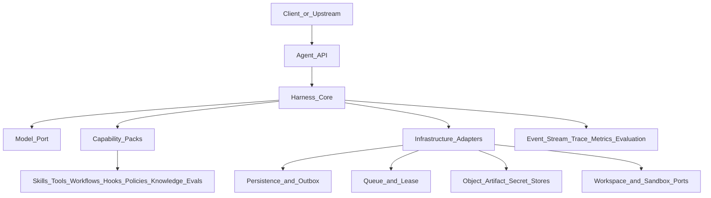
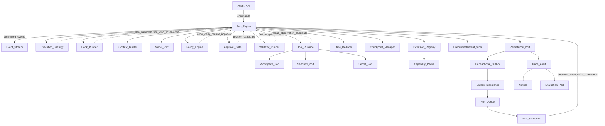

# 00 · 设计总览与决策索引

> 文档状态：架构设计基线  
> 适用范围：通用 Agent Harness（服务端 API）  
> 产物边界：设计文档，不含实现与技术选型

## 1. 背景与问题

大模型能够生成决策候选，但不能单独承担可靠产品的控制职责。模型输出具有概率性，可能漂移、幻觉、越权或在长任务中丢失进度。让 Agent 可用、可控、可恢复、可审计和可演化的工程控制骨架是 **Harness**。

本设计面向多租户服务端形态：Run 可排队、等待、中断、恢复和回放；业务能力通过版本化 Capability Pack 与端口接入，不进入运行内核。设计吸收两类领域实践中的 Harness 分层、状态与安全纵深、生命周期 Hook、Skill 编排、知识增强和验证闭环思想，不复制特定业务实现。

首个验证场景是中性的**通用工作区任务**：读取资料、规则检索、受控 Tool 调用、生成 Artifact 和确定性验收。文档研究与工单处理仅作为 Capability Pack 契约样例。

## 2. 目标与非目标

### 2.1 设计目标

| 目标 | 含义 |
| --- | --- |
| 可控 | 模型只提出结构化 Action；Engine 掌握生命周期、门禁、执行与提交 |
| 可恢复 | 从 Event、领域记录与 Checkpoint 恢复，不依赖聊天历史猜测进度 |
| 可扩展 | 新业务域增加 Capability Pack 与 Adapter，不改变 Core 对象和状态机 |
| 可观测 | 输入、决策、Tool、审批、事实接受、状态变化与结果可关联、可回放 |
| 可评测 | 质量、安全、恢复、成本和效率由版本化 Eval Suite 与 Event 派生指标验证 |
| 可演进 | 轻量内核优先，复杂能力只按可量化信号与回归门禁引入 |

### 2.2 非目标

- 不建设通用 AGI、多 Agent 社会或完全自治系统
- 不把所有任务强制转换为 DAG
- 不默认启用 Memory、向量检索、语义路由或自动 Knowledge 写回
- 不讨论 UI、商业模式或具体业务规则
- 不绑定语言、框架、仓库组织、数据库、中间件或部署拓扑

### 2.3 质量属性优先级

1. **正确性与安全边界**（不可妥协）
2. **可恢复性与可审计性**
3. **扩展性与契约稳定性**
4. **可观测性与可评测性**
5. **延迟与成本效率**（在前四项满足后优化）

## 3. 范围与约束

### 3.1 范围内

- 服务端 API 形态的统一异步 Run 语义
- 核心对象、Event、Run/Step 状态机、并发提交与恢复协议
- Skill、Tool、Workflow、Hook、Policy、Validator、Evaluator 与 Capability Pack 协议
- Context、State、Knowledge、Memory、Artifact 与敏感数据边界
- 权限、审批、副作用、安全、Trace、Metrics 与 Evaluation 闭环
- 通用工作区 MVP 垂直切片及按信号演进的能力边界

### 3.2 范围外

- 代码、工程骨架与 SDK 实现
- 具体 LLM 供应商、中间件、存储和队列产品选型
- 工单、直播、编码等业务规则实现
- 客户端产品与交互设计

### 3.3 硬约束

- 技术中立：对象、端口和语义不依赖特定技术栈或部署形态。
- Core 不依赖业务 Pack；Pack 与 Adapter 只依赖公开契约和端口。
- 模型不得直接接触长期密钥、宿主执行权或任意网络权限。
- Event Log 是审计与回放真相；Checkpoint 只加速恢复，不替代 Event 或领域记录。
- Child Run 具备完整对象、隔离、权限、恢复、join 与取消传播契约，但 MVP 不启用 `spawn_child` 执行路径。

## 4. 设计原则与核心不变量

1. **Engine 唯一拥有推进权**：Engine 是 Run 生命周期、Step、Hook、Policy、Approval、Tool 派发、Fact 接受、恢复与终止的唯一编排者，也是 Run Event 和可变领域记录的唯一提交协调者。Strategy、Policy Engine、Approval Gate、Hook Runner、Tool Runtime、Validator 与 Scheduler 只返回计划、命令、判定、贡献或 Observation 候选。
2. **EventEnvelope 统一顺序**：Event 使用 [01-domain-model](./01-domain-model.md#51-eventenvelope) 的统一信封；`sequence` 只在单个 Run 内从 1 开始严格递增，由 Engine 在成功事务中连续分配，跨 Run 不定义全局顺序。
3. **并发与租约双重约束**：所有可变提交校验 `expectedRevision` 与当前 `leaseEpoch`；取得或接管执行租约时 epoch 严格递增，stale Worker 停止派发与提交。
4. **State 只接受事实**：Tool、Hook 和用户数据先成为 Observation；只有通过 Schema、权限和业务验证形成 FactEnvelope 后，纯函数 Reducer 才能计算 State。Event payload、模型输出和 Hook 贡献均不能直接写 State。
5. **副作用先准备后派发**：有副作用的调用遵守 `Action → Policy/Approval → PreToolCall → ToolCallRecord prepared → dispatch → Observation → FactEnvelope → Reducer`。无权威结果时进入 `outcome_unknown` 并按 ToolEffectContract 对账；补偿是独立 Tool，不能代替幂等或对账。
6. **等待只唤醒到排队态**：`awaiting_approval`、`awaiting_input`、`waiting_child` 和 `paused` 只可回到 `queued`；Scheduler 取得新租约后才能进入 `running`。
7. **权限与 Policy 只收紧**：有效权限是平台、租户、Agent、Pack、Tool/Hook、资源与委派范围的交集；显式 deny 优先。Policy 限制强度为 `allow < require_approval < deny`，后层不能放宽累计结果。
8. **审批绑定且单次消费**：ApprovalRecord 绑定规范化 `actionDigest`、资源范围、主体、TTL、Tool/Policy/Manifest 精确版本；`approved → consumed` 与对应 ToolCallRecord `prepared` 原子提交，一个 ApprovalRecord 最多消费一次。
9. **执行依赖冻结**：Run 使用创建时解析的不可变 Execution Manifest；Agent、Pack、Skill、Workflow、Hook、Tool、Prompt、Action Schema、Policy、Model、Strategy、Context Builder、Reducer、Validator、Evaluator 与 Knowledge 等版本和摘要在运行、恢复与回放中保持一致。
10. **敏感载荷外置**：敏感或大载荷使用受 ACL、加密、保留与删除策略保护的不可变引用和 hash；Secret 只由 SecretPort 在 Tool 执行边界注入，不进入认知平面或 Event 明文。
11. **观测由事实记录派生**：Trace、日志视图、Metrics 与 Evaluation 样本消费已提交 Event 和只读领域记录；Metrics 不建立第二套领域真相，下游不可用不改变 Run 或触发副作用重放。

## 5. 系统上下文

| 参与方 | 职责 | 不负责 |
| --- | --- | --- |
| Client | 创建 Run、查询或订阅 Event、提交输入及审批、pause/resume/cancel | 不执行 Tool，不分配 Event 顺序，不写 Run State |
| Harness Core | Engine 编排、门禁、提交、归约、检查点、恢复与终止 | 不内嵌业务规则，不依赖基础设施产品 |
| Model Port | 按冻结 Model Policy 返回结构化模型响应候选 | 不授权、不执行副作用、不写 State |
| Capability Pack | 声明版本化 Skill、Tool、Workflow、Hook、Policy、Knowledge、Validator、Evaluator | 不拥有 Run 状态机、Event 序列或持久化写权 |
| Infrastructure Adapter | 实现 Persistence、Outbox、Queue、Lease、Workspace、ObjectStore、Sandbox、Secret 等端口 | 不定义领域语义，不绕过 Engine 推进 |
| Observability / Evaluation | 从已提交 Event 和只读记录派生 Trace、Metrics、审计与评测结果 | 不改变生产 State、审批、ToolCallRecord 或 Run 状态 |

## 6. 逻辑架构一览

详细职责与端口见 [02-core-architecture](./02-core-architecture.md)。

图中的候选返回不具有推进权。Policy、Approval、Hook、Tool Runtime、Strategy、Validator、Scheduler、Queue 与 Dispatcher 均不能直接写 State、追加 Run Event 或调用下一阶段。严格投递链为 `Persistence/Transactional Outbox → Outbox Dispatcher → Run Queue → Run Scheduler → Engine`。

## 7. 文档导航

| 文档 | 内容 |
| --- | --- |
| [00-overview](./00-overview.md) | 目标、边界、系统上下文、核心不变量与 ADR 唯一索引 |
| [01-domain-model](./01-domain-model.md) | 术语唯一来源、核心对象、EventEnvelope、FactEnvelope、ToolEffectContract 与所有权 |
| [02-core-architecture](./02-core-architecture.md) | Engine 中心架构、Outbox/Queue/Scheduler、端口、依赖与部署映射 |
| [03-run-lifecycle](./03-run-lifecycle.md) | Run/Step 状态机、Hook 顺序、副作用、DAG 并发、Child Run 与恢复 |
| [04-extension-model](./04-extension-model.md) | Capability Pack、权限交集、Policy 偏序、注册生命周期与 Pack 样例 |
| [05-context-and-data](./05-context-and-data.md) | Observation/Fact/State、Context、Knowledge、Memory、Artifact 与数据保护 |
| [06-safety-and-control](./06-safety-and-control.md) | 信任边界、审批、Tool 出口、租约、Secret、Sandbox 与威胁模型 |
| [07-observability-and-evaluation](./07-observability-and-evaluation.md) | Event 派生 Trace/Metrics、回放等级、Eval Suite 与回归门禁 |
| [08-mvp-and-evolution](./08-mvp-and-evolution.md) | 通用工作区 MVP、验收矩阵与阶段 A–G 量化演进条件 |

## 8. 关键架构决策（ADR 索引）

本节是 ADR 标识、决策与状态的唯一索引；其他章节只引用，不重复定义。状态取值为 `Accepted`、`Provisional` 或 `Deferred`。

| ID | 决策 | 状态 | 主要契约 |
| --- | --- | --- | --- |
| ADR-001 | 模型只提出结构化 Action；副作用仅经 Engine 门禁与 Tool Runtime | Accepted | [01](./01-domain-model.md)、[06](./06-safety-and-control.md) |
| ADR-002 | 统一异步 Run 语义；同步等待仅为客户端订阅封装 | Accepted | [02](./02-core-architecture.md)、[03](./03-run-lifecycle.md) |
| ADR-003 | Event Log 是审计与回放真相；Checkpoint 仅用于恢复加速 | Accepted | [01](./01-domain-model.md)、[03](./03-run-lifecycle.md) |
| ADR-004 | Skill、Tool 与 Workflow 分离，Action 不包含 `skill.invoke` | Accepted | [01](./01-domain-model.md)、[04](./04-extension-model.md) |
| ADR-005 | 默认使用 light Strategy；DAG 是共享同一内核的可替换 Strategy | Accepted | [03](./03-run-lifecycle.md)、[08](./08-mvp-and-evolution.md) |
| ADR-006 | 业务能力通过 Capability Pack 接入，Core 禁止依赖业务实现 | Accepted | [02](./02-core-architecture.md)、[04](./04-extension-model.md) |
| ADR-007 | State、Context、Knowledge 与 Memory 分离并具有独立形成路径 | Accepted | [01](./01-domain-model.md)、[05](./05-context-and-data.md) |
| ADR-008 | Memory、向量检索、语义路由与自动 Knowledge 写回默认关闭 | Accepted | [05](./05-context-and-data.md)、[08](./08-mvp-and-evolution.md) |
| ADR-009 | 多 Agent 不作为基础抽象；需要隔离委派时使用 Child Run 契约 | Accepted | [01](./01-domain-model.md)、[03](./03-run-lifecycle.md) |
| ADR-010 | Core 保持技术与部署中立，具体产品通过端口和 Adapter 映射 | Accepted | [00](./00-overview.md)、[02](./02-core-architecture.md) |
| ADR-011 | MVP 仅实现中性通用工作区垂直切片，不启用真实垂直业务执行路径 | Accepted | [08](./08-mvp-and-evolution.md) |
| ADR-012 | DAG、Memory、Child Run、语义检索等复杂能力仅按量化信号、独立门禁与 canary 边界引入 | Accepted | [07](./07-observability-and-evaluation.md)、[08](./08-mvp-and-evolution.md) |

### 8.1 取舍摘要

| 议题 | 采用 | 备选 | 取舍依据 |
| --- | --- | --- | --- |
| 执行模型 | light Strategy + 可选 DAG Strategy | 全量 DAG / 无持久控制的循环 | 简单路径成本可控，复杂路径仍共享状态与恢复协议 |
| 扩展方式 | 声明式 Capability Pack + Registry | Core 内嵌业务分支 | 保持对象、状态机和提交语义稳定 |
| 状态真相 | Event + FactEnvelope 归约的 State | 消息历史或日志充当真相 | 支持确定性恢复、审计与并发控制 |
| 经验复用 | 可选 Memory 候选晋升 | 自动长期记忆 | 限制污染、越权和错误经验扩散 |
| 任务隔离 | 独立 Child Run + 显式 Artifact/Fact 回传 | 共享可变 State 的多 Agent | 保持租约、权限、预算与 Event 隔离 |

### 8.2 验证假设与能力引入

1. 通用工作区垂直切片能够验证 Core 的异步 Run、门禁、副作用、恢复与评测闭环；MVP 范围以 [08](./08-mvp-and-evolution.md#3-mvp-垂直切片) 为准。
2. light Strategy 能覆盖多数基础任务；DAG 的需求和收益使用 [07](./07-observability-and-evaluation.md) 定义的指标，并满足 [08](./08-mvp-and-evolution.md#阶段-f--dag-strategy) 的进入、退出与回滚条件。
3. 固定版本和确定性规则检索能够支撑 MVP；Knowledge 增强、Memory、语义路由只按 08 的阶段门禁启用。
4. Child Run 的总体契约在 01、03、05、06 中保持完整；MVP 不启用，只有满足阶段 G 的量化信号、权限子集与回归门禁后才开放。
5. 单一异步 Run 模型同时覆盖短任务的客户端等待封装与长任务后台执行，不产生同步专用状态机。

## 9. 模型与 Harness 的决策边界

| 模型提出 | Harness 决定 |
| --- | --- |
| 下一步意图和一个结构化 Action 候选 | Action Schema、预算、Agent allowlist 与 Policy 是否允许 |
| 从 Context 可见集合中选择 `toolId` | Tool 精确版本、有效权限、资源范围、审批和 Runtime 出口 |
| Tool 参数候选与自然语言理由 | 参数规范化、`actionDigest`、幂等键、超时、投递和对账 |
| 对 Observation 与 Artifact 的解释建议 | Observation 是否形成 FactEnvelope，以及 Reducer 如何更新 State |
| 提议 `finish` 或 `spawn_child` | required `acceptanceChecks`、未知副作用、Child Run 启用门禁和终态 |
| 建议换路或重试 | revision、leaseEpoch、ToolEffectContract、预算与合法状态转换 |

模型输出永远不是授权、执行结果或 State 事实。Harness 的确定性门禁不能由模型自述、Evaluator 分数、Hook 贡献或 Adapter 行为替代。

## 10. 架构评审条件

1. Core、Capability Pack 与 Adapter 的依赖方向清晰，Engine 是唯一编排者与提交协调者。
2. 01 定义的对象、字段、状态、Event、错误和所有权在各章无同名异义。
3. 创建、排队、执行、等待、取消、失败、恢复、对账和终态路径闭合。
4. 权限交集、Policy 偏序、Approval 单次消费、prepared-before-dispatch 与 `outcome_unknown` 可执行、可审计。
5. State、Context、Knowledge、Memory、Event、Checkpoint 与 Artifact 职责互不替代。
6. 新业务域只增加 Pack、受限实现与 Adapter，不要求业务专用 Core 分支。
7. Trace、Metrics 与 Evaluation 由 Event 派生，Validator 与 Evaluator 的生产权限边界明确。
8. MVP 禁用项不能通过 Tool 别名、Hook、Pack 后台任务、模型文本或 Adapter 旁路启用。
9. 07 与 08 的门禁、样本、指标、阶段信号、退出和回滚条件可计算且相互一致。
10. 全集不包含未经论证的技术栈、产品或部署结论。

---

下一篇：[01-domain-model.md](./01-domain-model.md)
