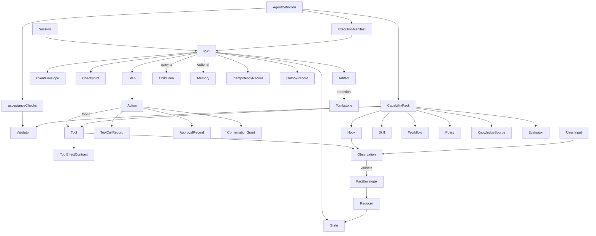
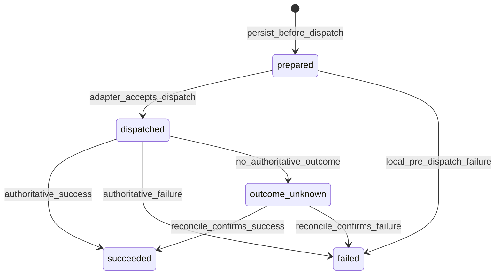

# 01 · 统一术语与核心对象

> 本文是术语、对象、标识符与核心契约的**唯一定义来源**。其他设计文档只引用这些定义，不另设同名语义；发生冲突时以本文为准。

## 1. 术语表

| 术语 | 定义 |
| --- | --- |
| Harness | 包裹模型的工程控制骨架：执行循环、工具协议、上下文、状态、安全控制、观测与评测接口 |
| Agent Definition | 可部署 Agent 的版本化装配声明，定义能力、策略、预算、模型策略与验收检查 |
| Session | 同一租户边界内的对话或任务会话容器，可包含多次 Run |
| Run | 一次有明确目标的异步执行实例，也是并发控制与恢复的基本单位 |
| Child Run | 由父 Run 派生的隔离 Run，独立持有 State、Event 序列与租约，通过显式关联和 Artifact 交换结果 |
| Step | Run 内的一次决策、执行或确定性工作流节点推进 |
| Action | 模型或 Workflow 提出的结构化下一步意图 |
| Event | 对运行中已发生事项的不可变记录；Event Log 是审计与回放的真相来源 |
| EventEnvelope | Event 的统一信封，承载版本、关联、顺序、因果、并发与完整性信息 |
| Governance Event | 未绑定 Run 的租户控制面事项，使用 GovernanceEventEnvelope；不推进 Run 或改变 State |
| Observation | 来自 Tool、Hook 或用户输入的有来源数据；在被接受前不属于 State 事实 |
| FactEnvelope | Observation 通过 Schema、权限与业务验证后形成的、可供 Reducer 消费的事实信封 |
| State | Run 当前已接受事实的结构化快照 |
| Context | 某一步投影给模型的预算化临时信息视图 |
| Artifact | Run 产生或引用的可寻址产物，如文件、报告、结构化结果包 |
| Checkpoint | State 与策略进度的恢复加速存档，不替代 Event Log |
| Skill | 面向任务的能力说明、使用条件与编排知识 |
| Tool | 由 Tool Runtime 控制的原子执行单元，以 `toolId` 标识 |
| Tool Effect Contract | Tool 的副作用、投递、幂等、结果保留、对账与补偿契约 |
| Tool Call Record | 单次逻辑 Tool 调用的持久记录，覆盖准备、派发与结果确定过程 |
| Workflow | 确定性的步骤关系，可为线性流程或 DAG |
| Hook | 生命周期切入点上的受限横切扩展，只能贡献 Context、否决或 Observation |
| Policy | 授权、风险、审批、预算、租户隔离等确定性规则 |
| Approval Record | 与特定 Action 摘要、资源范围和版本集合绑定的单次消费审批凭证 |
| Confirmation Grant | `confirm_once` 使用的有界复用确认，绑定主体、Session、运行配置、Action pattern、资源、版本与 TTL |
| Idempotency Record | 在稳定 namespace 与 tenant 作用域内绑定请求摘要、所有者和结果引用的去重记录 |
| Outbox Record | 与领域事务原子保存、供 Dispatcher 投递的消息记录；其投递状态不是 Run 真相 |
| Tombstone | 敏感载荷删除后保留的不含正文的审计墓碑 |
| Validator | 确定性验证器；相同版本、输入与配置必须得到相同判定，可作为执行或完成门禁 |
| Evaluator | 建议性质量评测器；输出分数、标签或建议，不直接改变生产 State 或放行副作用 |
| Knowledge Source | 有来源、可追溯、版本化的外部事实来源 |
| Memory | 从交互中形成的候选或长期经验，带来源、置信度与晋升状态 |
| Capability Pack | 一组可注册的 Skill、Tool、Workflow、Hook、Policy、Knowledge、Validator 与 Evaluator 声明 |
| Execution Manifest | Run 启动时解析并冻结的执行依赖清单；包含 Agent、Pack、Tool、Policy、Schema 等精确版本与摘要 |

## 2. 对象关系总览



关系约束：

- `toolId` 是 Tool 的稳定逻辑标识；Run 内实际执行版本由 `executionManifestRef` 指向的 Execution Manifest 解析。
- Event 记录“某数据被观察、被接受或被拒绝”这一客观过程，不等于其载荷天然可信。
- State 只由 Reducer 根据 `FactEnvelope` 产生；Event、Observation、模型输出、Hook 输出均不能直接写 State。
- Child Run 与父 Run 共享 `tenantId`、`sessionId` 和根关联，不共享可变 State、Event 序列、租约或隐式 Context。

## 3. 标识、版本与并发约定

### 3.1 标识与引用

- 标识符在其声明作用域内稳定且不可复用；`eventId`、`runId`、`toolCallId`、`approvalId`、`artifactId` 全局唯一。
- Tool 在所有对象中统一使用 `toolId`。禁止以展示名称或实现类名充当执行标识。
- 版本化扩展引用使用 `{ id, version }`；Action 只表达 `toolId`，版本由 Execution Manifest 固定。
- 大载荷使用不可变 `payloadRef` 或 `artifactId`，并保存内容哈希；引用内容不得被原地覆盖。

### 3.2 Execution Manifest

```text
ExecutionManifest {
  schemaVersion, manifestId, createdAt
  eventOrderingVersion
  agentDefinition { agentDefinitionId, version, digest }
  packVersions[] { packId, version, digest }
  skills[] { skillId, version, digest }
  workflows[] { workflowId, version, digest }
  hooks[] { hookId, version, digest }
  tools[] { toolId, version, inputSchemaVersion, outputSchemaVersion, effectContractVersion, digest }
  promptAssets[] { ref, version, hash }
  actionSchemas[] { actionType, schemaVersion, digest }
  policies[] { policyId, version, digest }
  validators[] { validatorId, version, digest }
  evaluators[] { evaluatorId, version, digest }
  knowledgeSources[] { sourceId, version }
  modelPolicy { version, resolvedTargets[] }
  strategy { type, version, digest }
  contextBuilder { version, digest }
  reducer { version, digest }
  coreContractVersion
  hash
}
```

Execution Manifest 创建后不可变。`eventOrderingVersion` 固定本文与 03 定义的事务内生命周期阶段顺序。Run 的恢复、审批校验、工具执行、回放和审计都使用同一份 Manifest；Manifest 不可解析时不得启动或恢复执行。

### 3.3 乐观并发与租约栅栏

- `Run.revision` 是乐观并发版本。任何改变 Run、State、ToolCallRecord、ApprovalRecord 或追加 Run Event 的提交都必须携带 `expectedRevision`。
- IdempotencyRecord、OutboxRecord、ConfirmationGrant、Tombstone 和治理审计流各自使用 `revision` 或 append CAS。它们与 Run 在同一 Unit of Work 中变化时，必须同时校验 Run 与记录自身的预期版本；任一冲突使整个事务不发生。
- 持久化边界仅在 `expectedRevision == Run.revision` 时提交；成功后将 `revision` 递增一次，冲突返回 `conflict`。
- `Run.leaseEpoch` 是租约栅栏令牌。每次成功取得或接管执行租约时严格递增；Engine 的提交与副作用派发必须携带当前 `leaseEpoch`。
- 发现更高 `leaseEpoch` 或租约失效的执行者必须停止派发、停止提交并返回 `lease_lost`。旧执行者的迟到结果只能作为待核验 Observation 进入对账流程。

## 4. 核心运行对象

### 4.1 Agent Definition

| 项 | 说明 |
| --- | --- |
| 职责 | 声明 Agent 的 Skill、Tool 授权、策略、知识、模型、预算、默认审批和完成门禁 |
| 所有者 | 平台配置管理 |
| 生命周期 | 版本化发布；Run 绑定精确版本并解析为 Execution Manifest |
| 禁止 | 不保存运行时对话；不直接执行 Tool；不以 Evaluator 分数代替确定性安全门禁 |

```text
AgentDefinition {
  schemaVersion
  agentDefinitionId, name, version
  skillRefs[] { skillId, version }
  toolAllowlist[]           // toolId 列表，不含展示名；Run 只能调用此集合与 Policy 共同允许的 Tool
  workflowRefs[] { workflowId, version }
  policyRefs[] { policyId, version }
  knowledgeRefs[] { sourceId, version }
  modelPolicy { primary, fallback?, temperatureBounds? }
  budgets { maxSteps, maxTokens, maxCost, maxWallTime }
  defaults { approvalMode, executionStrategy }
  acceptanceChecks[] {
    checkId
    validatorRef { validatorId, version }
    inputSelector {
      selectorVersion
      selectorType             // json_pointer | artifact_ref | fact_ref | state_ref
      selector?                // selectorType=json_pointer 时的 RFC 6901 路径
      ref?                     // 其余 selectorType 的不可变引用或稳定对象标识
      schemaRef
      required                 // true 时数据缺失直接使检查 fail；false 时得到 not_applicable
    }
    required
  }
}
```

`acceptanceChecks` 只能引用 Validator。`inputSelector` 是由 Core 解释的版本化声明式结构，只能从已提交 State、FactEnvelope 或不可变 Artifact 引用取值，禁止嵌入表达式、脚本或任意代码。选择结果必须通过 `schemaRef`；选择器自身 `required=true` 且数据缺失时产生确定性 `fail`，为 false 时产生 `not_applicable`，两者都记录选择器版本、输入 hash 与原因。检查项 `required=true` 时必须得到 `pass`，`finish` Action 才能被接受；Validator 的输入、版本、配置和判定结果必须进入 Event。Evaluator 可并行提供质量建议，但其输出不改变该门禁结果。

### 4.2 Session

| 项 | 说明 |
| --- | --- |
| 职责 | 聚合同一会话边界内的多次 Run，承载租户、主体和轻量会话元数据 |
| 所有者 | 接入层与持久化层 |
| 生命周期 | 创建 → 活跃 → 关闭或过期 |
| 禁止 | 不替代 Run State；不作为无界全局可变黑板 |

### 4.3 Run

| 项 | 说明 |
| --- | --- |
| 职责 | 承载一次目标导向的异步执行、并发版本、租约、冻结依赖和父子关联 |
| 所有者 | Run Engine |
| 生命周期 | 见 [03-run-lifecycle](./03-run-lifecycle.md) |
| 禁止 | 不跨租户；不在运行中静默切换 Manifest；终态不可原地重开 |

```text
Run {
  schemaVersion
  runId, tenantId, sessionId
  agentDefinitionId, agentVersion
  executionManifestRef
  packVersions[] { packId, version }
  goal, inputRef?
  status                     // created | queued | running | awaiting_approval | awaiting_input | waiting_child | paused | succeeded | failed | cancelled
  strategy { type: light | dag, version }
  budgets
  revision                  // 乐观并发版本
  leaseEpoch                // 单调递增租约栅栏令牌
  rootRunId                 // 根 Run 等于自身 runId
  parentRunId?              // Child Run 必填
  parentStepId?             // 触发派生的父 Step；Child Run 必填
  spawnActionId?            // spawn_child Action；Child Run 必填
  depth                     // 根 Run 为 0，Child Run = 父 depth + 1
  delegationScope?          // Child Run 的目标、资源与权限上限；不得宽于父 Run
  createdAt, updatedAt
}
```

Child Run 的 `tenantId`、`sessionId` 与 `rootRunId` 必须和父链一致。创建父子关联、子 Run 记录及 `child_run.created` Event 必须处于一个原子提交边界。子 Run 结果通过 `artifactId` 或经验证的 `FactEnvelope` 显式回传；父 Run 不读取子 Run 的可变 State。

### 4.4 Step

| 项 | 说明 |
| --- | --- |
| 职责 | Run 内一次“决策—校验—执行—归约”或 Workflow 节点推进 |
| 所有者 | Execution Strategy，经 Engine 提交 |
| 关键关联 | `runId`、`stepId`、Action、ModelCall、ToolCall、Approval、Fact |
| 禁止 | 不跨 Run；不绕过 Policy、Approval、Tool Runtime 或 Reducer |

```text
Step {
  schemaVersion
  stepId, tenantId, sessionId, runId
  strategyNodeId?
  status                     // planned | reasoning | action_proposed | gating | awaiting_approval | awaiting_input | waiting_child | executing | reconciling | reducing | succeeded | failed | skipped
  actionId?
  attempt
  dependencyStepIds[]
  startedAt?
  completedAt?
  failure?
  revision
}
```

Run 与 Step 的完整状态枚举由本节唯一规定；[03-run-lifecycle](./03-run-lifecycle.md) 只定义转换、触发条件与提交语义。

### 4.5 Action

| 项 | 说明 |
| --- | --- |
| 职责 | 表达结构化下一步意图 |
| 来源 | 模型或 Workflow |
| 门禁 | 版本化 Schema、Agent `toolAllowlist`、Policy、预算与必要审批 |
| 禁止 | Action 本身不代表授权、执行成功或 State 事实 |

```text
Action {
  schemaVersion
  actionId
  type                       // tool.call | ask_user | finish | spawn_child | noop
  toolId?                    // type=tool.call 时必填
  arguments?
  resourceScope?
  idempotencyKey?            // 有副作用的 tool.call 必填
  childSpec? {
    goal, inputRef?, delegationScope, strategy?
  }
  rationaleRef?              // 可选解释引用，不作为执行依据
}
```

### 4.6 Artifact

| 项 | 说明 |
| --- | --- |
| 职责 | 表示可寻址、可校验、可授权引用的产物 |
| 所有者 | 产物存储负责内容；Harness 负责元数据与关联 |
| 必须 | `artifactId`、`tenantId`、`ref`、媒体类型、大小、哈希、创建来源、保留策略 |
| 禁止 | 不以可变路径替代不可变版本引用；不因生成成功自动成为 State 事实 |

### 4.7 Checkpoint

| 项 | 说明 |
| --- | --- |
| 职责 | 保存 State 快照、策略游标、对应 `revision` 与最后 Event `sequence`，加速恢复 |
| 所有者 | Engine / Checkpoint Manager |
| 性质 | 性能优化，可由 Event Log 重建 |
| 禁止 | 不替代 Event、ToolCallRecord、ApprovalRecord 或审计证据 |

## 5. Event 与提交语义

### 5.1 EventEnvelope

```text
EventEnvelope {
  schemaVersion
  eventId
  eventType
  tenantId, sessionId, runId
  stepId?
  modelCallId?
  toolCallId?
  approvalId?
  confirmationGrantId?
  artifactId?
  tombstoneId?
  sequence
  occurredAt
  recordedAt
  causationId?
  correlationId
  producer { type, id, version? }
  payload?                   // 与 payloadRef 二选一
  payloadRef?                // 与 payload 二选一
  hash
  expectedRevision
}
```

字段语义：

- `sequence` 在单个 Run 内从 1 开始严格递增且不重复；跨 Run 不定义全局顺序。
- `occurredAt` 是生产者观察到事项发生的时间，`recordedAt` 是 Event 被持久化提交的时间；排序与恢复以 `sequence` 为准。
- `causationId` 指向直接原因 Event；`correlationId` 关联同一请求、Action 或跨父子 Run 的工作链。
- `producer` 标识产生事件候选的组件。Tool、Hook、Policy、Approval Gate 和客户端只产生候选或命令，不自行分配 `sequence`。
- `payload` 与 `payloadRef` 必须且只能出现一个；`hash` 校验规范化不可变信封及载荷内容。
- `expectedRevision` 是本次提交开始时预期的 `Run.revision`，用于证明 Event 所属的并发提交边界。

Engine 是 Run Event 的唯一提交协调者。在一个原子提交边界内，Engine：

1. 校验 `expectedRevision` 与 `leaseEpoch`。
2. 按 Execution Manifest 的 `eventOrderingVersion` 和 03 定义的固定生命周期阶段顺序排列本批 Event。
3. 从当前最大 `sequence + 1` 连续分配顺序。
4. 一并写入 Event、领域记录投影、State 结果与 Run 元数据。
5. 将 `Run.revision` 递增一次后提交。

提交失败不对外宣称成功。生产者重送候选时以稳定业务标识去重，不能自行沿用或猜测 `sequence`。

### 5.2 事件类型

最小事件类型集合：

- Run：`run.created`、`run.queued`、`run.lease_acquired`、`run.lease_lost`、`run.status_changed`、`run.completed`、`run.failed`、`run.cancelled`
- Step 与 Context：`step.started`、`step.completed`、`step.failed`、`context.built`
- Model 与 Action：`model.called`、`model.responded`、`action.proposed`、`action.accepted`、`action.rejected`
- Policy：`policy.evaluated`、`policy.denied`
- Approval：`approval.requested`、`approval.approved`、`approval.rejected`、`approval.expired`、`approval.revoked`、`approval.consumed`
- Confirmation：`confirmation.granted`、`confirmation.used`、`confirmation.expired`、`confirmation.revoked`
- ToolCall：`tool.call_prepared`、`tool.dispatched`、`tool.succeeded`、`tool.failed`、`tool.outcome_unknown`、`tool.reconciled`
- Hook：`hook.invoked`、`hook.context_contributed`、`hook.vetoed`、`hook.observation_emitted`、`hook.failed`
- Observation 与 Fact：`observation.recorded`、`fact.accepted`、`fact.rejected`
- State 与恢复：`state.reduced`、`checkpoint.saved`
- Artifact：`artifact.created`、`artifact.linked`
- Child Run：`child_run.spawn_requested`、`child_run.created`、`child_run.completed`、`child_run.failed`、`child_run.cancelled`、`child_run.result_linked`
- Run 关联 Retention：`retention.deletion_requested`、`retention.deletion_deferred`、`payload.deleted`、`payload.tombstoned`、`legal_hold.applied`、`legal_hold.released`

状态变化必须使用对应专用事件；通用日志文本不能代替领域事件。

Run 关联 Retention Event 只用于具有明确 `runId` 的载荷，并追加到该 Run 的 Event Log。租户级 Knowledge、Memory、Pack 或未绑定 Run 的对象使用独立治理审计信封：

```text
GovernanceEventEnvelope {
  schemaVersion
  governanceEventId
  eventType
  tenantId
  governanceStreamId
  subject { objectType, objectId, sourceRunId? }
  sequence
  occurredAt
  recordedAt
  causationId?
  correlationId
  actor { principalId, authContextRef }
  payload?                   // 与 payloadRef 二选一
  payloadRef?
  hash
  expectedRevision
}
```

`sequence` 在 `{tenantId, governanceStreamId}` 内严格递增，由控制面治理服务通过 append CAS 分配。治理事件至少覆盖同名 Retention、legal hold 与 payload 删除事件，也可承载不依附 Run 的 Pack/Confirmation 管理事件。GovernanceEventEnvelope 不属于任何 Run，不改变 Run/Step/State，也不能取得 Engine 的推进权。Run 关联对象的删除同时写入治理审计流；若需要解释原 Run，再由 Engine 以相同 `correlationId` 将同名 Run Event 追加到来源 Run，两个提交通过受控 Outbox 关联而不宣称跨流原子。

### 5.3 IdempotencyRecord 与 OutboxRecord

```text
IdempotencyRecord {
  schemaVersion
  idempotencyRecordId
  namespace                  // create_run | tool_call | child_run
  tenantId
  key                        // 调用方或契约提供的稳定键
  dedupeKey                  // namespace + tenant + 作用域字段规范化后的唯一键
  requestHash
  ownerRef {
    ownerType                // run | tool_call | child_run
    runId
    stepId?
    toolCallId?
    parentRunId?
    spawnActionId?
  }
  resultRef? {
    resultType               // run | tool_result | child_run
    runId?
    toolCallId?
    childRunId?
    payloadRef?
    hash?
  }
  status                     // reserved | completed | expired
  revision
  createdAt, updatedAt
  expiresAt                  // namespace 策略计算的绝对 TTL 截止时间
  completedAt?
}

OutboxMessage {
  messageType
  tenantId
  aggregateRef { aggregateType, aggregateId, revision }
  dedupeKey
  payload?                   // 与 payloadRef 二选一
  payloadRef?
  payloadHash
  availableAt
}

OutboxRecord {
  schemaVersion
  outboxRecordId
  message: OutboxMessage
  status                     // pending | claimed | published | failed | expired
  claimOwner?
  claimExpiresAt?
  publishAttempts
  publishedAt?
  lastError?
  revision
  createdAt, updatedAt
  expiresAt                  // 投递与审计保留策略计算的绝对 TTL 截止时间
}
```

`dedupeKey` 在 `{namespace, tenantId}` 或消息类型规定的更窄作用域内唯一；同键同 `requestHash` 返回已有 `resultRef`，同键不同摘要返回 `conflict`。CreateRun 必须将 Run、`run.created`、`namespace=create_run` 的 IdempotencyRecord 和首条 OutboxRecord 在同一事务提交。Tool prepared 与其幂等记录及派发 Outbox、Child Run 与 `namespace=child_run` 的幂等记录及 Child Outbox 分别遵守各自生命周期的原子边界。Dispatcher 只更新 OutboxRecord 的投递状态；`claimed`、`published` 或发布失败均不是 Run 状态真相，也不能替代 Run Event。

### 5.4 Tombstone

```text
Tombstone {
  schemaVersion
  tombstoneId
  tenantId
  subject {
    objectType
    objectId
    originalRef?
    sourceRunId?
  }
  originalHash
  deletionPolicy { policyId, version, digest }
  requestedBy { principalId, authContextRef }
  deletionRequestEventId
  legalHoldDecision {
    applied
    decisionEventId
    reasonCode?
  }
  deletionMethod              // physical_delete | crypto_shredding
  payloadState                // deleted | tombstoned
  deletedAt
  tombstonedAt
  evidenceRefs[]
  auditStreamRef { streamType, streamId } // streamType=run | governance
  revision
  hash
}
```

删除请求先提交 `retention.deletion_requested`。存在 legal hold 时提交 `retention.deletion_deferred`，并以 `legal_hold.applied` 或既有 hold 证据关联原因；释放时提交 `legal_hold.released` 后重新判定。载荷删除或 crypto-shredding 完成后提交 `payload.deleted`，随后创建不含敏感正文的 Tombstone 并提交 `payload.tombstoned`。这些 Event 通过对象引用、原 hash、策略版本、授权主体和因果链形成完整审计证据。

## 6. Observation、Fact 与 State

### 6.1 Observation

Tool 输出、Hook 输出和用户输入进入 Harness 时一律先记录为 Observation。来源可信度不改变这一顺序。

```text
Observation {
  schemaVersion
  observationId
  tenantId, sessionId, runId, stepId?
  source {
    kind                     // tool | hook | user
    sourceId                 // toolCallId | hook invocation id | input id
    principalId?
    version?
  }
  observedAt
  data?                      // 与 dataRef 二选一
  dataRef?
  hash
  declaredSchemaRef?
  sensitivity?
}
```

Observation 是“收到这些数据”的证据，不是“这些数据可写入 State”的证明。模型输出不是 Observation；它先形成 Action，只有用户、Tool 或 Hook 返回的数据才走 Observation 接受链。

### 6.2 FactEnvelope

Observation 依次通过：

1. **Schema 验证**：类型、结构、边界与引用完整性。
2. **权限验证**：租户、主体、资源范围、Tool 授权与数据可见性。
3. **业务验证**：由版本化 Validator 或确定性 Policy 检查业务不变量。

任一阶段拒绝都产生 `fact.rejected`，保留原因与来源，不进入 Reducer。全部通过后形成：

```text
FactEnvelope {
  schemaVersion
  factId
  factType
  tenantId, sessionId, runId, stepId?
  observationIds[]
  subjectRefs[]
  acceptedAt
  validators[] {
    validatorId, version, inputHash, decision, evidenceRef?
  }
  authorizationDecisionRef
  businessRuleRefs[]
  data?                      // 与 dataRef 二选一
  dataRef?
  hash
}
```

### 6.3 State 与 Reducer

| 项 | 说明 |
| --- | --- |
| 职责 | 保存 Run 当前已接受事实、策略进度、产物引用与有界错误摘要 |
| 唯一写入口 | `nextState = reduce(previousState, FactEnvelope)` |
| 所有者 | Reducer 计算，Engine 在并发提交边界持久化 |
| 禁止 | 不消费裸 Tool 结果、Hook 输出、用户输入、模型自由文本或未接受 Event payload |

Reducer 必须是确定性纯函数，不执行 IO。大结果只以 `ref + hash + summary` 进入 State。每次 State 变化必须与 `fact.accepted`、`state.reduced` Event 在同一提交边界中持久化。

### 6.4 Context、Knowledge 与 Memory

| 概念 | 内容 | 持久真相 | 写入或形成方式 |
| --- | --- | --- | --- |
| State | 当前已接受事实全集的结构化快照 | 是，可由 Event 重建 | Reducer 只消费 FactEnvelope |
| Context | 安全边界、State 投影、可见 Tool、知识片段、近期 Event 摘要等预算化视图 | 否，可重建 | Context Builder；Hook 只能贡献带来源的临时片段 |
| Knowledge | 外部权威、可追溯、版本化资产 | 是，位于知识源 | 独立发布与审核流程 |
| Memory | 交互产生的偏好或经验候选 | 仅晋升项 | 候选 → 来源/冲突/置信度验证 → 晋升 |

Context 丢失不得影响恢复。Knowledge 不等于 Memory；模型总结默认不能成为 Knowledge 或 State 事实。

## 7. Tool 与副作用契约

### 7.1 Tool

| 项 | 说明 |
| --- | --- |
| 职责 | 执行一个受控原子操作 |
| 必须 | `toolId`、版本、输入输出 Schema、权限、风险、超时、错误码、ToolEffectContract |
| 所有者 | Capability Pack 声明；Tool Runtime 执行与约束 |
| 禁止 | 不承载任务级长流程；不绕过 Runtime；不直接写 State |

```text
Tool {
  schemaVersion
  toolId, version, description
  inputSchema, outputSchema
  riskLevel                  // read | write_low | write_high | forbidden
  timeoutMsMax
  permissions[]
  errorCodes[]
  effectContract: ToolEffectContract
}
```

### 7.2 ToolEffectContract

```text
ToolEffectContract {
  schemaVersion
  version
  sideEffectProfile          // none | workspace | external_system
  deliverySemantics          // at_most_once | at_least_once
  idempotencyScope           // run | tenant | resource | global
  keyDerivation {
    algorithm
    fields[]
    canonicalizationVersion
  }
  resultRetention {
    mode                     // full | reference | digest_only
    ttl
  }
  reconcile {
    supported
    toolRef? { toolId, version }
    requiredAfterOutcomeUnknown
    maxWait                  // 从首次 tool.outcome_unknown.recordedAt 计算的最长持续时间
    pollBudget {
      maxPolls
      minInterval
      maxInterval
      backoffAlgorithm
    }
    attemptBudget {
      maxAttempts
    }
  }
  compensationToolRef? { toolId, version }
}
```

规则：

- `sideEffectProfile != none` 的每次逻辑调用都必须在派发前得到稳定 `idempotencyKey`；Runtime 必须验证其符合 `idempotencyScope` 与 `keyDerivation`。
- 重试、恢复和租约接管必须复用同一逻辑调用的幂等键，不能用新键伪装重试。
- `at_most_once` 在派发结果未知时不自动再次派发；`at_least_once` 只允许携带同一幂等键重派发。
- 本契约不宣称基础设施级“恰好一次”。可观测的等效一次效果依赖持久化准备记录、幂等键、目标系统去重和对账共同实现。
- `compensationToolRef` 只用于已确认副作用的业务逆操作。补偿本身也是有副作用的 Tool，必须具有独立幂等键；补偿不能替代原调用幂等。
- 外部系统可能在超时后完成操作时，`reconcile.supported` 必须为真，并提供可确定查询方式；否则该 Tool 不得用于要求自动恢复的高风险路径。
- `reconcile.supported=true` 时 `maxWait`、`pollBudget` 与 `attemptBudget` 必填。`reconcileDeadline = firstOutcomeUnknown.recordedAt + reconcile.maxWait`。两个 budget 同时限制对账调用；任一预算耗尽后记录未解决状态并停止自动轮询，不得改变 deadline。由此可以确定计算 unresolved age、超 deadline 数量和 deadline 内闭合率。

### 7.3 ToolCallRecord

```text
ToolCallRecord {
  schemaVersion
  toolCallId, tenantId, sessionId, runId, stepId, actionId
  toolId, toolVersion
  executionManifestRef
  inputRef?, inputHash
  resourceScope
  idempotencyKey?
  idempotencyScope?
  deliverySemantics
  status                     // prepared | dispatched | succeeded | failed | outcome_unknown
  attempt
  preparedAt
  dispatchedAt?
  completedAt?
  resultObservationId?
  resultRef?, resultHash?
  error?
  dispatchLeaseEpoch
  revision
}
```

状态语义与转换：



- `prepared`：调用参数、版本、资源范围、幂等键和租约栅栏已经持久化；任何副作用派发必须晚于该提交。
- `dispatched`：执行适配器已接受派发，不代表目标系统成功。
- `succeeded`：得到可验证的权威成功结果；结果先记录为 Observation。
- `failed`：得到可验证的权威失败，或派发前确定失败。
- `outcome_unknown`：派发后因超时、连接中断、进程失效等原因无法判断副作用是否发生。必须先按 ToolEffectContract 对账；不得把未知当失败并盲目使用新幂等键重试。

ToolCallRecord 是当前投影；每次状态转换都必须有对应不可变 Event。

## 8. Approval、Confirmation 与 Hook

### 8.1 Action canonicalization 与 digest

```text
ActionCanonicalizationContract {
  canonicalizationVersion
  actionSchemaVersion
  canonicalJsonAlgorithm       // RFC 8785 JCS
  unicodeNormalization         // NFC
  numberEncoding               // JCS 有限 JSON number；拒绝 NaN、Infinity、-Infinity
  objectKeyOrdering            // 按 JCS 的 UTF-16 code unit 确定性顺序
  defaultHandling              // 先按 actionSchemaVersion 注入显式默认值；无声明默认值则保持缺失
  pathNormalizationVersion
  resourceNormalizationVersion
  referenceResolutionVersion
  digestAlgorithm              // sha-256
}
```

规范化输入必须覆盖 Action 的 `type`、`toolId`、`arguments`、`resourceScope`、`idempotencyKey`、`childSpec.goal`、`childSpec.inputRef`、`childSpec.delegationScope` 与 `childSpec.strategy`；`actionId` 和 `rationaleRef` 只用于关联，不进入授权摘要。处理顺序固定为：

1. 以冻结的 `actionSchemaVersion` 验证类型、拒绝未知字段，并注入该 Schema 明确声明的默认值。
2. 字符串按 Unicode NFC 规范化；数字按 JCS 的有限 JSON number 表示，等值数字只有一种编码；对象键按 JCS 排序，数组保持原顺序。
3. 路径按目标平台的冻结 `pathNormalizationVersion` 解析绝对根、`.`、`..`、大小写、Unicode、符号链接、连接点、设备路径与归档条目，再验证仍位于授权根。
4. 资源标识按 `resourceNormalizationVersion` 解析协议、主机、端口、路径、查询、命名空间与大小写规则；资源集合去重并按规范化标识排序。
5. 所有 ref 按 `referenceResolutionVersion` 解析为 `{tenantId, objectType, objectId, immutableVersion, hash}`；禁止把短时 signedRef、重定向结果或可变别名直接纳入摘要。解析失败、跨租户未授权或 hash 不一致即失败。
6. 对规范化对象执行 `canonicalJsonAlgorithm`，再使用 `digestAlgorithm` 计算 `actionDigest`。摘要表示为小写十六进制并随版本证据持久化。

任何审批、确认和执行前复核必须使用同一 `canonicalizationVersion + actionSchemaVersion + digestAlgorithm`。任一版本、解析结果或摘要不一致时不得沿用授权。

### 8.2 ApprovalRecord

```text
ApprovalRecord {
  schemaVersion
  approvalId, tenantId, sessionId, runId, stepId, actionId
  requestKind                // policy_required | mode_confirm_once | mode_always
  actionDigest
  canonicalizationVersion
  actionSchemaVersion
  digestAlgorithm
  resourceScope
  toolRef? { toolId, version }
  riskLevel
  evaluatedPolicyVersions[] { policyId, version, digest }
  executionManifestRef
  requestedAt
  expiresAt                  // TTL 的绝对截止时间
  status                     // pending | approved | rejected | expired | revoked | consumed
  approver? {
    principalId, tenantId, authContextRef, decidedAt
  }
  decisionReason?
  consumedAt?
  consumedByToolCallId?
  revision
}
```

`actionDigest` 按第 8.1 节契约计算。审批只对记录中的 canonicalization 与 Action Schema 版本、风险级、Tool 版本、Policy 版本、资源范围和 Manifest 有效。

审批规则：

- `pending` 只能转为 `approved`、`rejected`、`expired` 或 `revoked`。
- `approved` 只能转为 `consumed`、`expired` 或 `revoked`。
- `approved` 不是执行成功；它是未消费的一次性授权。
- Tool 调用时必须重新计算 `actionDigest` 并校验 TTL、资源范围、版本与审批人权限。
- `approved → consumed` 与对应 ToolCallRecord 的 `prepared` 必须原子提交。
- 一个 ApprovalRecord 最多消费一次；任何字段或版本不匹配都必须重新请求审批。
- `rejected`、`expired`、`revoked`、`consumed` 均不可再次放行。

### 8.3 ConfirmationGrant

```text
ConfirmationGrant {
  schemaVersion
  confirmationGrantId
  tenantId
  principalRef
  sessionId
  originRunId
  originStepId
  originActionId
  runConfigurationDigest
  toolId
  actionPattern {
    canonicalizationVersion
    actionSchemaVersion
    digestAlgorithm
    patternRef
    patternHash
  }
  resourceScope
  policyVersions[] { policyId, version, digest }
  executionManifestRef
  executionManifestHash
  grantedBy { principalId, tenantId, authContextRef }
  status                     // active | expired | revoked
  useCount
  lastUsedAt?
  grantedAt
  expiresAt
  revokedAt?
  revision
}
```

ConfirmationGrant 只实现 `confirm_once` 的有界复用确认：每次匹配使用都在当前使用 Run 中提交 `confirmation.used`，并以 Grant revision 原子增加 `useCount`，不会转成 ApprovalRecord，也不消费或替代 Policy 要求的单次审批。创建时在 `originRunId` 提交 `confirmation.granted`；执行中发现到期或撤销时在当前 Run 提交对应 Event。主动撤销或定时过期没有当前 Run 时，写 GovernanceEventEnvelope，并在后续尝试使用时由 Engine 把拒绝证据关联到当前 Run。匹配必须同时验证 tenant、principal、Session、`runConfigurationDigest`、`toolId`、Action pattern、资源范围、全部 Policy 版本、Manifest 与 TTL；范围扩大或任一版本变化都要求新的 Grant。

ApprovalRecord 与具体 `runId + stepId + actionId + actionDigest` 绑定，最多消费一次；ConfirmationGrant 绑定受限模式，可在同一授权边界内多次使用。若 Policy 返回 `require_approval`，即使存在有效 ConfirmationGrant 也必须创建并消费独立 ApprovalRecord。

### 8.4 Hook

Hook 只允许返回以下三类贡献：

```text
HookResult {
  contextContributions[]? {
    contentRef, hash, priority, ttl, provenance, sensitivity?
  }
  veto? {
    code, reason, policyRef?
  }
  observations[]? {
    declaredSchemaRef?, data?, dataRef?, hash, sensitivity?
  }
}
```

| 贡献 | 语义 | 后续处理 |
| --- | --- | --- |
| Context | 带来源、大小上限和有效期的临时投影片段 | 由 Context Builder 选择，不持久化为 State |
| veto | 对当前生命周期动作的确定性否决 | Engine 记录 `hook.vetoed`，返回 `hook_vetoed` |
| Observation | Hook 观察到的数据 | 记录来源，经 Schema、权限、业务验证后才可形成 Fact |

Hook 不得直接写 State、Checkpoint、ApprovalRecord 或 ToolCallRecord，不得分配 Event `sequence`，不得静默执行 Tool 或外部副作用。Hook 需要 IO 时只能读取授予的窄接口；任何写操作必须建模为正常 Action 和 Tool 调用。

## 9. 扩展对象边界

### 9.1 Skill、Tool 与 Workflow

| | Skill | Tool | Workflow |
| --- | --- | --- | --- |
| 回答的问题 | 一类任务何时用、如何完成 | 如何执行一个原子操作 | 确定性步骤如何依赖和推进 |
| 粒度 | 任务或场景级 | 操作级 | 多步骤关系 |
| 确定性 | 可含提示与启发式 | IO 契约与执行边界确定 | 节点、边、失败规则确定 |
| 副作用 | 不直接产生 | 可产生，受 ToolEffectContract 约束 | 只调度 Action，不直接产生 |
| 状态 | 不持有运行 State | 不直接写 State | 进度进入同一 Run State |

Skill 可引用 Tool 与 Workflow；Workflow 可产生 Action；所有 Tool 调用仍经过同一 Policy、Approval、Tool Runtime、Observation、Fact 与 Reducer 链。

### 9.2 Policy

Policy 是可版本化、可测试的确定性规则，拥有授权、风险、审批要求、预算和租户边界的判定权。Policy 优先于模型意图；Policy 输出不直接写 State，而是形成领域事件或参与 Observation 的权限、业务验证。

### 9.3 Validator 与 Evaluator

| | Validator | Evaluator |
| --- | --- | --- |
| 性质 | 确定性判定 | 建议性评测 |
| 输出 | `pass/fail`、结构化原因、证据引用 | 分数、标签、解释、改进建议 |
| 生产门禁 | 可用于 Action、Fact、Policy、`acceptanceChecks` | 不可单独放行权限、安全或副作用 |
| State 写入 | 只通过 FactEnvelope 与 Reducer 间接影响 | 不直接写生产 State |
| 复现要求 | 同版本、输入、配置必须同结果 | 记录模型、提示、采样与版本；允许统计波动 |

Evaluator 输出可触发人工复核或离线发布门禁。需要把评测结论变成生产事实时，必须经过独立的确定性 Validator 或人工确认 Observation 接受链。

### 9.4 Knowledge Source 与 Memory

Knowledge Source 保存外部版本化事实；Memory 保存带来源与置信度的交互经验。Memory 默认先进入候选区，经冲突检查和授权流程晋升；不得将未验证的模型总结直接写入 Knowledge、Fact 或 State。MVP 的启用边界见 [08-mvp-and-evolution](./08-mvp-and-evolution.md)。

## 10. 最小 Schema 与错误约定

- 所有对外契约带 `schemaVersion`。
- 未知字段默认拒绝；仅在契约显式允许时进入 `extensions` 命名空间。
- 结构化错误统一包含 `code`、`category`、`retryable`、`message`、`details`、`causationId?`。
- 错误信息不得泄漏密钥、跨租户标识或未经授权的载荷。

错误类别：

| category | 含义 | 典型处理 |
| --- | --- | --- |
| `validation` | Schema、参数或确定性校验失败 | 纠正输入或结束当前 Step |
| `authorization` | Tool、资源或租户权限不足 | 拒绝并审计 |
| `approval_required` | Action 需要有效的单次审批 | 进入等待审批 |
| `hook_vetoed` | Hook 对当前动作作出确定性否决 | 记录原因，重规划或失败 |
| `conflict` | `expectedRevision`、幂等记录或并发更新冲突 | 重新加载后按策略有限重试 |
| `lease_lost` | 执行者的租约或 `leaseEpoch` 已失效 | 立即停止派发与提交 |
| `outcome_unknown` | Tool 已派发但副作用结果无法确定 | 对账，不以新幂等键盲目重试 |
| `transient` | 明确未产生未知副作用的临时故障 | 在契约允许时有限重试 |
| `budget_exceeded` | 步数、Token、费用或墙钟预算耗尽 | 终止或执行显式降级策略 |
| `fatal` | 不可恢复的契约、数据或执行故障 | 终止 Run |

`retryable=true` 只表示策略可考虑重试，不覆盖 ToolEffectContract、幂等、租约、审批和预算限制。

## 11. 所有权矩阵

| 对象或记录 | 产生者 | 唯一提交或写入者 | 主要读取者 |
| --- | --- | --- | --- |
| Run | API / 父 Run 命令 | Engine，经 Persistence | Scheduler、API、恢复、审计 |
| Step / Action | Strategy、Model、Workflow | Engine | Policy、Tool Runtime、Trace |
| EventEnvelope | 各组件产生候选 | Engine 分配顺序并提交 | Trace、恢复、Evaluator、客户端 |
| GovernanceEventEnvelope | 控制面治理服务根据已授权命令生成 | 治理审计存储，通过 append CAS | 合规审计、对象生命周期回放、与 Run Event 的关联查询 |
| Observation | Tool Runtime、Hook、用户输入适配器 | Engine | Validator、Policy、审计 |
| FactEnvelope | Validator / Policy 形成接受决定 | Engine | Reducer、审计、回放 |
| State | Reducer 计算 | Engine，经 Persistence | Context Builder、Policy、只读 API |
| Checkpoint | Checkpoint Manager 构造 | Engine | 恢复流程 |
| ToolCallRecord | Tool Runtime 提议状态转换 | Engine | Tool Runtime、恢复、审计、对账 |
| ApprovalRecord | Policy / Approval Gate / 审批人命令 | Engine | Approval Gate、Tool Runtime、审计 |
| ConfirmationGrant | confirm_once 授权命令 | Engine 处理 Run 内创建/使用；控制面治理服务处理主动撤销或定时过期 | Policy、Approval Gate、Tool Runtime、治理审计 |
| IdempotencyRecord | API、Tool Runtime、父 Run 命令提出键与摘要 | Engine，经 Persistence 条件写入 | API、恢复、Tool Runtime、审计 |
| OutboxRecord | Engine 的领域提交计划 | Engine 在领域事务写入；Dispatcher 只更新投递字段 | Dispatcher、Scheduler、审计 |
| HookResult | Hook | Engine 记录；Context Builder 只接收 Context 贡献 | Engine、Context Builder、Validator |
| Child Run 关联 | 父 Run 的 `spawn_child` Action | Engine 原子创建 | 父 Run、子 Run、审计 |
| Artifact 元数据 | Tool Runtime / Artifact 服务 | Engine 或受控 Artifact 端口 | Reducer、客户端、Evaluator |
| Execution Manifest | 配置解析器 | Manifest Store，不可变 | Engine、Policy、Tool Runtime、回放 |
| Tombstone | Retention Manager 提出删除证据 | 受控 Retention Store 与治理审计流；关联 Run Event 仍由 Engine 提交 | 审计、回放、合规查询 |
| MemoryContributionRecord | Evaluation Port 从已提交 ContextBuildRecord 派生 | Evaluation Store | 指标、发布门禁、人工复核 |
| Evaluator 结果 | Evaluation Port | Evaluation Store | 发布门禁、运营、人工复核 |

Tool Runtime、Hook、Policy、Approval Gate、Strategy 和客户端都不得绕过 Engine 直接写 Run Event 序列或 State。

## 12. 一致性规则

1. 本文定义的对象职责、字段语义、标识与状态名称在全部设计文档中保持一致。
2. 新领域对象必须明确职责、所有者、生命周期、关联、并发语义与禁止项。
3. 禁止让聊天消息同时充当 State、Event、Observation、Fact 或 Artifact。
4. 任何副作用都必须经过 `Action → Policy/Approval → PreToolCall → ToolCallRecord prepared → dispatch → Observation → FactEnvelope → Reducer` 链；PreToolCall veto 不消费审批。
5. 任何恢复路径都必须遵守 `revision`、`leaseEpoch`、幂等键、审批单次消费与 Tool 对账约束。
6. 任何 Hook 数据都必须带来源；Hook 永不直接写 State。
7. Evaluator 永不取代 Validator、Policy 或 Approval。

---

上一篇：[00-overview.md](./00-overview.md) · 下一篇：[02-core-architecture.md](./02-core-architecture.md)
