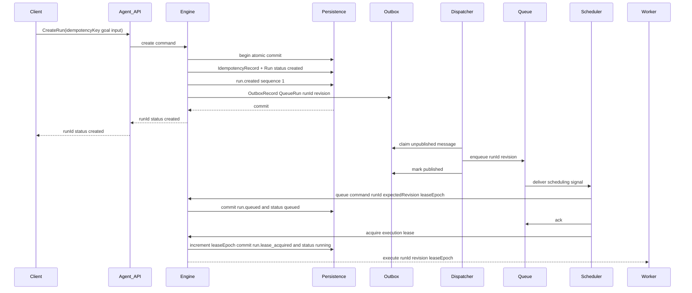

# 02 · Harness 总体架构

## 1. 架构意图与不变量

Harness 是服务端 Agent 的执行控制骨架：接收目标、驱动 Run、约束 Action、协调持久化、隔离副作用并输出可回放 Event。业务能力与基础设施只通过版本化契约和端口接入，核心保持技术中立与业务中立。

架构不变量：

1. **Engine 唯一编排**：Engine 是 Run 生命周期、Step 推进、Hook 调用、Policy 判定、Approval 等待、Tool 派发和恢复的唯一编排者。
2. **Engine 唯一协调提交**：组件只返回候选、判定或 Observation；只有 Engine 可以校验 `expectedRevision` 与 `leaseEpoch`、分配 Event `sequence` 并原子提交 Run、State 和领域记录。
3. **统一 Run 语义**：创建、排队、执行、等待、恢复与终止都使用同一异步 Run；同步等待只是客户端封装。
4. **统一执行内核**：轻量循环与 DAG 只是 Execution Strategy；两者共享 Run、Step、Action、Policy、Approval、ToolCallRecord、Observation、FactEnvelope、Reducer 和 Event Log。
5. **副作用先持久化后派发**：任何外部副作用都必须经过 `Action → Policy/Approval 复核 → PreToolCall → ToolCallRecord prepared → dispatch → Observation → FactEnvelope → Reducer`；PreToolCall veto 或失败不得消费 ApprovalRecord。
6. **依赖单向**：Core 只依赖端口和核心契约；Adapter 与 Capability Pack 依赖核心，不允许核心反向依赖具体实现。

## 2. 逻辑模块

```mermaid
flowchart TB
    subgraph access [Access_Layer]
        Auth[Authn_Authz]
        API[Agent_API]
        Stream[Event_Stream]
    end

    subgraph delivery [Delivery_and_Scheduling]
        Outbox[Transactional_Outbox]
        Dispatcher[Outbox_Dispatcher]
        Queue[Run_Queue]
        Scheduler[Run_Scheduler]
    end

    subgraph kernel [Run_Kernel]
        Engine[Run_Engine]
        Strategy[Execution_Strategy]
        Light[Light_Loop]
        DAG[DAG_Optional]
        Hooks[Hook_Runner]
        Budget[Budget_Guard]
    end

    subgraph cognition [Cognition]
        Context[Context_Builder]
        Knowledge[Knowledge_Port]
        Model[Model_Port]
    end

    subgraph control [Control]
        Policy[Policy_Engine]
        Approval[Approval_Gate]
        Validator[Validator_Runner]
    end

    subgraph execution [Execution]
        ToolRT[Tool_Runtime]
        Sandbox[Sandbox_Port]
        Workspace[Workspace_Port]
        Secret[Secret_Port]
    end

    subgraph state [State_and_Recovery]
        Reducer[State_Reducer]
        Checkpoint[Checkpoint_Manager]
        Persist[Persistence_Port]
        Manifest[ExecutionManifest_Store]
        Idem[Idempotency_Store]
    end

    subgraph extension [Extension]
        Registry[Extension_Registry]
        Packs[Capability_Packs]
    end

    subgraph observability [Observability]
        Audit[Trace_Audit]
        Metrics[Metrics]
        Evaluation[Evaluation_Port]
    end

    Auth --> API
    API -->|commands| Engine
    Engine -->|committed events| Stream

    Engine --> Strategy
    Strategy --> Light
    Strategy --> DAG
    Engine --> Hooks
    Engine --> Budget
    Engine --> Context
    Context --> Knowledge
    Engine --> Model
    Engine --> Policy
    Engine --> Approval
    Engine --> Validator
    Engine --> ToolRT
    ToolRT --> Sandbox
    ToolRT --> Workspace
    ToolRT --> Secret
    ToolRT -->|Observation candidate| Engine
    Hooks -->|contribution veto Observation| Engine
    Approval -->|decision candidate| Engine
    Policy -->|allow deny require_approval| Engine
    Validator -->|Fact decision| Engine
    Engine --> Reducer
    Engine --> Checkpoint
    Engine --> Persist
    Engine --> Manifest
    Engine --> Idem
    Engine --> Registry
    Registry --> Packs

    Persist --> Outbox
    Outbox --> Dispatcher
    Dispatcher --> Queue
    Queue --> Scheduler
    Scheduler -->|enqueue lease wake commands| Engine

    Persist --> Audit
    Audit --> Metrics
    Audit --> Evaluation
```



图中箭头表示调用、候选返回或已提交数据流，不表示被调用模块拥有状态推进权。Policy 只返回 `allow`、`deny` 或 `require_approval`；Approval Gate、Hook、Tool Runtime、Scheduler 和 Strategy 都不能直接执行下一阶段，不能写 State，也不能追加 Run Event。

## 3. 模块职责

### 3.1 接入与投递

| 模块 | 职责 | 禁止 |
| --- | --- | --- |
| Agent API | 鉴权后向 Engine 提交 CreateRun、输入、审批、暂停、恢复和取消命令；提供只读查询 | 不直接写 Run，不直接调用 Tool，不自行分配 Event 顺序 |
| Event Stream | 从已提交 Event 按游标推送 SSE、WS、轮询或消息订阅视图 | 推送成功不作为领域提交条件 |
| Transactional Outbox | 与领域事务原子保存待投递消息 | 不充当 Run 状态或 Event Log |
| Outbox Dispatcher | 认领 Outbox、发布队列消息、记录投递结果 | 不改变 Run 状态；不把发布成功等同于 `run.queued` |
| Run Queue | 提供至少一次的调度信号、可见性超时与 ack/nack | 不作为 Run 真相来源 |
| Run Scheduler | 并发限额、租户公平、补偿扫描、唤醒和执行租约请求 | 只向 Engine 提交命令，不直接推进状态 |

### 3.2 Run Kernel

| 模块 | 职责 | 拥有或产生的内容 |
| --- | --- | --- |
| Run Engine | 唯一编排者和 Event 提交协调者；执行加载、决策、门禁、等待、派发、归约、检查点、恢复与终止协议 | 原子提交计划、Event 顺序、Run/Step 转换 |
| Execution Strategy | 基于已提交 State 与策略游标提出下一 Step、Action 或 DAG 就绪节点 | 计划候选，不直接持久化 |
| Budget Guard | 计算步数、Token、费用、总墙钟、活跃执行和等待计量，返回确定性门禁结果 | 预算判定，不直接终止 Run |
| Hook Runner | 在固定生命周期点执行 Hook，返回 Context 贡献、veto 或 Observation | `HookResult`，不产生隐式 Action |

Engine 对每次可变提交使用同一协议：

```text
load current Run
validate expectedRevision and current leaseEpoch
validate command preconditions
order candidate Events deterministically
allocate contiguous per-Run sequence
persist Events + projections + State + records + optional Outbox/Checkpoint
increment Run.revision exactly once
commit or expose no success
```

非租约阶段的命令也携带当前持久化 `leaseEpoch`；取得或接管执行租约时，Engine 在同一原子提交中严格递增 `leaseEpoch`。任何 Worker 的提交、Tool 派发和结果回送都必须携带取得工作时的 `leaseEpoch`。

### 3.3 Context、Model 与 Knowledge

| 模块 | 职责 | 禁止 |
| --- | --- | --- |
| Context Builder | 在预算与权限内投影 State、近期 Event、可见 Tool、Knowledge 和 PreReasoning Hook 贡献 | 不持久化唯一真相，不接受无来源 Hook 内容 |
| Model Port | 调用冻结 Model Policy，返回结构化模型响应供 Engine 解析为 Action | 不执行副作用，不写 State，不把密钥放入 Context |
| Knowledge Port | 按 `sourceId`、版本、权限、查询和预算返回带来源片段 | 不把查询结果自动视为 Fact 或 State |

### 3.4 Policy、Approval 与 Validator

| 模块 | 输出 | 边界 |
| --- | --- | --- |
| Policy Engine | `allow`、`deny`、`require_approval` 及结构化理由和版本证据 | 不请求审批、不调用 Tool、不推进 Step |
| Approval Gate | 审批命令的身份校验结果与 ApprovalRecord 状态转换候选 | 不消费审批、不恢复 Run、不派发 Tool |
| Validator Runner | 对 Action、Observation、Fact 和 `acceptanceChecks` 的确定性判定 | 不直接写 State；Evaluator 不得替代它 |

Engine 收到 `require_approval` 后创建 ApprovalRecord 并进入等待；收到有效批准后仍由 Engine 重新校验 Action 摘要、资源范围、TTL、Policy 版本和 Manifest。`approved → consumed` 只能由 Engine 与对应 ToolCallRecord `prepared` 原子提交。

### 3.5 Tool Runtime 与 State

| 模块 | 职责 | 禁止 |
| --- | --- | --- |
| Tool Runtime | 按 Manifest 解析 `toolId` 版本，校验 Schema、权限、幂等键、效果契约、超时和资源限制，调用 Tool Adapter | 不编排后续阶段，不写 Event sequence、State 或 Run 状态 |
| State Reducer | 纯函数 `nextState = reduce(previousState, FactEnvelope)` | 不执行 IO，不消费裸 Tool/Hook/用户数据 |
| Checkpoint Manager | 构造绑定 `revision`、Event `sequence`、State 快照和 strategy cursor 的 Checkpoint | 不替代 Event、ApprovalRecord 或 ToolCallRecord |
| Persistence | 提供带乐观并发和租约栅栏的原子提交、读取和投影能力 | 失败时不得对外暴露部分成功 |

Tool 与 Hook 返回的数据先成为 Observation。Engine 记录来源后调用 Schema、权限和业务验证；只有形成 FactEnvelope 才能交给 Reducer。Tool Runtime 或 Hook 不能绕过 `Observation → FactEnvelope → Reducer`。

### 3.6 Extension 与 Observability

| 模块 | 职责 |
| --- | --- |
| Extension Registry | 发现、校验、版本兼容与冲突检测；解析 Capability Pack |
| Capability Pack | 声明 Skill、Tool、Workflow、Hook、Policy、Knowledge、Validator 与 Evaluator |
| Trace/Audit | 消费已提交 Event，校验关联与完整性，生成审计视图 |
| Metrics | 从 Event 和只读投影聚合在线指标 |
| Evaluation Port | 提交轨迹样本、运行离线回归和建议性评测 |

Trace、Metrics 和 Evaluation 都是 Event 消费者。审计输出不可用时不影响已提交 Event 的真实性；若核心 Event 完整性校验失败，Engine 按生命周期协议终止推进。

## 4. 依赖规则

```text
Capability Pack ──depends──► Core Contracts
Infra Adapter   ──depends──► Core Ports
Core            ──depends──► Ports
Core            ──X──► Capability Pack implementations
Core            ──X──► Concrete infrastructure products
```

允许：

- Core → `ModelPort`、`PersistencePort`、`OutboxPort`、`QueuePort`、`LeasePort`、`KnowledgePort`、`WorkspacePort`、`ObjectStorePort`、`SandboxPort`、`SecretPort` 等接口。
- Capability Pack → Tool、Skill、Workflow、Hook、Policy、Validator、Evaluator 契约与受限执行上下文。
- Adapter → 具体基础设施或业务 SDK。

禁止：

- Core import 业务包符号或具体基础设施客户端。
- Strategy、Policy、Approval、Hook、Tool Runtime 或 Scheduler 绕过 Engine 写持久化投影。
- Tool 打开未授权网络、读取其他租户数据或从模型上下文获取长期密钥。
- Queue 消息、内存游标或日志文本充当 Event Log。

## 5. CreateRun 与统一异步语义

### 5.1 CreateRun 协议

客户端必须在租户作用域提供稳定的 CreateRun `idempotencyKey`。幂等与投递记录直接使用 [01-domain-model](./01-domain-model.md#53-idempotencyrecord-与-outboxrecord) 定义的 IdempotencyRecord 和 OutboxRecord。相同键与相同规范化请求摘要返回同一 `runId`；相同键配不同摘要返回 `conflict`。



约束：

- Run、`run.created`、客户端幂等记录和首条 Outbox 消息必须在同一原子边界提交；任一写入失败则 CreateRun 不成功。
- Dispatcher 只保证调度信号最终可见。Scheduler 消费信号或补偿扫描持久化为 `created` 的 Run，再向 Engine 请求 `created → queued`。
- 严格顺序是 `created → queued → running`；入队、队列 lease 或 Worker 启动不能跳过 `queued` Event。
- Queue、Dispatcher、Scheduler 和 Worker 都按 `{runId, revision}` 去重。重复消息若 revision 落后则 ack；相同 revision 的重复命令由 Engine 的 `expectedRevision` 条件提交消除。
- Outbox 长时间未发布、Queue 消息丢失或消费者崩溃时，补偿扫描可重建同一 `{runId, revision}` 信号，不创建新 Run。

### 5.2 同步等待封装

1. Client 按异步协议创建 Run。
2. Client 订阅已提交 Event，阻塞到终态或客户端超时。
3. 客户端超时只结束等待，返回 `runId` 供查询；不取消 Run，除非另行提交取消命令。

不得实现同步专用状态机、直接 Tool 调用或旁路持久化。

## 6. 外部副作用协议

```mermaid
flowchart LR
    A[Action] --> E1[Engine_validates]
    E1 --> P[Policy_evaluates]
    P -->|decision| E2{Engine_handles_decision}
    E2 -->|deny| X[action.rejected]
    E2 -->|require_approval| R[Engine_commits_ApprovalRecord]
    R --> G[Approval_Gate]
    G -->|decision_candidate| E3[Engine_validates_approval]
    E3 -->|approved_and_valid| H[Engine_invokes_PreToolCall]
    E2 -->|allow| H
    H -->|veto_or_failure| X
    H -->|pass| T[Engine_atomic_consume_and_prepare]
    T --> D[Dispatch_with_idempotencyKey_and_leaseEpoch]
    D --> S[succeeded]
    D --> F[failed]
    D --> U[outcome_unknown]
    U --> C[reconcile]
    C --> S
    C --> F
    S --> O[Observation]
    F --> O
    O --> V[Fact_validation]
    V --> RED[Reducer]
```



Policy 与 Approval 复核通过后必须先调用 PreToolCall；veto 或失败时不创建 ToolCallRecord、不消费审批。`ToolCallRecord prepared` 与派发意图必须先持久化。若需要审批，`approval.consumed`、ApprovalRecord `consumed`、ToolCallRecord `prepared` 和派发 Outbox 在同一提交中完成；任何一项失败都不能派发。

- `at_most_once`：Dispatcher 只认领一次持久派发槽。发送后无法得到权威结果时进入 `outcome_unknown`，不得自动重发。
- `at_least_once`：允许重派发，但逻辑调用始终复用同一 `toolCallId` 和 `idempotencyKey`；目标系统或 Adapter 必须按效果契约去重。
- 所有派发携带 `dispatchLeaseEpoch`。派发前再次读取当前 epoch、租约有效期和 Run 状态；不匹配时停止并返回 `lease_lost`。
- `succeeded` 或 `failed` 必须来自权威结果；超时、断连、Worker 失效或取消竞态只能进入 `outcome_unknown`。
- `outcome_unknown` 必须按 ToolEffectContract 对账。相关 Step 和 Run 在未知结果未解决前不得进入 `succeeded`。
- 补偿是已确认副作用的独立业务逆操作，具有独立 Action、审批、ToolCallRecord 和幂等键；它不替代原调用的幂等或对账。

## 7. 端口清单

| 端口 | 最小契约 |
| --- | --- |
| `ModelPort` | `completeStructured(context, schema, modelPolicy) -> model response` |
| `PersistencePort` | 读取 Run/State/Event；以 `expectedRevision + leaseEpoch` 原子提交 Event、Run、State、Step、Checkpoint、ToolCallRecord、ApprovalRecord、Child Run 关联、Artifact 元数据，以及 01 定义的 IdempotencyRecord 和 OutboxRecord |
| `OutboxPort` | 对 01 定义的 OutboxRecord 在领域事务内 append；事务外 claim/publish/mark；按稳定 `dedupeKey` 去重 |
| `QueuePort` | enqueue、lease、ack、nack、延迟可见；至少一次投递；载荷至少含 `runId + revision` |
| `LeasePort` | acquire、heartbeat、validate、release、expire；取得或接管时返回单调递增 `leaseEpoch` |
| `ExecutionManifestStorePort` | 不可变 put/get；按 `executionManifestRef` 与 hash 校验读取 |
| `IdempotencyPort` | 条件创建和查询 01 定义的 IdempotencyRecord，覆盖 CreateRun、Tool 调用及 Child Run namespace |
| `ApprovalPort` | 接收审批请求与决定；ApprovalRecord 的持久状态仍由 Engine 提交 |
| `ToolCallPort` | 查询待派发、未知结果与对账候选；ToolCallRecord 的转换仍由 Engine 提交 |
| `KnowledgePort` | 按来源、版本、权限、查询和预算返回带 provenance 的片段 |
| `WorkspacePort` | list、read、write、search 逻辑工作区；写操作仅供受控 Tool 使用 |
| `ObjectStorePort` | put、get、signedRef；不可变内容哈希与租户隔离 |
| `SandboxPort` | `exec(codeOrCmd, limits) -> bounded result` |
| `SecretPort` | 按主体、Tool 和资源范围注入短时凭证；不进入 Context、Event 明文或 State |
| `EventStreamPort` | 从已提交 sequence 游标读取与推送；支持重放 |
| `EvaluationPort` | 提交轨迹样本与拉取评测任务；不改变生产门禁 |

`PersistencePort` 与 `OutboxPort` 必须能加入同一 Unit of Work；端口可以由同一产品或不同 Adapter 实现，但原子语义不能因部署形态改变。Queue 只提供通知和竞争消费，不承担领域事务或持久真相。

## 8. 部署映射

同一逻辑架构可映射到不同部署，而不改变对象、状态机和提交协议：

| 部署形态 | 映射方式 |
| --- | --- |
| 单进程 | API、Engine、Dispatcher、Scheduler 与 Worker 同进程；本地持久化和队列仍实现端口语义 |
| API + Worker | API 提交命令；共享 Persistence/Outbox；Worker 运行 Engine 执行段 |
| 多 Worker | Run lease、`revision`、`leaseEpoch`、Tool 幂等和对账共同隔离并发与迟到结果 |
| 边缘或专有云 | 替换 Model、Queue、Store、Secret、Sandbox 等 Adapter；契约与 Event 语义不变 |

单体、微服务、数据库和队列产品属于实现选型，不改变本文边界。

## 9. 失败与降级

1. **模型失败**：在冻结的 Model Policy 内有限重试或切换已声明 fallback；耗尽后由 Engine 使 Step 失败。
2. **Policy deny**：Engine 记录 `policy.denied` 与 `action.rejected`；Policy 不执行后续动作。
3. **审批不可用**：保持 `awaiting_approval` 直到决定、TTL 或预算触发；不得默认放行。
4. **Tool 不确定结果**：进入 `outcome_unknown` 并对账；不能以新幂等键盲重试。
5. **持久化提交失败**：该次转换视为未发生，不发布领域成功、不 ack 依赖成功提交的消息；从最后已提交 revision 恢复。
6. **Event 完整性失败**：停止 Run 推进；在可靠持久化可用时由 Engine 提交唯一的失败转换。
7. **流推送失败**：不影响已提交 Event；客户端按 sequence 重放。
8. **Manifest 或 Pack 不可解析**：未创建 Run 时拒绝请求；已创建 Run 在启动或恢复门禁失败时由 Engine 提交 `failed`。

## 10. 架构一致性检查

- [ ] 所有下一阶段都由 Engine 调用，没有 Policy、Approval、Hook、Tool Runtime 或 Scheduler 的直连推进路径
- [ ] 所有 Event、State 和领域记录变更都经过 `expectedRevision + leaseEpoch`
- [ ] CreateRun 的 Run、`run.created`、幂等记录与 Outbox 原子提交
- [ ] `created → queued → running` 不被队列实现细节跳过
- [ ] Queue 至少一次投递与领域幂等、租约栅栏相互独立
- [ ] Tool 副作用满足 prepared-before-dispatch、同键重试、未知结果对账
- [ ] 轻量循环和 DAG 只替换 Strategy，不引入第二套状态、事件或工具链
- [ ] 端口未绑定具体基础设施产品

---

上一篇：[01-domain-model.md](./01-domain-model.md) · 下一篇：[03-run-lifecycle.md](./03-run-lifecycle.md)
