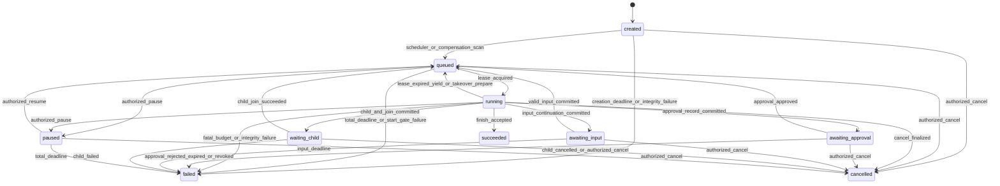
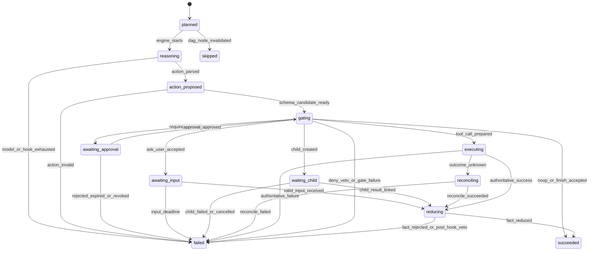
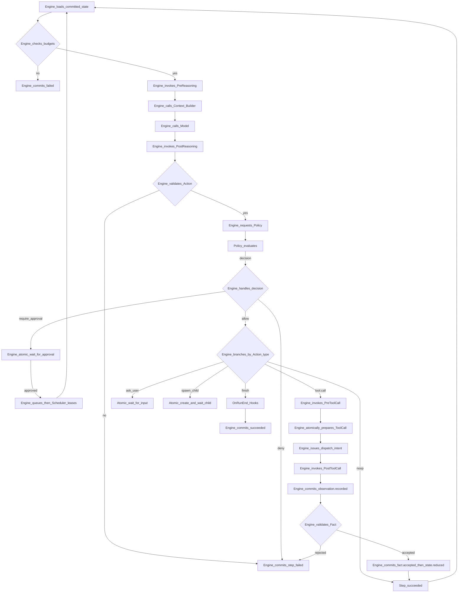
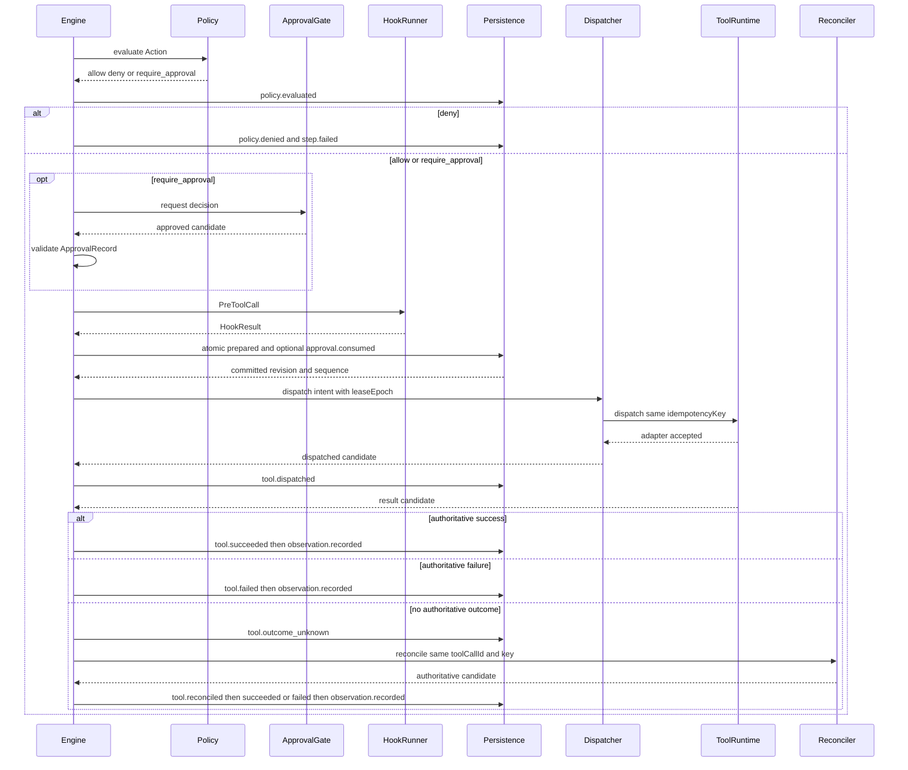
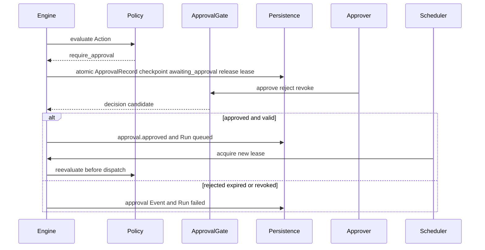

# 03 · 执行循环、状态机与恢复

## 1. 生命周期不变量

- 任意时刻都能从已提交 Run、Event、ToolCallRecord、ApprovalRecord 和 Checkpoint 回答：Run 位于何处、因何停下、谁可以发出推进命令。
- Engine 是唯一编排者与 Event 提交协调者。Policy、Approval Gate、Hook、Tool Runtime、Strategy、Scheduler 和 Worker 都只返回命令、候选、判定或 Observation。
- Run 的所有可变提交同时校验 `expectedRevision` 和 `leaseEpoch`；任何外部副作用派发携带当前 `leaseEpoch`。
- State 只由 Reducer 消费 FactEnvelope 产生；Tool、Hook 和用户输入都不能绕过 `Observation → FactEnvelope → Reducer`。
- Tool、Hook 或用户数据形成 Observation 后，Engine 必须先持久化对应 `observation.recorded`，才能提交该 Observation 的 `fact.accepted` 或 `fact.rejected`；允许同事务提交，但 Event 顺序不可颠倒。
- 每次 Policy 评估都必须提交 `policy.evaluated` 及版本、输入摘要和判定；判定为 deny 时在其后额外提交 `policy.denied`。
- 轻量循环与 DAG 共用一套 Run、Step、Action、Event、租约、副作用和恢复协议。
- 终态不可原地重开。相同目标再次执行必须创建新的 Run，并以关联字段表达关系。

## 2. Run 状态机

### 2.1 状态集合

本节使用 [01-domain-model](./01-domain-model.md#43-run) 定义的完整 Run 状态枚举，不增加别名或隐式状态。

| 状态 | 含义 | 是否持有执行租约 |
| --- | --- | --- |
| `created` | Run、`run.created` 与首条 Outbox 已持久化，尚未完成排队提交 | 否 |
| `queued` | 已具备执行或恢复条件，等待 Scheduler 取得租约 | 否 |
| `running` | 当前 Worker 持有有效租约，Engine 可以推进 Step | 是 |
| `awaiting_approval` | 已持久化审批待续信息，等待 ApprovalRecord 决定 | 否 |
| `awaiting_input` | 已持久化输入 Schema 与待续信息，等待用户输入 | 否 |
| `waiting_child` | 父 Run 已创建 Child Run 并等待 join | 否 |
| `paused` | 经授权显式暂停，保留待续信息但不接受执行推进 | 否 |
| `succeeded` | 完成门禁全部通过，且相关 Tool 不存在未解决的 `outcome_unknown` | 否 |
| `failed` | 确定性失败、预算耗尽、等待超时或不可恢复故障 | 否 |
| `cancelled` | 经授权取消的终态；不表示外部副作用一定未发生 | 否 |

`succeeded`、`failed`、`cancelled` 是终态。终态允许追加遗留 Tool 对账，以及与该 Run 关联的 Confirmation、Retention 和 legal hold 审计 Event；这些 Event 不改变 Run `status`、State 或 strategy cursor，也不会恢复执行 Step。

### 2.2 合法转换



未列出的转换全部非法，尤其禁止：

- `created → running`、等待态直接到 `running`、`paused → running`；
- `running → running` 的租约接管；
- `failed/cancelled → queued`；
- 任意终态转到其他状态。

所有等待态和 `paused` 的唤醒都先提交为 `queued`，再由 Scheduler 请求租约并进入 `running`。`running` 租约过期或接管也先提交 `running → queued`，随后新的租约取得者才能提交 `queued → running`。

### 2.3 转换提交、触发者与 Event

| 转换 | 命令或事实来源 | Engine 的原子提交 |
| --- | --- | --- |
| `created → queued` | Scheduler 的队列信号或补偿扫描 | `run.queued`、`run.status_changed`、新 revision |
| `queued → running` | Scheduler 的 lease 请求 | lease owner/expiry、递增 `leaseEpoch`、`run.lease_acquired`、`run.status_changed` |
| `running → queued` | lease 失效扫描、Worker 主动 yield、接管准备 | `run.lease_lost` 或 yield 原因、`run.queued`、`run.status_changed`、清除 owner |
| `running → awaiting_approval` | Policy 返回 `require_approval` | ApprovalRecord、`approval.requested`、Action 待续信息、Checkpoint、`run.status_changed`、释放 lease |
| `running → awaiting_input` | `ask_user` Action 通过门禁 | 输入要求、Action 待续信息、Checkpoint、`run.status_changed`、释放 lease |
| `running → waiting_child` | `spawn_child` Action 通过门禁 | 父子关联、Child Run、父子 Event、Child Outbox、join 待续信息、Checkpoint、释放父 lease |
| 等待态或 `paused → queued` | 审批通过、有效输入、Child join 成功、授权恢复 | 对应领域 Event、`run.queued`、`run.status_changed`、新 Outbox |
| 活跃态 → `paused` | 授权主体的 pause 命令 | 待续信息、Checkpoint、`run.status_changed`、释放 lease |
| 非终态 → `cancelled` | 授权主体的 cancel 命令或 Child 取消传播 | `run.cancelled`、`run.status_changed`、取消意图和遗留对账引用 |
| `running → succeeded` | Engine 接受 `finish` | `step.completed`、`run.completed`、`run.status_changed`、最终 Checkpoint |
| 非终态 → `failed` | 表 2.4 中唯一失败原因 | `step.failed`（若有活动 Step）、`run.failed`、`run.status_changed`、最终 Checkpoint |

Scheduler、API、Approval Gate 或 Child Run 完成通知只提供命令或候选。它们不能直接写上述记录，也不能分配 Event `sequence`。

### 2.4 终止原因的唯一映射

| 原因 | 唯一状态结果 | 说明 |
| --- | --- | --- |
| 授权主体显式取消 | `cancelled` | 任何非终态均适用 |
| `maxWallTime`、输入 deadline、启动 deadline、等待 deadline 耗尽 | `failed` | 超时不解释为用户取消 |
| ApprovalRecord `rejected`、`expired` 或 `revoked` | `failed` | 审批失败不映射为 `cancelled` |
| Child Run `failed` | 父 Run `failed` | 默认 fail-fast，并尽力取消仍活动的兄弟 Child Run |
| Child Run `cancelled` | 父 Run `cancelled` | 沿父链传播，并尽力取消兄弟 Child Run |
| 必需审计完整性校验失败 | `failed` | 只有 Engine 成功提交后才对外可见 |
| Manifest 不可解析、必需 Pack 缺失、恢复数据不可验证 | `failed` | 不允许用其他版本静默继续 |
| 持久化事务失败 | 保持最后已提交状态 | 本次转换未发生；恢复后以相同业务标识重试 |
| 持久化在运行期限内持续不可用 | `failed`，仅限存储恢复后成功提交 | 无可靠提交时不得对外宣称 Run 已失败或成功 |
| `finish` 门禁不通过 | 当前 Step `failed` | Strategy 可创建新 Step；不直接把 Run 标记成功 |

一个原因不得在不同 Adapter 中映射为不同终态。结构化错误码、直接原因 Event 和版本证据必须进入 `run.failed` 或 `run.cancelled` 载荷。

## 3. revision、租约与 fencing

### 3.1 revision

- 每个改变 Run、State、Step、ToolCallRecord、ApprovalRecord 或 Run Event 序列的原子提交都携带 `expectedRevision`。
- 只有 `expectedRevision == Run.revision` 才能提交；成功后整个事务只令 `Run.revision + 1`。
- 冲突方重新加载最新 Run、Event 尾部、State 和策略游标，重新验证前置条件；不得覆盖获胜事务。
- Event 候选不带自分配 sequence。Engine 在成功事务内从当前最大 sequence 连续分配。

### 3.2 leaseEpoch 与 heartbeat

执行租约的端口级协调元数据至少包括：

```text
lease {
  runId
  ownerId
  leaseEpoch
  acquiredAt
  expiresAt
  lastHeartbeatAt
}
```

该元数据不是领域对象，也不是新的 State 真相。规则如下：

1. `queued → running` 的 lease acquire 与 `Run.leaseEpoch + 1`、`run.lease_acquired` 处于同一原子提交。
2. Worker 保存 `{runId, ownerId, revision, leaseEpoch, expiresAt}`。每次 Engine 提交、Tool 派发、结果回送和 Outbox 派发都携带该 epoch。
3. heartbeat 周期必须小于租约 TTL 的三分之一。heartbeat 只在 owner 与 epoch 均匹配且租约未被判失效时延长 `expiresAt`，不递增 epoch。
4. heartbeat 超时、owner 失联或更高 epoch 可见时，旧 Worker 立即停止模型调用后的提交、Tool 派发和 Step 推进。
5. 失效扫描通过 Engine 提交 `running → queued` 和 `run.lease_lost`；接管者随后取得新租约，epoch 严格递增。
6. 旧 Worker 的迟到 Tool 结果不能作为权威成功提交。它只能由当前 Engine 以待对账 Observation 记录，并按 ToolEffectContract 查询权威结果。
7. 旧 epoch 的未派发 Outbox 不得发送；已发送但结果不明的 ToolCallRecord 转入 `outcome_unknown`。

lease 防止过期 Worker 继续操作；`revision` 防止同一 epoch 内的并发提交覆盖。两者缺一不可。

## 4. Step 状态机

### 4.1 状态集合

本节使用 [01-domain-model](./01-domain-model.md#44-step) 定义的完整 Step 状态枚举，不增加别名或隐式状态。

| 状态 | 含义 |
| --- | --- |
| `planned` | Strategy 已提出 Step，尚未开始生命周期调用 |
| `reasoning` | 执行 PreReasoning、Context 构建、模型调用与 PostReasoning |
| `action_proposed` | 结构化 Action 已形成并记录，等待 Schema 与门禁 |
| `gating` | 执行预算、Action Schema、Policy、Approval 有效性和对应 Hook 门禁 |
| `awaiting_approval` | 当前 Step 等待绑定 Action 的 ApprovalRecord |
| `awaiting_input` | 当前 Step 等待用户输入 Observation |
| `waiting_child` | 当前 Step 等待其 Child Run join |
| `executing` | ToolCallRecord 已 prepared，正在派发或等待权威 Tool 结果 |
| `reconciling` | ToolCallRecord 为 `outcome_unknown`，正在按效果契约对账 |
| `reducing` | Observation 正在验证为 FactEnvelope，并由 Reducer 计算 State |
| `succeeded` | 当前 Step 的确定性完成条件满足 |
| `failed` | 当前 Step 的错误、拒绝、veto 或重试预算已确定 |
| `skipped` | DAG 节点在开始前因上游结果或重规划失效 |

### 4.2 合法转换



终态 Step 不可回到活动状态。Run 从等待态唤醒后恢复同一个等待 Step：先取得新的 Run lease，再从持久化待续阶段继续；它不会创建一个伪造的替代 Step。

### 4.3 触发者与重试身份

| 情况 | 谁提出 | 是否新 Step |
| --- | --- | --- |
| Model 网络错误或已声明 fallback | Model Port 返回错误，Engine 按冻结 Model Policy 决定 | 否；同一 Step，新 `modelCallId` 和 attempt |
| 模型响应无法解析为 Action，仍有解析重试预算 | Engine | 否；同一 Step，新 `modelCallId` |
| Action Schema 最终无效 | Validator 返回判定，Engine 提交 | 当前 Step `failed`；重规划必须创建新 Step |
| Policy `deny` 或 PreToolCall veto | Policy/Hook 返回判定，Engine 提交 | 当前 Step `failed`；若允许换路则新 Step |
| 等待审批、输入或 Child | Engine 进入等待并保存待续信息 | 否；唤醒后继续同一 Step |
| Tool 的 `at_least_once` 派发重试 | Engine 按 ToolEffectContract 决定 | 否；同一 Step、`toolCallId`、`idempotencyKey`，attempt 增加 |
| Tool `outcome_unknown` 对账 | Engine 调用 reconcile | 否；同一 Step 和 ToolCallRecord |
| Tool 已确定失败后 Strategy 换工具或参数 | Strategy | 是；新 Step、新 Action、新 ToolCallRecord |
| DAG 节点因 revision 冲突需重算且尚未产生副作用 | Engine 请求 Strategy 重算 | 保持同一 Step identity，更新未提交候选 |
| 已提交 Step 失败后再次尝试业务目标 | Strategy | 是；通过 causation 关联失败 Step |

重试预算属于 Run budgets，并按实际 ModelCall、Tool attempt 和 Step 分别计量。新 Step 不能用于规避 `maxSteps`、幂等、审批或预算。

## 5. 标准循环与 Hook

### 5.1 生命周期顺序

```text
while Run is running and lease is valid:
  1. Load Run, State, strategy cursor, pending records and Event tail
  2. Check total, active, awaiting, step, token and cost budgets
  3. Strategy proposes the next Step
  4. Invoke PreReasoning Hooks
  5. Context Builder selects valid Hook contributions and builds Context
  6. Call Model and parse one Action
  7. Invoke PostReasoning Hooks
  8. Validate Action Schema and Agent toolAllowlist
  9. Ask Policy for allow, deny or require_approval and commit policy.evaluated; deny also commits policy.denied
 10. If require_approval, atomically checkpoint and enter awaiting_approval
 11. Branch by Action type
 12. Persist observation.recorded, then validate Observations into FactEnvelopes and run Reducer
 13. Serially commit Events, records, State and strategy cursor
 14. Save Checkpoint when required
 15. Evaluate finish, wait, retry, yield, pause, cancel or failure
```



### 5.2 Hook 契约

| Hook 点 | Engine 调用时机 | 允许作用 |
| --- | --- | --- |
| `PreReasoning` | Strategy 选定 Step 后、Context 定稿前 | 返回 Context 贡献、veto、Observation；Context Builder 按来源、权限、TTL、优先级和预算选择贡献 |
| `PostReasoning` | Model 响应已记录并解析出 Action 后、Policy 前 | veto 当前 Action，或返回 Observation；不能改写 Action |
| `PreToolCall` | Policy 已允许或批准已验证后、ToolCallRecord `prepared` 前 | veto 派发，或返回 Observation；veto 时不得消费 ApprovalRecord |
| `PostToolCall` | 收到权威 Tool 结果或一次对账结果后、Fact 验证前 | 返回 Observation 或 veto Step 成功；不能撤销已发生副作用 |
| `OnRunEnd` | Engine 准备提交 `succeeded`、`failed` 或 `cancelled` 前 | 生成最终 Observation；veto 只可阻止 `succeeded`，不可阻止安全失败或取消 |

每次 Hook 调用都记录 `hook.invoked`，并按结果记录 `hook.context_contributed`、`hook.vetoed`、`hook.observation_emitted` 或 `hook.failed`。

Hook 返回 Observation 时，`hook.observation_emitted` 只表示 Hook 产出候选。Engine 必须为每条候选创建 Observation 并先提交 `observation.recorded`；只有随后提交的 `fact.accepted` 才能进入 Reducer，拒绝则提交 `fact.rejected`。该规则适用于五个 Hook 点，包括 OnRunEnd 的最终 Observation。

超时与失败语义：

- Hook 的版本、deadline、输入摘要和资源权限来自冻结 Capability Pack。超时按 `hook.failed` 处理。
- PreReasoning、PostReasoning 或 PreToolCall 失败会使当前 Step `failed`；失败不能产生默认 Context、默认授权或继续派发。
- PostToolCall 失败不抹去 Tool 结果；Tool Observation 仍走 Fact 验证，当前 Step 在结果归约后标记 `failed`。
- OnRunEnd 失败或 veto 阻止 `succeeded`；对于 `failed`、`cancelled` 只记录 Hook 失败，不能阻塞终止。
- Hook Observation 与 Tool/User Observation 使用相同验证链。Hook 不得直接调用 Tool、创建审批、写 Checkpoint、分配 Event sequence 或推进下一阶段。

Policy 只返回 `allow`、`deny`、`require_approval`。Hook veto 不能转化为 Policy allow，Approval approved 不能跳过 PreToolCall，Policy allow 也不能跳过 Hook 或 ToolEffectContract。

### 5.3 Confirmation 门禁

`approvalMode` 在 Policy 结果之上只能增加确认，不能放宽 `require_approval` 或 `deny`：

1. Policy 返回 `deny` 时立即拒绝，不查询或创建 ConfirmationGrant。
2. Policy 返回 `require_approval` 时创建当前 Action 专属的 ApprovalRecord；已有 ConfirmationGrant 不参与放行，也不因该次审批创建可复用 Grant。
3. Policy 返回 `allow` 且模式为 `auto` 时不增加人工确认。
4. Policy 返回 `allow` 且模式为 `always` 时，每个 Action 都创建新的 ApprovalRecord，并按普通审批等待、复核和单次消费。
5. Policy 返回 `allow` 且模式为 `confirm_once` 时，Engine 按 01 的完整作用域查询 active ConfirmationGrant。匹配 Grant 可继续门禁；不存在匹配项时创建 `requestKind=mode_confirm_once` 的 ApprovalRecord，进入 `awaiting_approval`。`always` 创建的额外审批使用 `requestKind=mode_always`，Policy 强制审批使用 `requestKind=policy_required`。
6. 首次确认批准并重新取得 lease 后，Engine 重新执行 Policy 与作用域校验。对 `tool.call`，只有 PreToolCall 通过后，才能在同一事务中提交 ApprovalRecord `consumed`、新 ConfirmationGrant、`confirmation.granted`、`confirmation.used`、Grant `useCount`、ToolCallRecord `prepared` 与派发 Outbox。对无外部副作用的 Action，Grant 创建与首次使用和该 Action 的确定性提交原子完成。
7. 复用既有 Grant 时，每次都重新校验 tenant、principal、Session、运行配置、Action pattern、资源、Policy/Manifest 版本和 TTL。对 `tool.call`，`confirmation.used` 与 `useCount` 只在 PreToolCall 通过后和 `prepared` 同事务提交；veto、版本冲突或派发前失败不得计为使用。
8. 到期或撤销的 Grant 不能放行。Engine 在当前 Run 中记录 `confirmation.expired` 或 `confirmation.revoked`；没有当前 Run 的主动撤销与定时过期写入 01 定义的 GovernanceEventEnvelope。

ConfirmationGrant 的创建 Run、首次 Action 与后续使用 Run 都通过 `confirmationGrantId`、`correlationId` 和 Grant revision 关联。任何 Grant 条件写冲突都使当前事务不发生，并从最新记录重新门禁。

## 6. Action 分支

所有 Action 先记录 `action.proposed`，通过 Schema、allowlist、预算和 Policy 后才记录 `action.accepted`；拒绝记录 `action.rejected`。

每次首次门禁、审批唤醒后的复核和派发前复核都视为独立 Policy 评估，必须各自提交 `policy.evaluated`；每次 deny 都在对应 `policy.evaluated` 后提交 `policy.denied`。

### 6.1 `tool.call`

1. 校验 `calls[]`（或兼容的顶层 `toolId`）中每条调用的参数、资源范围、Execution Manifest 中的精确 Tool 版本和 ToolEffectContract。
2. Policy **按条**判定每条调用，聚合成 Action 级 `all_allow` / `partial` / `all_deny` / `require_approval`；默认非原子，一条 `deny` 只拒绝该条。先提交 `policy.evaluated`（含逐条 `callResults`）；`all_deny` 时提交 `policy.denied` 并结束 Step；`require_approval` 时整批等待审批。
3. 有批准时重新计算 `actionDigest`（基于规范化 `calls[]`），校验 TTL、资源范围、审批人、Manifest 和 Policy 版本。
4. 调用 PreToolCall（整 Action 级 veto）；veto 或失败时不消费审批。
5. 仅为 allow（及审批后非 deny）的调用扇出：Engine 原子提交对应 ToolCallRecord `prepared`（`toolCallId` 含调用下标）、`namespace=tool_call` IdempotencyRecord、`tool.call_prepared` 与派发 OutboxRecord；有审批时同事务提交 `approval.consumed`（绑定整批 `toolCallIds`）。
6. Dispatcher 在 epoch 和 lease 有效时派发。Runtime 只返回执行结果候选。
7. Adapter 接受派发后，Dispatcher 向 Engine 返回候选；Engine 先提交 `tool.dispatched`，再接收并提交 `tool.succeeded`、`tool.failed` 或 `tool.outcome_unknown`。
8. **Step 闭合**：同一 `actionId` 下已 prepared 的兄弟 ToolCall 全部进入 `succeeded` 或 `failed` 后，才提交一次 `step.completed` 或 `step.failed`（`outcome_unknown` 仍算未闭合）。存在 `prepared` / `dispatched` 时不得再次调用模型。
9. 权威 Tool 结果先形成 Observation；PostToolCall 的每条数据也形成独立 Observation。每条 Observation 都先提交 `observation.recorded`，随后才能提交 `fact.accepted` 或 `fact.rejected`；只有接受后的 FactEnvelope 交给 Reducer。

### 6.2 `ask_user`

Engine 在一个原子边界提交：

- `action.accepted`；
- 当前 Step `awaiting_input`；
- 所需输入 Schema、提示引用、输入 deadline、`actionId` 和 resume phase；
- 绑定提交后 `revision`、最后 `sequence` 与 strategy cursor 的 Checkpoint；
- Run `awaiting_input` 与租约释放。

用户输入由 API 作为命令提交。Engine 校验主体、tenant、Schema、deadline 和重复 input id，创建用户 Observation 并提交 `observation.recorded`；有效输入唤醒为 `queued`。取得新租约后，同一 Step 才提交该 Observation 的 `fact.accepted` 或 `fact.rejected`，接受时从 Reducer 继续。唤醒事务可以同时提交 `observation.recorded` 与后续 Event，但 sequence 必须保持 Observation 在 Fact 之前。

### 6.3 `finish`

`finish` 被接受当且仅当：

1. Action Schema 合法且 Policy 返回 `allow`；
2. Agent Definition 的全部 required `acceptanceChecks` 由对应 Validator 通过；
3. 必需 Artifact 与 Fact 已存在且引用可验证；
4. 相关 Step 不存在 `executing` 或 `reconciling` ToolCallRecord；
5. Run 内不存在未解决且与完成声明相关的 `outcome_unknown`；
6. OnRunEnd 未失败且未 veto 成功。

Engine 将检查输入、Validator 版本、判定和证据写入 Event，再原子提交 Step `succeeded`、Run `succeeded`、`run.completed` 与最终 Checkpoint。Evaluator 分数不能代替 required `acceptanceChecks`。

### 6.4 `spawn_child`

通过第 9 节的父子协议创建 Child Run。父 Run 的当前 Step 进入 `waiting_child`，Run 进入 `waiting_child` 并释放租约。Child 完成后必须先显式链接 Artifact 或接受后的 FactEnvelope，父 Run 才能 join。

### 6.5 `noop`

`noop` 记录理由、`action.accepted` 和 `step.completed`，不产生 Observation 或 State 变化。它仍消耗 Step、Token、费用和活跃执行预算；连续 noop 上限耗尽使 Run `failed`，避免无进展循环。

## 7. 外部副作用、重试与对账

### 7.1 状态协议



### 7.2 投递语义

- `at_most_once`：prepared 后只允许一个持久派发槽。发送调用后若没有权威结果，必须进入 `outcome_unknown`；不得自动再次调用目标系统。
- `at_least_once`：允许重派发同一逻辑调用，但必须复用 `toolCallId`、`idempotencyKey`、规范化输入摘要和资源范围。每次 attempt 都记录 `tool.dispatched`。
- 相同逻辑调用在租约恢复、进程重启和网络重试时不得生成新幂等键。
- `compensationToolRef` 是已确认副作用的独立逆操作。补偿拥有新的 Action、ToolCallRecord、审批与幂等键；不能代替原调用的幂等和对账。
- `outcome_unknown` 未解决时，相关 Step 保持 `reconciling`，Run 不得 `succeeded`。对账不支持但契约要求自动恢复时，该 Tool 不得进入执行路径。

### 7.3 取消竞态

1. Engine 先提交取消意图，Worker 和 Tool Runtime 尽力发送中止信号。
2. 明确未派发时，ToolCallRecord 可确定失败，Run 提交 `cancelled`。
3. 已派发且中止结果不明时，ToolCallRecord 进入 `outcome_unknown` 并启动对账。
4. 在取消宽限期内，Run 可保持 `running` 完成有界对账；宽限期耗尽后可提交 `cancelled`，并保留遗留对账任务。
5. 终态后的对账只更新 ToolCallRecord、Observation、Artifact 和 Event，不改变 Run 终态；若确认副作用发生，按独立 Policy 决定是否提出补偿 Action。

`cancelled` 表示 Harness 不再推进业务 Step，不表示远端系统必然没有效果。

## 8. Event、Reducer 与 DAG 并发

### 8.1 单 Run 顺序

- `sequence` 只在单个 Run 内严格递增；父 Run 与 Child Run 不定义全局顺序。
- Engine 是唯一 sequence 分配者。Worker、Tool、Hook、Policy、Approval Gate 和并行 DAG 节点只产生候选。
- 一个事务只提交当前单一生命周期阶段，不跨越后续外部调用；其 Event 只按 `eventOrderingVersion` 的固定顺序排列：命令接受 → 当前阶段前置记录 → 当前阶段领域结果（Hook、Model、Action、Policy、Approval、Tool、User Input 或 Child Run）→ `observation.recorded` → `fact.accepted`/`fact.rejected` → `state.reduced` → Step/Run 状态 → `checkpoint.saved` → Outbox。可选阶段没有事件时直接跳过；Policy 阶段内 `policy.evaluated` 固定早于可选的 `policy.denied`。
- 同一 Observation 的 `observation.recorded` 必须早于其 Fact Event；有 `fact.accepted` 和 State 变化时，`fact.accepted` 必须早于 `state.reduced`。不产生 State 变化的 `fact.rejected` 不生成 `state.reduced`。
- 单个 Run 的一个事务最多提交一个并行 Step candidate 及其所属生命周期 Event，不在同一事务混合多个并行 Step。事务内无需 DAG 拓扑排序键；`occurredAt` 只记录发生时间，不决定回放顺序。
- 不同事务的顺序由成功提交的 revision 决定。先取得 revision 的事务先获得 sequence。

### 8.2 并行节点提交

每个并行候选至少携带：

```text
{
  runId
  stepId
  baseRevision
  leaseEpoch
  dependencyStepIds[]
  causationIds[]
  candidateHash
}
```

提交规则：

1. Engine 串行提交单个 Run 的事务，每个事务最多接受一个并行 Step candidate。多个候选基于同一 `baseRevision` 竞争同一 revision 时，只有一个能成功，其余候选不得合并进获胜事务。
2. 冲突候选重新加载最新 State、Event 尾部和 DAG cursor，检查依赖仍为 `succeeded`、输入 Fact 未失效、预算仍足够。
3. 未产生副作用的候选可在同一 Step identity 下重算；不满足前置条件则在尚未开始时 `skipped`，或在已开始时 `failed`。
4. 已派发 Tool 的结果不能因 revision 冲突而丢弃或重新执行。Engine 以同一 ToolCallRecord 重新绑定最新 revision，先记录 Observation，再重新执行 Fact 验证和 Reducer。
5. 影响同一 State 路径的 Fact 不使用 last-write-wins。Reducer 按 sequence 串行应用；若后一个 Fact 的业务前置条件已失效，则产生 `fact.rejected`，Strategy 基于新 State 重算。
6. stale `leaseEpoch` 的候选不能走普通冲突重算，只能进入 fencing 和待对账路径。

每个 `planned → reasoning` 提交 `step.started`；进入 `succeeded` 提交 `step.completed`；进入 `failed` 提交 `step.failed`。`skipped` 使用 `step.completed` 并在结构化结果中标记 `outcome=skipped`，不引入另一套 DAG Event。

### 8.3 DAG 不是第二内核

- DAG 节点是 Step，边是 Fact、Artifact 或控制依赖。
- DAG cursor 与 light cursor 都进入同一 Checkpoint；DAG 不拥有独立 Event Store、State Store 或 Tool 调度器。
- 所有节点都经过相同 Hook、Policy、Approval、ToolCallRecord、Observation、FactEnvelope 和 Reducer。
- 增量重规划只改变未开始的下游节点；已提交 Event、已派发 Tool 和已接受 Fact 不可删除。
- Strategy 类型与版本由 `Run.strategy` 和 Execution Manifest 固定。允许切换时也必须由 Engine 提交明确 cursor 迁移，不能换用不兼容状态存储。

## 9. Child Run 契约

Child Run 能力在 MVP 中不启用；核心对象、持久化 Schema、Policy 门禁和恢复协议保留以下完整契约，启用时不改变父 Run 语义。

### 9.1 创建与隔离

- `spawn_child` Action 必须包含 `childSpec.goal` 和不宽于父 Run 的 `delegationScope`。
- Child 创建幂等键由 `{parentRunId, parentStepId, spawnActionId, childSpecDigest}` 规范化派生。重复命令返回同一 `runId`；摘要冲突返回 `conflict`。
- Engine 在一个原子事务中提交父 Run `child_run.spawn_requested`、`namespace=child_run` 的 IdempotencyRecord、父子关联、Child Run `status=created`、Child 的 `run.created`、父 Run 的 `child_run.created`、Child OutboxRecord、父 Step/Run `waiting_child`、join 待续信息和父 Checkpoint。
- Child Run 具有独立 `runId`、State、Event sequence、revision、leaseEpoch、budgets 和 Checkpoint；只共享 `tenantId`、`sessionId`、`rootRunId` 与显式关联。
- Child 的 Manifest 必须等于父 Manifest 的权限子集或由受控解析器生成的不可变子集；Tool、Knowledge、Secret、资源范围和预算只能收紧，不能扩权。

### 9.2 join 与结果回传

- 父 Run 不读取 Child 的可变 State 或隐式 Context。
- Child 成功时，Engine 记录 `child_run.completed`，将结果以不可变 `artifactId` 或经验证的 FactEnvelope 显式链接，并记录 `child_run.result_linked`。
- 只有全部必需结果链接完成，父 Run 才从 `waiting_child → queued`。父 Step 在取得新租约后从 `waiting_child → reducing`。
- Child `failed` 触发父 Run `failed`；Child `cancelled` 触发父 Run `cancelled`。父终止后，仍活动的兄弟 Child 收到尽力取消命令。
- 父 Run 取消必须向全部非终态 Child 传播取消；传播失败进入孤儿回收队列，不阻塞父 Run 最终取消。

### 9.3 限制与孤儿回收

- Policy 在创建前检查 `maxChildDepth`、每父 Run Child 总数、同时活动 Child 数、租户并发、剩余 Token/费用/墙钟和资源范围。
- `depth` 必须等于父 `depth + 1`；超过上限时 Action 被拒绝，不创建 Child。
- Scheduler 扫描以下孤儿条件：父 Run 不存在、父已终态而 Child 仍活动、父不再持有对应 join、Child 超过 deadline。
- 孤儿回收通过 Engine 提交取消命令；不得直接删除 Child、父子 Event 或 Artifact。
- Child 的总墙钟、活跃执行和等待计量独立记账，同时计入根 Run 的聚合上限，不能通过派生规避预算。

## 10. Budget 与时间语义

### 10.1 三类时间

| 计量 | 起止与包含范围 | 等待是否计入 |
| --- | --- | --- |
| total wall time | 从 `run.created` 的 `recordedAt` 到终态提交；包括 created、queued、running、全部等待和 paused | 全部计入；对应 Agent Definition `maxWallTime` |
| active execution time | Run 处于 `running` 且持有有效租约的时间；包括 Context、Model、Hook、Policy、Tool 派发和同步对账 | 不计 queued、等待态、paused |
| awaiting time | Run 处于 `awaiting_approval`、`awaiting_input`、`waiting_child` 的累计时间 | 只计三种等待；不计 queued、running、paused |

`paused` 停止 active 和 awaiting 计量，但仍计入 total wall time。`queued` 只计 total wall time。外部 Tool 已派发后，即使取消信号已发送，只要 Run 仍为 `running`，对账时间计入 active execution time。

### 10.2 预算检查

- `maxSteps`、`maxTokens`、`maxCost`、`maxWallTime` 来自 Agent Definition 并冻结到 Run budgets。
- active execution 与 awaiting time 始终计量；若配置对应上限，Budget Guard 在进入阶段前、heartbeat、阶段完成后和唤醒时检查。
- 等待记录还必须带独立绝对 deadline；较早到期的预算或 deadline 决定失败时间。
- Budget Guard 只返回判定。Engine 记录证据并提交 Run `failed`；Budget Guard 不直接改状态。
- 降级只能选择 Manifest 中已声明且不放宽安全条件的 Model 或 Strategy 路径。预算耗尽不能通过创建 Child、新 Step 或新幂等键绕过。

## 11. Checkpoint 与恢复

### 11.1 Checkpoint 绑定

```text
Checkpoint {
  runId
  executionManifestRef
  revision
  sequence
  stateRef
  stateHash
  strategy {
    type
    version
    cursorRef
    cursorHash
  }
  activeStepRef?
  continuationRef?
  createdAt
  hash
}
```

`continuationRef` 指向以下不可变、内容寻址对象：

```text
Continuation {
  schemaVersion
  continuationId
  tenantId, sessionId, runId
  kind                       // approval | input | child_join | paused
  stepId
  actionId?
  resumePhase
  inputSchemaRef?            // kind=input 时必填
  approvalId?                // kind=approval 时必填
  childRunIds[]?             // kind=child_join 时必填且非空
  deadline?
  strategyCursorRef
  strategyCursorHash
  createdAt
  hash
}
```

`resumePhase` 必须是对应 Step 状态机中可恢复的固定阶段标识，不能携带可执行代码。Continuation 的 kind 与 Run/Step 等待状态必须一一对应；`approvalId`、`inputSchemaRef`、`childRunIds` 及 deadline 的存在性按 kind 校验。恢复时必须验证 tenant、Run、Step、Action、strategy cursor 与内容 hash，任何不匹配都停止推进。

`revision` 和 `sequence` 是包含 `checkpoint.saved` 的提交完成后的值；strategy cursor 与该 revision 下的 State 一致。Checkpoint 在以下边界保存：

- 每 N 个已完成 Step；
- 进入 `awaiting_approval`、`awaiting_input`、`waiting_child` 或 `paused` 前；
- Strategy cursor 迁移；
- Run 进入终态；
- 持久化策略要求的高价值 Tool 结果之后。

### 11.2 恢复顺序

1. 加载 Run、Execution Manifest、最新 Event sequence、ToolCallRecord、ApprovalRecord 和 lease 元数据。
2. 校验 Manifest hash 可解析且版本与 Run 一致；失败则停止执行并由 Engine 提交 `failed`。
3. 选择 hash 有效、`checkpoint.revision <= Run.revision`、`checkpoint.sequence <= Event max sequence` 且对应 Event 存在的最新 Checkpoint。
4. 从 Checkpoint 加载 State 与 strategy cursor，再按 sequence 重放 `checkpoint.sequence + 1` 到 Event 尾部。
5. 无有效 Checkpoint 时，从 `run.created` 开始重建 State、策略游标和领域投影；Event Log 是真相来源。
6. 交叉核对 ToolCallRecord、ApprovalRecord、Artifact 引用和幂等记录。Event 与投影不一致时停止推进，不猜测状态。
7. 若 Run 为等待态或 `paused`，保持该状态，不获取执行租约、不重放副作用。
8. 若 Run 为 `running` 且租约失效，Engine 提交 `running → queued`；若租约仍有效，只允许相同 owner/epoch 继续。
9. 对 `prepared`、`dispatched`、`outcome_unknown` ToolCallRecord 按 delivery semantics 恢复：未派发可继续；`at_most_once` 的未知发送不重发；`at_least_once` 只以同一键重派发；未知结果先对账。
10. 只有 `queued` Run 才能取得新租约进入 `running`。

Context 不属于恢复真相，恢复后由 Context Builder 依据 State、Event、Knowledge 和 Hook 重新构建。

## 12. 创建、等待与完成时序

### 12.1 CreateRun

CreateRun 使用客户端租户作用域 `idempotencyKey`。Run、`run.created`、01 定义的 `namespace=create_run` IdempotencyRecord 和首条 OutboxRecord 原子提交；Dispatcher 入队；Scheduler 或补偿扫描请求 `created → queued`；取得 lease 后才进入 `running`。所有重复投递和消费按 `{runId, revision}` 去重，完整时序见 [02-core-architecture](./02-core-architecture.md#51-createrun-协议)。

### 12.2 审批等待



Approval Gate 不恢复 Run。批准只令 Engine 将 Run 唤醒到 `queued`；Tool 派发前还要重新执行 Policy、PreToolCall 与 ApprovalRecord 消费协议。

### 12.3 持久化与审计故障

- 原子事务失败意味着该批 Event、State、Checkpoint 和状态转换均未发生。调用方不得返回领域成功，也不得 ack 依赖该提交的队列消息。
- Event hash、sequence、引用或租户边界不一致属于完整性故障。Engine 停止新 Model/Tool 调用；在可靠提交可用时记录证据并使 Run `failed`。
- Trace、Metrics 或 Evaluation 下游不可用不改变 Event Log；通过 Outbox 重放，不让观测 Adapter 接管 Run 状态。

## 13. 生命周期一致性检查

- [ ] 状态集合包含 `created`、`queued`、`running`、三种等待、`paused` 与三个终态
- [ ] 所有等待和暂停只唤醒到 `queued`，租约接管不出现 `running → running`
- [ ] 等待前原子保存 Event、Checkpoint、待续信息并释放 lease
- [ ] 每个 Step 转换有唯一 Engine 提交点，重试身份明确
- [ ] 五个 Hook 点的顺序、timeout、veto 和 `hook.failed` 语义闭合
- [ ] 五类 Action 均有门禁、持久化和恢复路径
- [ ] `outcome_unknown` 未解决时不能成功，取消后仍可对账
- [ ] DAG 并行结果由 Engine 串行提交，revision 冲突会重算而非覆盖
- [ ] Child Run 权限与预算只收紧，join、传播与孤儿回收闭合
- [ ] Checkpoint 与 revision、sequence、strategy cursor 一致，Event 可独立重建

---

上一篇：[02-core-architecture.md](./02-core-architecture.md) · 下一篇：[04-extension-model.md](./04-extension-model.md)
