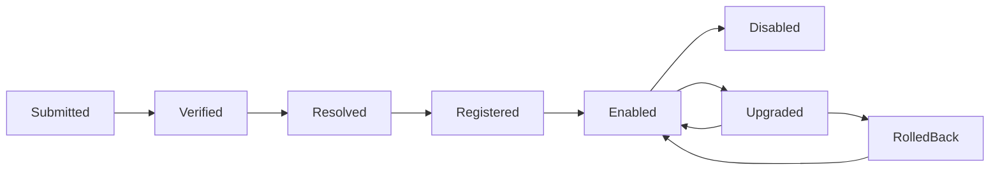

# 04 · 业务扩展协议

## 1. 目标与不变量

Capability Pack 在不改变 Harness Core 对象、状态机和提交协议的前提下提供业务能力。Pack 只声明版本化扩展及其实现绑定，Core 只依赖 [01-domain-model](./01-domain-model.md) 定义的 Skill、Tool、Workflow、Hook、Policy、Knowledge Source、Validator 和 Evaluator 契约。

扩展系统遵守以下不变量：

1. 所有 Tool 统一以 `toolId` 标识；领域 Action 使用 `type=tool.call` 与 `calls[].toolId`（批次 N≥1；顶层 `toolId` 仅兼容 N=1 旧形状）。
2. Pack、Tool、Hook 和 Agent 获得的权限只能逐层收紧，不能扩大平台或租户授权。
3. Policy 的组合结果只能保持或提高限制强度，不能把 `deny` 或 `require_approval` 放宽为 `allow`。
4. Hook 只返回 Context contribution、veto 或 Observation；Hook 不是隐式 Tool、Reducer、审批器或 Event 提交者。
5. 有副作用的 Tool 全部使用 `ToolEffectContract`；补偿不替代幂等和对账。
6. Run 只使用冻结到 Execution Manifest 的精确 Pack、Tool、Policy、Schema 与 Knowledge 版本。

## 2. Capability Pack Manifest

### 2.1 标识与命名空间

- `packId` 使用稳定的反向域名或组织命名空间，例如 `com.example.ticket-ops`。
- Pack 内未使用全局标识的对象必须解析为 `{packId}/{localId}`；`toolId`、`skillId`、`workflowId`、`hookId`、`policyId`、`validatorId`、`evaluatorId` 和 `sourceId` 在解析后全局唯一。
- 标识符不可复用。语义变化通过版本表达，显示名称不能充当引用。
- Pack、依赖和贡献对象使用语义化版本。破坏 Schema、权限、效果契约或确定性语义的变化必须提升 major。

### 2.2 Manifest Schema

```text
CapabilityPackManifest {
  schemaVersion
  packId
  version
  displayName
  publisher {
    publisherId
    provenanceRef
    signatureRef?
  }
  coreContractRange
  dependencies[] {
    packId
    versionRange
    optional
  }
  permissionsRequested[]
  contributes {
    agentFragments[]
    skills[]
    tools[]
    workflows[]
    hooks[]
    policies[]
    knowledgeSources[]
    validators[]
    evaluators[]
    evalSuites[]              // 07 定义的完整 EvalSuite 对象
  }
  artifactDigest
}
```

Manifest、实现产物和 Schema 都必须内容寻址并校验摘要。解析结果写入不可变 Execution Manifest；Run 启动后不得切换 Pack 版本或实现摘要。

## 3. 组件契约

### 3.1 Skill

```text
Skill {
  schemaVersion
  skillId, version, summary
  whenToUse[]
  inputSchema, outputSchema
  toolDeps[]                 // toolId 列表
  workflowRef? { workflowId, version }
  promptAssets[] { ref, hash }
  riskHints[]
  evalSuiteRefs[] { evalSuiteId, version }
}
```

Skill 是给模型的任务级 guide，说明适用条件、方法和可用能力。Skill 不可执行 IO、持有密钥、直接产生副作用或写 State。执行面不存在 `skill.invoke` Action；Action 类型始终是 `tool.call | ask_user | finish | spawn_child | noop`。

### 3.2 Tool

Tool Schema 直接采用 01 的定义：

```text
Tool {
  schemaVersion
  toolId, version, description
  inputSchema, outputSchema
  riskLevel                  // read | write_low | write_high | forbidden
  timeoutMsMax
  permissions[]
  errorCodes[]
  effectContract: ToolEffectContract
}
```

`ToolEffectContract` 的字段与语义由 [01-domain-model](./01-domain-model.md#72-tooleffectcontract) 唯一定义。关键约束：

- `sideEffectProfile != none` 的每次逻辑调用都必须在派发前具有稳定 `idempotencyKey`。
- Tool Runtime 按 `idempotencyScope`、`keyDerivation` 和规范化版本生成或验证幂等键。
- 恢复、重试和租约接管复用同一 `toolCallId` 与 `idempotencyKey`。
- `compensationToolRef` 是已确认副作用的独立业务逆操作，具有自己的 Action、ApprovalRecord、ToolCallRecord 和幂等键；它不能替代原调用的幂等或 `outcome_unknown` 对账。

### 3.3 Workflow

```text
Workflow {
  schemaVersion
  workflowId, version
  nodes[] {
    nodeId
    deps[]
    actionTemplate?          // 产生一个 01 定义的 Action
    skillRef? { skillId, version }
    inputSelector?
    completionValidatorRef? { validatorId, version }
  }
  onNodeFailure              // fail_run | retry | replan_downstream
}
```

每个节点必须且只能选择 `actionTemplate` 或 `skillRef`：

- `actionTemplate` 由 Workflow 确定性地产生一个 Action。
- `skillRef` 表示使用该 Skill guide 完成一次模型推理 Step；模型响应仍解析为一个标准 Action，并完整经过 Schema、Policy、Approval、Tool Runtime、Observation、FactEnvelope 和 Reducer。

Workflow 节点就是 [03-run-lifecycle](./03-run-lifecycle.md) 定义的 Step，进度由统一 strategy cursor、State、Checkpoint 和 Event 表达。Workflow 不拥有独立状态库、工具调度器或 Event 序列。

### 3.4 Hook

```text
Hook {
  schemaVersion
  hookId
  version
  mountPoint                 // PreReasoning | PostReasoning | PreToolCall | PostToolCall | OnRunEnd
  handlerRef                 // 内容寻址的内置处理器或隔离扩展入口
  trustLevel                 // trusted_builtin | isolated_extension
  timeoutMs
  permissions[]
  inputSchema
  outputSchema               // 必须兼容 HookResult
  order {
    phase                    // before | normal | after
    value                    // 有符号整数，仅在同 phase 内排序
  }
}
```

`HookResult` 只能包含：

```text
HookResult {
  contextContributions[]? {
    contentRef
    hash
    priority
    ttl
    provenance
    sensitivity?
  }
  veto? {
    code
    reason
    policyRef?
  }
  observations[]? {
    declaredSchemaRef?
    data?
    dataRef?
    hash
    sensitivity?
  }
}
```

Hook 的执行顺序与时机严格采用 [03-run-lifecycle](./03-run-lifecycle.md#52-hook-契约)：

1. Engine 按 `PreReasoning → PostReasoning → PreToolCall → PostToolCall → OnRunEnd` 所在生命周期阶段调用。
2. 同一 `mountPoint` 内按依赖拓扑序、`order.phase`、`order.value`、`hookId`、`version` 的稳定顺序串行执行。
3. `PreToolCall` 发生在 Policy 已允许或批准已验证后、ToolCallRecord `prepared` 前；veto 时不得消费 ApprovalRecord。
4. Hook 超时和执行错误产生 `hook.failed`，失败结果严格按 mountPoint 的固定语义处理，不接受 Pack 自定义覆盖。

| mountPoint | 固定失败语义 |
| --- | --- |
| `PreReasoning` | 当前 Step `failed`，不得生成默认 Context 或继续模型调用 |
| `PostReasoning` | 当前 Step `failed`，不得继续 Action 门禁 |
| `PreToolCall` | 当前 Step `failed`，不得创建 ToolCallRecord、消费 ApprovalRecord 或派发 |
| `PostToolCall` | 保留已确定的 Tool 结果，先完成 Observation、Fact 与 Reducer 归约，再将当前 Step 标记 `failed` |
| `OnRunEnd` | Run 原准备进入 `succeeded` 时阻止成功；原准备进入 `failed` 或 `cancelled` 时仅记录 `hook.failed`，不得阻止终止 |

Hook 明确禁止：

- 直接写 State、Checkpoint、ApprovalRecord、ToolCallRecord、Run 或 strategy cursor；
- 分配 Event `sequence`、追加 Event Log 或伪造领域 Event；
- 调用 Tool、执行未建模副作用、创建 Child Run 或推进生命周期；
- 修改 Action、将 veto 转为 allow、将 Observation 直接当作 Fact；
- 通过返回值、后台任务、共享内存或宿主回调产生隐式副作用。

Hook Observation 必须经过 `Observation → Schema 验证 → 权限验证 → 业务验证 → FactEnvelope → Reducer`。PreReasoning 的 Context contribution 还必须由 Context Builder 校验来源、权限、TTL、敏感级与预算。

### 3.5 Policy contribution

```text
PolicyContribution {
  schemaVersion
  policyId, version
  layer                      // platform_baseline | tenant | pack | agent
  rules[] {
    match {
      actionType?
      toolId?
      riskLevel?
      resourceSelector?
    }
    effect                   // allow | require_approval | deny
    conditions[]             // 确定性谓词
    reasonCode
  }
}
```

Policy 限制强度构成偏序：

```text
allow < require_approval < deny
```

组合顺序固定为 `platform_baseline → tenant → pack → agent`。每一层只能返回不低于已累计结果的限制：

- 任一匹配规则返回 `deny`，最终结果为 `deny`。
- 没有 `deny` 且任一层返回 `require_approval`，最终结果至少为 `require_approval`。
- 后续层不能把累计 `deny` 或 `require_approval` 改为 `allow`。
- 同层多条规则冲突时取限制更强者；相同强度按稳定 `policyId + version + rule index` 汇总理由，不使用普通 `priority` 覆盖。
- Pack 和 Agent 只能增加匹配范围、收窄资源或提高限制；无权声明平台或租户红线例外。
- 例外只能由平台基线或租户层的显式版本化规则表达，并作为自身确定性输入参与计算，不能授权 Pack 绕过组合偏序。

Policy Engine 只返回 `allow`、`deny` 或 `require_approval` 以及版本证据；它不创建审批、不调用 Tool、不写 State。

### 3.6 Knowledge、Validator、Evaluator 与 Eval Suite

```text
KnowledgeSourceContribution {
  sourceId, version
  connectorRef
  schemaRef
  sensitivityCeiling
  permissions[]
}

ValidatorContribution {
  validatorId, version
  handlerRef
  inputSchema, outputSchema
  deterministicConfigRef
}

EvaluatorContribution {
  evaluatorId, version
  handlerRef
  inputSchema, outputSchema
  evaluationConfigRef
}

EvalSuiteRef {
  evalSuiteId, version
}
```

Validator 是确定性门禁，可用于 Action、Fact、Policy 和 Agent Definition 的 `acceptanceChecks`。Evaluator 只输出建议性分数、标签或解释，不能放行权限、安全或副作用，也不能替代 Validator。EvalSuite 的完整 Schema 由 [07-observability-and-evaluation](./07-observability-and-evaluation.md#51-validatorevaluator-与-eval-suite) 唯一规范；Skill 等对象只使用 `EvalSuiteRef`，Capability Pack Manifest 的 `evalSuites[]` 若内联贡献对象，则必须是 07 定义的完整对象。EvalSuite 不是生产运行对象，不直接改变 Run State。

## 4. 信任边界与执行上下文

### 4.1 两种信任级别

| trustLevel | 部署边界 | 可见能力 |
| --- | --- | --- |
| `trusted_builtin` | 与 Core 同一受控发布和供应链，可进程内运行 | 仍只使用声明且授权的端口；不因内置身份自动扩权 |
| `isolated_extension` | 独立进程、容器、WASM、VM 或等价沙箱，通过 RPC/IPC 调用 | 只获得 capability-scoped ExecutionContext 和显式序列化数据 |

`isolated_extension` 不得获得：

- 数据库连接或 Persistence 实现；
- 宿主环境变量全集、宿主文件系统句柄或进程管理接口；
- 任意 socket、未授权 DNS/网络出口或监听端口；
- 长期 secret、Secret Store 客户端或其他租户凭证；
- Engine、Reducer、Event Store 或 Approval Store 的写接口。

### 4.2 capability-scoped ExecutionContext

```text
ExecutionContext {
  tenantId
  sessionId
  runId
  stepId?
  executionManifestRef
  principalRef
  effectivePermissions[]
  resourceScope
  deadline
  leaseEpoch?
  ports {
    workspace?
    objectStore?
    knowledge?
    secretLease?
    sandbox?
    telemetry?
  }
}
```

每个端口都是按 Tool 或 Hook、主体、资源、租户、时间和操作集合裁剪的窄接口。`secretLease` 只允许 SecretPort 在执行边界注入短时凭证，凭证值不进入 Context、Event、State 或扩展日志。

## 5. 权限与注册

### 5.1 权限交集

Tool 声明必须满足：

```text
Tool.permissions ⊆ CapabilityPackManifest.permissionsRequested
```

Hook、Knowledge connector 和其他可执行贡献遵守同一子集规则。运行时 Tool 的有效权限为：

```text
effectivePermissions =
  platformPermissions
  ∩ tenantPermissions
  ∩ AgentDefinition.toolAllowlist 对应能力范围
  ∩ CapabilityPack.permissionsRequested
  ∩ Tool.permissions
```

资源范围、网络 allowlist、Secret scope 和 Child Run `delegationScope` 也逐维取交集。任何一层显式 deny 都立即拒绝，不由其他 allow 抵消。Agent、Pack 与 Child Run 只能收紧有效权限。

权限超限不得静默删除权限后继续注册。受影响 Tool、Hook 或 connector 必须拒绝注册；不依赖该贡献的其他对象可按原子注册单元继续，但依赖被拒对象的贡献也必须拒绝。

### 5.2 可查询注册结果

```text
PackRegistrationResult {
  schemaVersion
  registrationId
  tenantId
  packRef { packId, version }
  manifestDigest
  status                     // active | partial_rejected | rejected | disabled
  resolvedDependencies[] { packId, version, digest }
  contributions[] {
    kind
    id
    version
    status                   // registered | rejected | disabled
    reasonCodes[]
    effectivePermissions[]
  }
  createdAt
  hash
}
```

注册结果不可变且可按租户、Pack 版本和贡献标识查询。拒绝原因至少覆盖契约不兼容、依赖不可解析、循环依赖、标识冲突、Schema 不兼容、权限超限、签名或摘要失败。

## 6. Agent fragments

```text
AgentFragment {
  fragmentId
  version
  skillRefs[]?
  toolAllowlist[]?
  workflowRefs[]?
  policyRefs[]?
  knowledgeRefs[]?
  acceptanceChecks[]?
  budgetsMaxima? {
    maxSteps?
    maxTokens?
    maxCost?
    maxWallTime?
  }
  defaultsConstraints? {
    minimumApprovalMode?
    allowedExecutionStrategies[]?
  }
}
```

可贡献字段仅限上述集合。合并在 Agent Definition 发布前完成，顺序为：

1. 平台 Agent 模板；
2. 租户约束；
3. Pack 依赖拓扑序；同层按 `packId + version + fragmentId`；
4. 直接 Pack；
5. Agent Definition 显式选择。

合并规则：

- 引用集合按完整 `{id, version}` 去重；同一 id 出现不兼容版本时解析失败。
- `toolAllowlist` 只能从已注册且权限有效的 Tool 中取交集，不能扩大平台或租户能力。
- `acceptanceChecks` 按 `checkId` 唯一；不同定义使用同一 `checkId` 时解析失败，`required=true` 不能被改为 false。
- budgets 逐项取更小上限；执行策略取允许集合交集；审批模式取限制更强者。
- Policy refs 按第 3.5 节偏序组合，不支持后写覆盖。

禁止覆盖 `agentDefinitionId`、`version`、`schemaVersion`、租户边界、`coreContractVersion`、Model Policy 安全上限、平台安全边界、Execution Manifest 标识与任何已冻结版本或摘要。冲突、空交集或不可解析引用均使 Agent Definition 发布失败，不进行猜测或静默选版。

## 7. Pack 生命周期



### 7.1 解析与锁定

1. 校验命名空间、Manifest Schema、发布者来源、签名、产物摘要和 `coreContractRange`。
2. 按 semver range 解析完整依赖图；禁止循环依赖。
3. 每个租户生成不可变依赖锁，记录每个 Pack 的精确版本与摘要。解析器不得在同一锁内浮动版本。
4. 校验标识冲突、Agent fragment、ToolEffectContract、Hook Schema、Policy 偏序和权限子集。
5. 保存 `PackRegistrationResult`；只有 `registered` 的贡献可进入 Agent Definition 与 Execution Manifest。

### 7.2 租户范围启停

- 启用和禁用以租户为作用域，不改变其他租户状态。
- Pack 禁用后，新 Run 不得解析到该 Pack；已创建但尚未启动且 Manifest 不可满足的 Run 按 03 的 Manifest 失败规则处理。
- 已绑定该版本的 Run 继续使用冻结 Manifest 和保留实现；若安全事件要求强制阻断，平台 Policy 可拒绝恢复或派发并使 Run 确定性失败。
- 禁用不能删除历史 Manifest、依赖锁、Schema、实现摘要、注册结果或审计证据。

### 7.3 升级与回滚

- 升级发布新版本和新依赖锁，只影响后续解析的新 Run；运行中的 Run 不热切换。
- minor/patch 也必须重新执行兼容、权限、Schema、Policy 与效果契约校验。
- 回滚通过把租户的激活指针指向一个已验证版本完成，不覆盖或删除高版本。
- 数据迁移必须显式版本化、可验证且可逆；迁移失败不改变激活指针。

### 7.4 历史保留与重放

| 场景 | 所需保留 | 允许结果 |
| --- | --- | --- |
| 审计回放 | Event、Execution Manifest、Pack Manifest、Schema、Policy、Validator、摘要 | 按记录解释决策，不调用外部副作用 |
| State 重建 | 上述内容及 Reducer、FactEnvelope、必要引用 | 确定性重建 State |
| 仿真重跑 | 上述内容及可执行旧实现、冻结模型与 Knowledge 片段 | 在隔离环境重演；外部写 sink 必须替身化 |

审计回放和 State 重建不得因当前 Pack 已禁用而选用新版本。仿真重跑若旧模型、外部系统或已删除敏感载荷不可用，必须标记 `degraded` 并列出差异来源，不能宣称与生产执行等价。

## 8. 两个 Capability Pack 的协议验证

### 8.1 文档研究 Pack

`com.example.doc-research` 可声明：

- Skill：`com.example.doc-research/research.synthesize`；
- Tool：`workspace.search`、`workspace.read`、`artifact.write_markdown`、可选的 allowlist Web 读取 Tool；
- Workflow：`collect → outline → draft → cite-check`，其中 Skill 节点是模型推理 Step；
- Knowledge Source：写作规范与引用手册；
- Validator：引用存在性与 Artifact 完整性检查；
- Evaluator / Eval Suite：基于 golden set 的纪要质量评测；
- Policy：外网资源限定 allowlist，外发 Action 为 `deny`。

只读 Tool 的效果契约为 `sideEffectProfile=none`；写 Artifact Tool 使用稳定幂等键。Knowledge 通过 KnowledgePort 进入 Context，Evaluator 不参与生产放行。该 Pack 不需要新的 Core 状态、Action 类型或 Event 类型。

### 8.2 工单处理 Pack

`com.example.ticket-ops` 可声明：

- Skill：`com.example.ticket-ops/ticket.triage-and-act`；
- Tool：`ticket.get`、`ticket.update_fields`、`ticket.transition`；
- Hook：`PreToolCall` 校验状态迁移并只返回 veto 或 Observation；
- Policy：关闭工单等 `write_high` Action 至少为 `require_approval`；
- Knowledge Source：工单状态机与 SLA；
- Validator：状态迁移和必填字段的确定性判定；
- Evaluator / Eval Suite：分类质量、非法迁移、审批与幂等场景。

外部 Tool 通过隔离 Adapter、SecretPort 和网络 allowlist 访问工单系统。`ticket.transition` 的 ToolEffectContract 固定资源级幂等、结果保留和 `outcome_unknown` 对账；补偿若存在也是独立 Tool。该 Pack 复用 ApprovalRecord、ToolCallRecord、Observation、FactEnvelope、Reducer 与 Event Log。

两者都只增加 Pack 声明、受限实现和适配器；风险由权限交集、Policy 偏序、Approval 与 Tool Runtime 共同约束，Core 对象和生命周期保持不变。

## 9. 一致性检查

- [ ] Manifest、Tool、Policy 与 Action 只使用 01 定义的对象和 `toolId`
- [ ] Hook Schema、HookResult、执行顺序、失败语义与 03 一致
- [ ] 隔离扩展只能使用 capability-scoped ExecutionContext
- [ ] 权限按平台、租户、Agent、Pack、Tool 取交集，超限贡献有可查询拒绝结果
- [ ] Policy 组合只收紧，普通 priority 不能覆盖红线
- [ ] agentFragments 的字段、顺序、冲突和禁止覆盖范围封闭
- [ ] 所有有副作用 Tool 使用 ToolEffectContract、幂等与对账
- [ ] Pack 依赖、启停、升级、历史保留、回滚和三类回放语义完整
- [ ] Skill、Tool、Workflow、Validator、Evaluator 与 Eval Suite 边界清晰

---

上一篇：[03-run-lifecycle.md](./03-run-lifecycle.md) · 下一篇：[05-context-and-data.md](./05-context-and-data.md)
