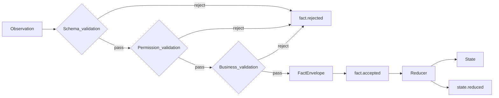
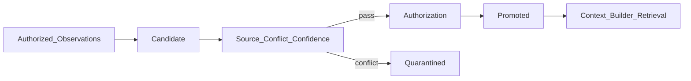
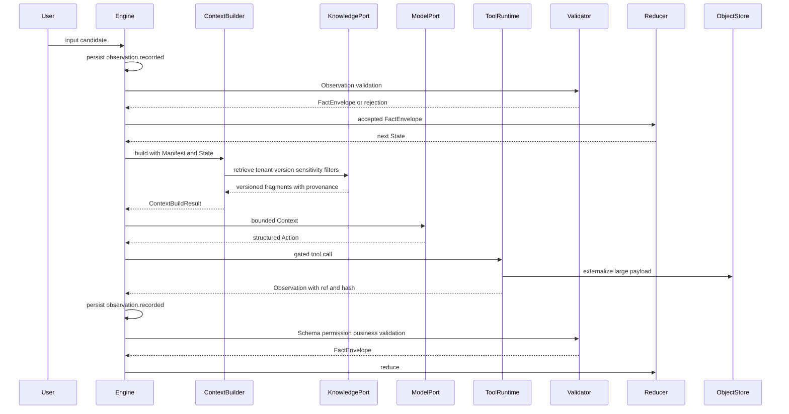

# 05 · 上下文、状态、知识与记忆

## 1. 数据平面不变量

| 概念 | 定义 | 持久真相 | 唯一形成或写入路径 |
| --- | --- | --- | --- |
| State | Run 当前已接受事实的结构化快照 | 是，可由 Event 重建 | Reducer 只消费 FactEnvelope |
| Context | 单个推理 Step 投影给模型的预算化临时视图 | 否，可按冻结依赖重建 | Context Builder |
| Knowledge | 有来源、可追溯、版本化的外部事实 | 是，位于 Knowledge Source | 独立发布、审核与 KnowledgePort 检索 |
| Memory | 从交互形成的候选或长期经验 | 仅已晋升项 | 候选、验证、授权、晋升 |

数据平面遵守以下不变量：

1. Tool、Hook 和用户输入先成为 Observation，不能直接写 State。
2. State 唯一写入口是 `nextState = reduce(previousState, FactEnvelope)`。
3. Context Builder 是动态 Knowledge 检索和 Context 组装的唯一入口。
4. Context、Knowledge、Memory、Artifact 和 Session 元数据都不能充当 Event Log。
5. 大载荷与敏感载荷使用不可变引用；State 不保存完整大载荷或 secret。
6. Run 的审计与恢复使用同一 Execution Manifest、Knowledge 版本和内容哈希。

## 2. Observation、FactEnvelope 与 State

### 2.1 接受链

所有输入使用同一接受链：



验证顺序和对象字段由 [01-domain-model](./01-domain-model.md#61-observation) 定义：

1. Schema 验证检查类型、结构、边界、引用和声明版本。
2. 权限验证检查租户、主体、资源范围、Tool 授权、ACL 和数据可见性。
3. 业务验证使用版本化 Validator 或确定性 Policy 检查不变量。
4. 任一阶段失败都产生 `fact.rejected`，保留来源与理由，不进入 Reducer。
5. 全部通过后形成 FactEnvelope，并由 Engine 与 `fact.accepted`、`state.reduced` 在同一提交边界持久化。

Observation 只证明“系统收到这些数据”。Tool 的 `succeeded`、用户身份已认证或 Hook 为 `trusted_builtin` 都不自动证明数据可接受。

### 2.2 State Schema

```text
State {
  schemaVersion
  goal
  progress {
    checklist[]
    percent?
  }
  workspaceIndex {
    roots[]
    importantPaths[]
  }
  entities {}
  artifacts[] {
    artifactId
    ref
    hash
    summary
    sensitivity
  }
  plan? {
    strategy
    nodes[]
    cursor
  }
  lastErrors[] {
    code
    at
    stepId
  }
  counters {
    steps
    validations
    retries
  }
}
```

State 是领域投影而不是消息历史。Reducer 是确定性纯函数，不执行 IO，只消费 FactEnvelope。大结果只以 `ref + hash + summary` 进入 State；有界错误只保存结构化摘要。

### 2.3 Reducer 规则

- Reducer 按单 Run Event `sequence` 串行应用 FactEnvelope，不使用 last-write-wins。
- FactEnvelope 的业务前置条件在应用时失效则产生 `fact.rejected`，不覆盖已接受事实。
- Reducer 不读取 KnowledgePort、ObjectStore、网络、当前时间或随机源；所需决定性输入必须在 FactEnvelope 中。
- Child Run 结果只通过 `artifactId` 或经验证的 FactEnvelope 显式链接；父 Run 不读取 Child Run 的可变 State。
- 模型输出先解析为 Action，不是 Observation 或 FactEnvelope。

## 3. Context

### 3.1 Context Builder

Context Builder 接收冻结的 Execution Manifest、当前 State、近期已提交 Event、最新用户输入、Agent 可见能力和预算，输出单个模型调用的 Context 与构建记录：

```text
ContextBuildRequest {
  tenantId, sessionId, runId, stepId
  executionManifestRef
  stateRef, stateHash
  latestUserObservationRef?
  queryIntent
  principalRef
  budget
}

ContextBuildResult {
  contextRef
  contextHash
  sections[] {
    kind
    contentRef
    hash
    tokenCount
    provenance
    sensitivity
  }
  knowledgeSelections[]
  hookSelections[]
  truncations[]
}
```

Context Builder 是动态 Knowledge 检索的唯一入口。只有它可以按当前 Run 的 `tenantId`、主体、冻结 `sourceId + version`、敏感级和预算调用 KnowledgePort。Model Port、Skill、Tool、Hook、Workflow 和 Reducer 都不能自行查询 Knowledge Source 后把结果塞入 Context。

### 3.2 PreReasoning Hook 边界

PreReasoning Hook 只能贡献已授权、带 provenance 的 Context 候选：

```text
ContextContribution {
  contentRef
  hash
  priority
  ttl
  provenance {
    sourceKind
    sourceId
    sourceVersion
    retrievedAt?
  }
  sensitivity
  authorizationDecisionRef
}
```

Context Builder 对每个候选重新校验租户、主体、资源 ACL、TTL、敏感级、内容哈希与预算。属于 Knowledge 的动态内容必须通过 KnowledgePort 返回，并执行相同的 tenant/version/sensitivity 过滤；Hook 不能通过缓存、宿主连接、共享内存或自带 connector 绕过该入口。无来源、超权限、版本不匹配或已过期的贡献被拒绝并记录对应 Hook Event。

### 3.3 组装优先级

Context 在预算内按以下顺序保留，高优先级内容不得被低优先级内容挤出：

1. **平台与租户安全边界**：不可裁掉，且不能被任何用户、Knowledge、Tool 输出或 Hook 内容覆盖。
2. **最新用户输入**：保留语义完整性和来源标记；其中的不可信指令仍受安全边界、权限与 Policy 约束。
3. **当前目标、关键 State 与待续阶段**：可使用确定性摘要，但不得遗漏执行所需的关键字段和引用。
4. **本步可见 Tool Schema**：只包含 Execution Manifest、Agent `toolAllowlist` 与权限交集允许的 Tool。
5. **适用 Skill guide**：独立分区展示，不与 Tool 混为可调用能力。
6. **与目标相关的 Knowledge 片段**：带来源、版本、敏感级和哈希。
7. **近期已提交 Event 摘要**：不使用未提交候选或全文日志替代 State。
8. **已晋升 Memory**：仅在启用、授权且未冲突时进入。
9. **历史对话摘要**：最低优先级，可大量裁剪。

最新用户输入的优先级高于一般历史和检索内容，但永远低于安全边界。Tool 与 Skill 必须使用不同 Context section：

- Tool 是可执行原子操作，以 `toolId` 暴露 Schema。
- Skill 是 guide，只影响模型如何推理和选择标准 Action。
- Action 不存在 `skill.invoke`；Skill 不能伪装成 Tool。

### 3.4 Token 预算与裁剪

```text
ContextBudget {
  hardMaxTokens
  reservedForSafety
  reservedForLatestUserInput
  reservedForState
  reservedForToolSchemas
  softBuckets {
    skills
    knowledge
    events
    memory
    history
  }
}
```

超预算时依次裁剪历史对话、Memory、Event 扩展、Knowledge 扩展和非适用 Skill；State 大字段改为引用。安全边界、最新用户输入的核心语义、待续信息和实际可调用 Tool 集合不能被静默裁掉。若硬预算仍不足，Context 构建失败，Engine 不调用模型。

## 4. Knowledge

### 4.1 Knowledge fragment

```text
KnowledgeFragment {
  fragmentId
  sourceId
  sourceVersion
  tenantId
  retrievedAt
  validFrom?
  validUntil?
  content?                   // 与 contentRef 二选一
  contentRef?
  hash
  schemaRef
  provenance
  sensitivity
  retentionClass
  aclRef
}
```

KnowledgePort 最小契约：

```text
retrieve(
  query,
  filters { tenantId, principalRef, sourceId, sourceVersion, sensitivityCeiling, validAt, labels[] },
  budget
) -> KnowledgeFragment[]
```

每次检索强制使用 Execution Manifest 冻结的 Knowledge Source 版本。片段没有匹配版本、哈希、provenance、ACL 或敏感级时不得进入 Context。将 Run 产出自动写回 Knowledge 默认关闭；启用时必须经过来源验证、冲突检测、人工或确定性授权及新版本发布。

### 4.2 审计与回放固定

`context.built` 对应的持久构建记录至少保存：

```text
ContextBuildRecord {
  executionManifestRef
  executionManifestHash
  agentDefinition { agentDefinitionId, version, digest }
  packVersions[] { packId, version, digest }
  promptAssets[] { ref, version, hash }
  policyVersions[] { policyId, version, digest }
  modelPolicy { version, resolvedTarget, digest }
  strategy { type, version, digest }
  contextBuilder { version, digest }
  reducer { version, digest }
  validatorVersions[] { validatorId, version, digest }
  evaluatorVersions[] { evaluatorId, version, digest }
  stateHash
  latestUserObservationHash?
  selectedSkills[] { skillId, version, digest }
  selectedTools[] { toolId, version, digest }
  memoryContributions[] {
    memoryId
    memoryVersion
    contributionHash
    sectionHash
  }
  knowledgeFragments[] {
    fragmentId
    sourceId
    sourceVersion
    hash
    contentRef?
  }
  hookContributions[] {
    hookId
    version
    hash
    contentRef?
  }
  contextHash
  truncations[]
}
```

敏感内容不以内联明文进入 Event；记录使用受 ACL 保护的不可变引用与哈希。审计回放按构建记录解释当时模型所见内容，State 重建不依赖 Context。仿真重跑若引用已删除、模型不可用或外部源无法重现，必须标记降级与缺失范围。

## 5. 大载荷、截断与 Artifact

### 5.1 载荷描述

超过内联阈值的 Tool、Hook、Knowledge 或用户载荷写入 ObjectStore 或 Artifact Store：

```text
ExternalPayload {
  ref                       // object ref 或 artifactId
  hash
  mediaType
  sizeBytes
  preview?
  previewHash?
  truncated
  completeEvidence          // 只有完整内容已验证时为 true
  sensitivity
  retentionClass
}
```

规则：

- `ref` 指向不可变内容；同一 ref 的内容不得原地覆盖。
- `preview` 仅用于定位和预算化展示，不代替完整载荷。
- `truncated=true` 的 stdout、结果或 preview 不能作为完整成功、required `acceptanceChecks` 通过或副作用结果确定的证据。
- Tool 的权威成功需要 output Schema 要求的完整字段、可校验 ref/hash 或独立 Validator 证据；不满足时进入确定性失败或 `outcome_unknown`，由 ToolEffectContract 决定。
- Reducer 只把 `ref + hash + summary` 写入 State，不展开大载荷。
- EventEnvelope 使用 `payloadRef + hash`；敏感载荷外置并受独立 ACL、保留和加密策略控制。

### 5.2 Artifact 引用

Artifact 元数据至少包含 `artifactId`、`tenantId`、不可变 `ref`、hash、大小、媒体类型、来源 Run/Step/ToolCall、sensitivity、ACL 和 retention。Artifact 创建成功先形成 Observation；只有经过 FactEnvelope 接受链后，其引用才能进入 State。

跨 Run 引用必须有显式授权链：

```text
ReferenceAuthorization {
  referenceId
  sourceTenantId
  targetTenantId
  sourceRunId?
  targetRunId
  subjectRef
  aclDecisionRef
  purpose
  grantedAt
  expiresAt?
}
```

默认只允许同租户。跨租户访问必须由平台支持的显式共享机制产生授权记录，不能通过猜测 ref、复制 signedRef 或 Child Run 关联获得。

## 6. Session 与 Run 数据

### 6.1 Session Schema

```text
Session {
  schemaVersion
  sessionId
  tenantId
  subjectRef
  status                     // active | closed | expired
  createdAt
  updatedAt
  expiresAt
  metadata {
    title?
    locale?
    tags[]?
  }
  limits {
    maxRuns
    maxMetadataBytes
    maxLifetime
    idleTtl
  }
  revision
}
```

Session 只承载同一租户内的会话边界、主体和有界元数据：

- 元数据大小、标签数量、Run 数量、总生命周期和空闲 TTL 都必须有限。
- `expiresAt` 到期后不接受新 Run；已有非终态 Run 按其独立生命周期处理。
- Session 不保存 Run State、完整消息历史、Tool 结果、Knowledge 缓存或无界 Memory。
- Session 与 Run 的租户必须一致；Child Run 继承父 Run 的 `sessionId` 和 `tenantId`。
- Session 关闭或过期不等同于删除受保留策略约束的 Event、Artifact 或审计证据。

### 6.2 Run 边界

Run 持有自己的 State、Event sequence、revision、leaseEpoch、Checkpoint、ToolCallRecord 和 ApprovalRecord。跨 Run 数据只通过有授权的 Artifact、Knowledge 或 FactEnvelope 引用流动；Session 不是共享可变黑板。

## 7. Memory

### 7.1 Schema 与来源

```text
MemoryItem {
  schemaVersion
  memoryId
  tenantId
  subjectRef
  category
  content?                   // 与 contentRef 二选一
  contentRef?
  hash
  source {
    runId
    observationIds[]
    factIds[]
    eventIds[]
  }
  sensitivity
  confidence
  evidenceCount
  conflictRefs[]
  status                     // candidate | promoted | deprecated | quarantined
  createdAt
  promotedAt?
  expiresAt?
}
```

来源必须追溯到已授权 Observation、FactEnvelope 和 Event。模型总结只能提出 candidate，不能直接成为 promoted Memory、Knowledge 或 State 事实。

### 7.2 候选晋升



晋升要求版本化 Validator 检查来源、重复、冲突、置信度、主体授权、敏感级和有效期。冲突不静默覆盖；可累积证据或请求用户确认，确认也先形成 Observation。MVP 默认关闭 Memory 检索和晋升；接口可存在，但不得在未启用时把 candidate 放入 Context。

### 7.3 Memory 使用证据

阶段 E 启用 Memory 后，Context Builder 只可选择已授权的 `promoted` Memory，并在 ContextBuildResult 中返回 `memoryContributions`。Engine 提交 `context.built` 与 ContextBuildRecord 时，必须保存每个实际展示片段的 `memoryId + memoryVersion + contributionHash + sectionHash`；未进入最终 Context 的候选不记录为展示。

EvaluationPort 从已提交 `context.built`、ContextBuildRecord 和 07 定义的版本化判定生成 `MemoryContributionRecord`，`displayedAt` 取对应 Event 的 `recordedAt`，记录写入独立 Evaluation Store。后续确定性 Validator、经授权人工确认或版本化 Evaluator 只更新该评测记录的 outcome，不写生产 State、MemoryItem 或 Run Event。由此 `memory error suggestion rate` 可从已提交生产证据和 Evaluation Store 重算，且评测下游故障不会反向影响 Run。

## 8. 租户、敏感级与保留

### 8.1 sensitivity

统一敏感级枚举：

```text
public < internal < confidential < restricted
```

- 数据派生、合并、摘要、preview、Artifact 和 FactEnvelope 默认继承所有输入中的最高敏感级。
- 降低敏感级必须由显式、版本化的脱敏 Validator 证明，并记录证据；模型声明不构成降级依据。
- Context Builder 使用主体与模型目标允许的 `sensitivityCeiling`。`restricted` 默认不进入外部模型 Context。
- Secret 不使用普通 sensitivity 降级机制；只能通过 SecretPort 注入受控 Tool 执行环境。

### 8.2 signedRef 与 ACL

- ObjectStore `signedRef` 是短时传输能力，必须绑定 tenant、主体、对象、操作、用途和 TTL。
- `signedRef` 不得写入长期 State、可公开日志、模型输出或跨 Run Memory；长期保存的是稳定 object ref、hash 与 ACL。
- signedRef 过期只影响访问能力，不改变 Artifact 身份；需要时重新执行授权并签发。
- Knowledge 和 Artifact 的跨 Run 引用都校验当前 ACL、授权链、保留状态和敏感级，不能只信创建时权限。

### 8.3 保留、删除与加密

```text
RetentionMetadata {
  retentionClass
  retainUntil?
  legalHold
  deletionRequestedAt?
  deletedAt?
  tombstoneRef?
  encryptionKeyRef
}
```

规则：

1. Event、State 快照、Checkpoint、Artifact、Knowledge、Memory 和 Context 敏感载荷分别声明 retention class。
2. 删除请求先鉴权并解析引用图，提交 `retention.deletion_requested`。处于 legal hold 的内容保持不可变，提交 `retention.deletion_deferred`，并通过 `legal_hold.applied` 或既有 hold Event 关联理由；释放时提交 `legal_hold.released` 后重新判定请求。Run 关联对象同时关联来源 Run Event；租户级或无 Run 对象使用 01 的 GovernanceEventEnvelope。
3. 可删除内容先撤销 signedRef 和访问授权，再删除对象或执行 crypto-shredding，提交 `payload.deleted`，随后创建 [01-domain-model](./01-domain-model.md#54-tombstone) 定义的 Tombstone 并提交 `payload.tombstoned`。
4. 敏感对象使用 envelope encryption；数据密钥按 tenant 与对象域隔离。crypto-shredding 销毁相应数据密钥，不影响其他租户或保留对象。
5. Tombstone 至少记录 tenant、对象标识、原 hash、删除策略版本、时间、授权主体和 legal hold 判定，不保存已删除正文。
6. `retention.deletion_requested → retention.deletion_deferred/legal_hold.released → payload.deleted → payload.tombstoned` 通过 causation 与对象引用形成审计链；无 hold 时可省略 deferred/released，但不得省略请求、删除和墓碑 Event。
7. 删除后的审计回放保留 Event 结构、hash 与 Tombstone，但将不可读取载荷标记为 `payload_unavailable`；State 重建或仿真重跑若依赖该载荷必须标记 `degraded`，不能合成替代内容。

## 9. 数据流



## 10. 一致性检查

- [ ] 所有输入使用 `Observation → Schema/权限/业务验证 → FactEnvelope → Reducer`
- [ ] Context Builder 是动态 Knowledge 检索和 Context 组装唯一入口
- [ ] 最新用户输入、安全边界、Tool 与 Skill 分区及裁剪顺序明确
- [ ] 大载荷使用不可变 ref/hash/preview，截断不充当完整成功证据
- [ ] Execution Manifest、Knowledge 片段、Hook 贡献与 Context hash 可用于审计回放
- [ ] sensitivity、ACL、signedRef、保留、删除、legal hold 与加密语义闭合
- [ ] Session 有 Schema、大小、数量、生命周期与过期限制
- [ ] Memory 有来源、候选晋升与冲突处理，MVP 默认关闭
- [ ] Child Run 和跨 Run 数据只通过显式授权引用或 FactEnvelope 流动

---

上一篇：[04-extension-model.md](./04-extension-model.md) · 下一篇：[06-safety-and-control.md](./06-safety-and-control.md)
