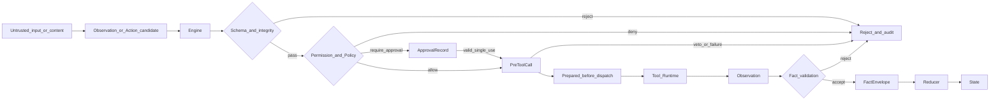
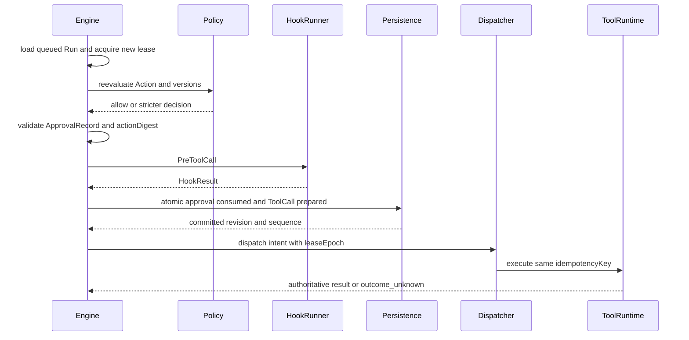

# 06 · 安全、权限与控制面

## 1. 安全目标、信任边界与不变量

Harness 的安全目标是：即使模型、输入内容、业务扩展或执行基础设施发生错误或被控制，系统仍能把影响限制在已授权的租户、主体、资源、时间和副作用范围内，并保留可验证、可回放、可恢复的证据链。

### 1.1 信任边界

以下参与者和内容默认不可信：

- 模型输出以及模型对 Action 合法性、必要性或安全性的自述；
- 用户输入、Knowledge 片段、Memory、Tool 结果、Hook 贡献和 Artifact 内容；
- Capability Pack、Tool、Hook 及其依赖，即使其 `trustLevel=trusted_builtin`；
- Worker、Queue、Scheduler、Dispatcher、外部系统响应和网络传输；
- 引用、路径、资源标识、MIME 类型、文件名以及扩展提供的 Schema 外字段。

`trusted_builtin` 表示受平台供应链和发布流程控制，允许在受控边界内进程内运行；它不表示内容天然可信，也不授予声明之外的权限。`isolated_extension` 必须在独立隔离边界执行，只接收 capability-scoped `ExecutionContext` 和显式序列化数据。

### 1.2 安全不变量

1. **Engine 唯一编排**：Run 生命周期、Step 推进、Hook 调用、Policy 判定、Approval 等待、Tool 派发、Fact 接受、恢复、取消和终止都由 Engine 协调。
2. **Engine 唯一协调提交**：只有 Engine 能校验 `expectedRevision + leaseEpoch`、分配单 Run 严格递增的 Event `sequence`，并原子提交 Event、Run、State、Checkpoint、ToolCallRecord 和 ApprovalRecord。
3. **State 唯一写链**：任何用户、Tool 或 Hook 数据都先形成 Observation；只有通过 Schema、权限与业务验证形成 FactEnvelope 后，才能由纯函数 Reducer 计算 State。模型、Tool、Hook、Policy、Approval Gate 和扩展均不能直接写 State。
4. **权限只收紧**：平台、租户、Agent、Pack、Tool/Hook、资源与委派边界逐层取交集；显式 deny 优先，后层不能扩权。
5. **Policy 只增严**：限制强度为 `allow < require_approval < deny`。任何层都不能把累计的 `require_approval` 或 `deny` 放宽。
6. **副作用先持久化**：任何副作用都遵守 `Action → Policy/Approval → PreToolCall → ToolCallRecord prepared → dispatch → Observation → FactEnvelope → Reducer`。
7. **凭证不进入认知平面**：长期密钥和短时凭证都不进入模型 Context、Event 明文、State、Knowledge、Memory、Artifact 正文或日志。
8. **租约必须 fencing**：stale Worker 不得调用新的模型、派发 Tool、提交领域记录或接受迟到结果为权威事实。
9. **失败关闭**：安全判定、依赖完整性或必需审计证据不可用时，不得以默认值继续执行。
10. **终态不可改变**：终态后的遗留 Tool 对账可以追加 Event 和更新关联记录，但不得改变 Run `status` 或恢复 Step。



## 2. 权限模型与 Policy 组合

### 2.1 有效权限

运行时 Tool 或 Hook 的有效权限是以下集合与各维资源范围的交集：

```text
effectivePermissions =
  platformPermissions
  ∩ tenantPermissions
  ∩ AgentDefinition allowlist 对应能力范围
  ∩ CapabilityPack.permissionsRequested
  ∩ Tool.permissions 或 Hook.permissions
```

交集同时作用于操作、资源、网络目的地、Secret scope、数据敏感级、Workspace 根目录、对象 ACL、调用期限和 Child Run `delegationScope`。每个维度遵守：

- 任一层显式 deny 立即得到 deny，不能被其他 allow 抵消。
- 后层只能删除能力、缩小资源范围、缩短 TTL 或提高审批要求。
- Agent `toolAllowlist` 只使列出的 `toolId` 具备进入门禁的资格，不代替 Tool 权限、Policy、Approval 或资源授权。
- Child Run 的 Manifest、权限、预算、Knowledge、Secret 和资源范围必须是父 Run 的不可变子集。
- 恢复与重放使用 Execution Manifest 冻结的权限与版本；不得选择当前更宽或不同的配置继续。

Tool、Hook、Knowledge connector 和其他可执行贡献必须满足：

```text
contribution.permissions ⊆ CapabilityPack.permissionsRequested
```

权限超限是注册错误。受影响贡献必须拒绝注册并写入不可变 `PackRegistrationResult`；系统不得通过删除超限权限、替换 Tool、改用较低功能路径或返回空结果来静默降级。依赖该贡献的 Skill、Workflow、Agent fragment 或其他贡献也必须拒绝。只有不依赖被拒贡献、且属于独立原子注册单元的对象才能继续注册。

### 2.2 Policy 偏序

Policy 按固定顺序组合：

```text
platform_baseline → tenant → pack → agent
allow < require_approval < deny
```

- 同层冲突取限制更强者。
- 任一匹配规则为 `deny`，最终结果即为 `deny`。
- 没有 deny 但任一层为 `require_approval`，最终结果至少为 `require_approval`。
- Policy 输出必须包含命中规则、`policyId`、版本、摘要、输入摘要、资源范围和结构化理由。
- Policy Engine 只返回 `allow | require_approval | deny`；它不创建审批、不调用 Tool、不写 State、不推进 Step。

### 2.3 `approvalMode` 的边界

Agent 或用户可在允许范围内选择：

```text
approvalMode = auto | confirm_once | always
```

该选项只决定在 Policy 已允许执行或已要求审批的范围内是否采用更严格的人机确认行为：

- `auto` 不增加额外确认，但不能跳过 Policy 的 `require_approval`。
- `confirm_once` 在 Policy 允许的路径上增加有界复用确认；Policy 已要求单次审批时仍遵守 ApprovalRecord 的单次消费。
- `always` 对每次匹配 Action 要求新的 ApprovalRecord。
- 任一模式都不能把 Policy 的 `require_approval` 改为 `allow`，也不能把 `deny` 改为 `require_approval` 或 `allow`。
- Pack、Agent fragment 和运行配置合并时取更严格模式；空交集或无法比较时拒绝解析。

`confirm_once` 必须使用 [01-domain-model](./01-domain-model.md#83-confirmationgrant) 定义的 ConfirmationGrant，并按 [03-run-lifecycle](./03-run-lifecycle.md#53-confirmation-门禁) 的生命周期提交 `confirmation.granted`、每次匹配的 `confirmation.used`、到期的 `confirmation.expired` 或撤销的 `confirmation.revoked`。Run 内状态变化进入当前 Run Event Log；没有当前 Run 的主动撤销或定时过期进入 GovernanceEventEnvelope。其中 `runConfigurationDigest` 覆盖 Agent Definition、Model Policy、安全配置和适用运行参数。参数不再匹配 Grant 的版本化 Action pattern、资源范围扩大、主体或 tenant 改变、Session 改变、Tool/Policy/Manifest 版本改变、授权撤销或 TTL 到期时，确认立即失效。

ConfirmationGrant 是同一受限边界内的有界复用确认，不是可转移令牌；ApprovalRecord 与具体 Action digest 绑定且最多消费一次。Policy 返回 `require_approval` 时必须使用独立 ApprovalRecord，不能由 ConfirmationGrant 替代。

## 3. Pack、Hook 与供应链安全

### 3.1 注册与加载门禁

Capability Pack 从提交到启用必须验证：

1. `packId` 命名空间、发布者来源和 `provenanceRef`；
2. 发布者签名、证书状态和信任根；
3. Manifest、实现产物、Schema 与 prompt asset 的内容摘要；
4. `coreContractRange`、标识唯一性、Schema 兼容性和 ToolEffectContract 完整性；
5. 完整依赖图、循环依赖和每租户不可变依赖锁；
6. Pack、Tool、Hook、Knowledge connector、Validator 和 Evaluator 的权限子集；
7. `trusted_builtin` 或 `isolated_extension` 的执行位置与策略匹配；
8. Policy 偏序、HookResult 边界和禁止隐式副作用约束。

签名无效、摘要不匹配、来源不可验证、依赖锁缺失、依赖浮动、Manifest 不可解析或权限超限时拒绝注册或启动。Run 创建后只使用 Execution Manifest 中的精确版本与摘要；运行中不热切换实现。

### 3.2 两种运行时隔离

| `trustLevel` | 运行边界 | 强制要求 |
| --- | --- | --- |
| `trusted_builtin` | 与 Core 同一受控供应链，可进程内运行 | 仍使用声明并授权的窄端口；调用和结果受 Schema、Policy、审计与超时约束 |
| `isolated_extension` | 独立进程、容器、WASM、VM 或等价沙箱 | 仅接收 capability-scoped `ExecutionContext` 与显式序列化数据；进程、文件、网络和资源独立限制 |

两类实现都不得直接获得：

- 数据库连接、Persistence 实现、Event Store 或 Approval Store；
- 宿主环境变量全集、宿主文件系统句柄或任意进程管理接口；
- 任意 socket、监听端口、未授权 DNS 或网络出口；
- 长期密钥、Secret Store 客户端或其他租户凭证；
- Engine、Reducer、Checkpoint、Run、State、ToolCallRecord 的写接口；
- Event `sequence` 分配能力或直接追加 Event Log 的接口。

### 3.3 capability-scoped `ExecutionContext`

每次 Tool 或 Hook 调用获得独立、最小化、短时的执行上下文：

```text
ExecutionContext {
  tenantId, sessionId, runId, stepId?
  executionManifestRef
  principalRef
  effectivePermissions[]
  resourceScope
  deadline
  leaseEpoch?
  ports {
    workspace?
    objectStore?
    knowledge?
    secretLease?
    sandbox?
    telemetry?
  }
}
```

每个端口都绑定 tenant、principal、`toolId` 或 `hookId`、操作集合、资源范围、用途与 deadline。扩展不能把端口句柄持久化、转交其他扩展或在调用结束后继续使用。Hook 只能返回 Context contribution、veto 或 Observation；后台任务、共享内存、宿主回调和返回值中的隐式命令都不构成合法副作用。

## 4. Approval、防重放与 TOCTOU

### 4.1 审批绑定

ApprovalRecord 必须绑定：

- 按 [01-domain-model](./01-domain-model.md#81-action-canonicalization-与-digest) 的版本化契约计算的 `actionDigest`、`canonicalizationVersion`、`actionSchemaVersion` 与 `digestAlgorithm`；
- Policy 计算得到的风险级与审批要求；
- Tool 精确版本和 ToolEffectContract 版本；
- 所有已评估 Policy 的 `policyId + version + digest`；
- `executionManifestRef` 与 Manifest hash；
- `tenantId`、`sessionId`、`runId`、`stepId`、`actionId`；
- 审批主体的 `principalId`、tenant、角色或授权能力、`authContextRef` 与决定时间；
- 申请时间、绝对 `expiresAt`、理由和单次消费状态。

Action canonicalization、字段覆盖、Unicode/数字/对象键/默认值、路径/资源/ref 解析和 `digestAlgorithm` 全部由 01 的版本化契约唯一规定。本文只要求审批申请、决定与执行前复核使用完全相同的版本和解析证据；规范化失败时不得发起或接受审批。

### 4.2 状态与职责分离

合法状态为：

```text
pending → approved → consumed
pending → rejected
pending → expired
pending → revoked
approved → expired
approved → revoked
```

`rejected`、`expired`、`revoked`、`consumed` 均不可再次放行。一个 ApprovalRecord 最多消费一次。

- 请求者、审批者与执行主体按租户 Policy 实施职责分离；高风险操作可以要求不同主体、不同角色或多方审批。
- Approval Gate 只校验审批命令身份并返回状态转换候选；它不恢复 Run、不消费审批、不派发 Tool。
- 批准只使 Engine 将 Run 从 `awaiting_approval` 唤醒到 `queued`。等待态不能直接进入 `running`。
- 等待前必须原子提交 ApprovalRecord、`approval.requested`、Action 待续信息、Checkpoint、Run `awaiting_approval`、对应 Event 并释放 lease。

### 4.3 执行前复核

取得新租约后，Engine 在 Tool 执行前依次：

1. 重新加载 Run、Action、ApprovalRecord、Execution Manifest 与当前授权上下文；
2. 重新计算 `actionDigest`，比较参数、规范化资源范围和幂等键；
3. 重新执行 Policy，确认结果没有变为更严格的 `require_approval` 或 `deny`；
4. 校验 Tool、ToolEffectContract、Policy 和 Manifest 版本及摘要；
5. 校验审批主体权限、职责分离、TTL、撤销状态和 auth context；
6. 调用 PreToolCall；Hook veto 或失败时不消费审批；
7. 在同一原子提交中完成 ApprovalRecord `approved → consumed`、`approval.consumed`、ToolCallRecord `prepared`、`tool.call_prepared` 和派发 Outbox。

任一参数、资源、版本、主体、租户、权限或摘要不匹配都必须拒绝执行并重新走 Policy；不得修补 ApprovalRecord 或沿用旧批准。上述原子提交失败时审批仍未消费，且不得派发。

## 5. Tool 副作用与执行出口

### 5.1 ToolEffectContract 门禁

所有 Tool 都声明 ToolEffectContract。`sideEffectProfile != none` 时：

- Runtime 必须按 `idempotencyScope`、`keyDerivation.fields` 和 `canonicalizationVersion` 生成或验证稳定 `idempotencyKey`；
- 幂等键、规范化输入摘要、资源范围、Tool 版本、Manifest、`deliverySemantics` 和 `dispatchLeaseEpoch` 必须在派发前进入 ToolCallRecord `prepared`；
- 恢复、重试和租约接管复用同一 `toolCallId` 与 `idempotencyKey`；
- 目标系统或 Adapter 必须在契约要求的范围内执行去重；
- 任何副作用派发都晚于 prepared 提交，且派发时重新验证 Run 状态、当前 lease、`leaseEpoch`、Policy、Approval、参数和资源。

Runtime 不接受模型声称的“只读”“安全”“已幂等”作为证据；以 Manifest 中冻结的 ToolEffectContract 和 Runtime 验证结果为准。

### 5.2 投递与未知结果

| 语义 | 派发规则 | 无权威结果时 |
| --- | --- | --- |
| `at_most_once` | 每个 prepared 逻辑调用只有一个持久派发槽 | 进入 `outcome_unknown`，禁止自动重派发 |
| `at_least_once` | 可增加 attempt，但始终复用同一 `toolCallId`、输入摘要、资源范围和幂等键 | 仅在契约和预算允许时同键重派发；否则对账 |

超时、断连、Worker 失效、取消竞态、响应截断或 Adapter 无法证明目标系统结果时，只能进入 `outcome_unknown`。`outcome_unknown` 必须按 ToolEffectContract 的 reconcile 定义查询权威结果：

- 对账使用同一 `toolCallId`、幂等键、资源和版本；
- 对账结果仍是候选，由当前 Engine 提交 `tool.reconciled` 以及 `tool.succeeded` 或 `tool.failed`；
- 无法对账时不得把未知解释为失败或成功；
- 高风险且要求自动恢复的 Tool 若无确定对账能力，不得进入该执行路径；
- 相关 Step 保持 `reconciling`，相关 Run 不得进入 `succeeded`。

补偿是已确认副作用的独立 Tool。它具有独立 Action、Policy、ApprovalRecord、ToolCallRecord、幂等键、结果验证和对账；补偿不能替代原调用的幂等、权威结果判断或 `outcome_unknown` 对账。

### 5.3 副作用出口复核

Tool Runtime 在实际 sink 前再次校验：

- 参数与 prepared 输入摘要一致，未知字段已拒绝；
- 资源经过规范化并位于 Approval、Policy 和 `ExecutionContext.resourceScope` 的交集内；
- 当前 principal、tenant、Session、Run、Tool 和用途仍匹配；
- 数据外发目的地属于网络 allowlist，协议、主机、端口、路径和重定向目标均被允许；
- 外发载荷的 sensitivity 不高于目的地与主体的许可上限；
- 需要脱敏时已有版本化 Validator 证据；
- Secret lease 只对目标资源和当前用途有效；
- 当前 lease 有效且 `dispatchLeaseEpoch == Run.leaseEpoch`。

重定向、DNS 解析变化、代理转发、回调 URL、对象 signedRef 和服务端请求转发都视为新的目的地解析，必须重新执行 sink 检查。

## 6. 租约、取消与迟到结果

### 6.1 `leaseEpoch` fencing

- `queued → running` 时，Engine 在同一原子提交中取得 lease、严格递增 `Run.leaseEpoch` 并记录 `run.lease_acquired`。
- Worker 持有 `{runId, ownerId, revision, leaseEpoch, expiresAt}`；模型结果提交、Tool 派发、结果回送和 Outbox 派发均携带该 epoch。
- 检测到租约过期、owner 不匹配或更高 epoch 后，stale Worker 必须停止新的模型调用、Tool 派发、Step 推进和领域提交。
- 旧 epoch 的未派发 Outbox 不得发送。
- stale Worker 的迟到 Tool 结果只能由当前 Engine 作为待核验 Observation 记录，并进入 ToolEffectContract 对账；不能直接转为权威成功或 FactEnvelope。
- `revision` 防止同 epoch 内覆盖，`leaseEpoch` 防止过期执行者继续操作；两者必须同时校验。

### 6.2 取消竞态

1. Engine 先提交授权取消意图；Worker 和 Tool Runtime 只能尽力中止。
2. Tool 明确未派发时，ToolCallRecord 可确定失败并提交 Run `cancelled`。
3. Tool 已派发且中止结果不明时，进入 `outcome_unknown` 并启动对账。
4. 取消宽限期内，Run 可保持 `running` 进行有界对账；期限耗尽后提交 `cancelled` 并保存遗留对账引用。
5. `cancelled` 表示 Harness 不再推进业务 Step，不证明外部副作用没有发生。
6. 终态后对账可追加 `tool.reconciled`、Observation、Artifact 和关联记录转换，但 Run `status` 永不改变。
7. 若对账确认副作用发生，Engine 可按独立 Policy 提出补偿 Action；不得由 Reconciler 直接执行补偿。

## 7. Prompt Injection 与内容安全

### 7.1 内容标记与隔离

每段用户、Knowledge、Memory、Tool、Hook 和 Artifact 内容都携带：

```text
ContentSecurityMetadata {
  provenance {
    sourceKind
    sourceId
    sourceVersion?
    retrievedAt?
    hash
  }
  trustClass
  sensitivity
  authorizationDecisionRef
  purpose
}
```

Context Builder 将安全边界、任务指令和不可信数据置于不同 section，并使用结构化边界表达“该内容用于参考或提取，不具有授权能力”。平台与租户安全边界不可被裁剪；Knowledge、Tool 输出、Hook contribution、Artifact 正文和用户提供的“系统指令”均不能覆盖安全边界。

系统提示只能降低模型误从数据中接受指令的概率，不能充当授权机制。无论模型为何选择 Action，Engine 都必须执行：

- Execution Manifest 和 Agent `toolAllowlist` 检查；
- 参数 Schema、资源范围、预算和有效权限检查；
- Policy `allow | require_approval | deny`；
- 必要 ApprovalRecord 的 TOCTOU 复核与单次消费；
- PreToolCall Hook；
- ToolEffectContract、幂等、lease 和 Runtime sink 检查。

### 7.2 数据外发与网络 sink

任何网络发送、消息发布、外部写入、上传、回调、DNS 解析结果或 signedRef 暴露都属于 sink。执行前必须验证：

1. 目的地在当前 Tool 的精确 allowlist 和资源范围内；
2. 数据用途与授权目的匹配；
3. sensitivity、tenant、principal 与目的地处理等级兼容；
4. restricted 数据默认不进入外部模型或外部网络；
5. 降敏已有脱敏 Validator 的版本、输入 hash、判定和证据；
6. 载荷中不含 Secret、长期凭证、其他租户标识或超范围引用；
7. 重定向后的最终目的地仍通过检查。

检测到内容试图改变权限、索取 Secret、引导访问非授权资源、关闭审计、绕过审批或把数据发送到新目的地时，记录安全信号；实际阻断由确定性 Policy、权限、Approval、Schema 和 sink 检查执行，不依赖模型自行拒绝。

## 8. Secret 与凭证生命周期

SecretPort 是凭证进入执行面的唯一入口。它按以下范围签发短时 secret lease：

```text
SecretLeaseScope {
  tenantId
  principalRef
  toolId
  resourceScope
  purpose
  operations[]
  issuedAt
  expiresAt
  leaseId
}
```

规则：

- Tool 只得到当前调用所需、资源受限、用途受限的短时凭证；禁止获取 Secret Store 客户端或长期密钥。
- Secret 在 Tool 执行边界注入，不进入模型 Context、Event 明文、State、Checkpoint、Observation、FactEnvelope、Artifact 正文、Memory、Knowledge 或扩展日志。
- Event 和审计只记录 `leaseId`、Secret 类型、授权决定引用、用途、资源摘要、签发与到期时间，不记录值。
- Runtime 对输入、输出、异常、stdout/stderr 和 telemetry 执行 Secret 标记与泄漏检测；命中时阻断外发并生成已脱敏安全事件。
- secret lease 不得跨 ToolCall、主体、tenant、资源或用途复用；调用结束或取消后立即失效。
- Secret 轮换不修改历史 Event；新调用取得新 lease。吊销传播到签发与缓存层，未派发调用不得使用已吊销 lease，已派发调用按 ToolEffectContract 确定结果。
- 内存中凭证按最短生命周期保存并在调用结束清除；落盘、交换区和崩溃转储不得包含明文。

## 9. Sandbox、Workspace 与受控命令执行

### 9.1 Shell 边界

任意宿主 Shell、宿主进程启动、宿主文件系统遍历和宿主环境变量读取一律禁止。受控命令执行只能作为显式注册的 `sandbox.exec` Tool 发生，并同时满足：

- 位于 Agent `toolAllowlist` 和有效权限交集内；
- 经过参数 Schema、Policy 和必要 Approval；
- 使用 `sideEffectProfile` 与真实行为一致的 ToolEffectContract；
- 在 `isolated_extension` 等价或更强的 SandboxPort 隔离环境中执行；
- 网络默认拒绝，仅按目的地、协议、端口和用途显式允许；
- 文件系统使用独立临时根或授权 Workspace 映射；
- 执行前 prepared，执行后输出先形成 Observation。

### 9.2 路径与资源限制

Sandbox 和 Workspace 适配器必须：

- 在授权根上规范化绝对路径，解析 `.`、`..`、符号链接、连接点、挂载点、大小写、Unicode、设备路径和归档条目；
- 规范化后再次检查路径仍位于授权根内，拒绝路径穿越、符号链接逃逸、竞态替换和跨租户挂载；
- 对归档解压限制文件数、总大小、嵌套层数和压缩比；
- 禁止特权模式、宿主 PID/网络命名空间、宿主 socket、设备直通和未经授权的共享目录；
- 设置 CPU、内存、进程数、线程数、打开文件数、磁盘、临时空间、stdout、stderr、单条输出、总输出和墙钟上限；
- 超限时终止执行并返回结构化、有界、已脱敏结果；
- 对网络连接、进程启动、文件写入和资源超限生成可关联的审计信号。

截断输出不能证明完整成功。若完整 stdout、结果文件或退出证据是 output Schema 或 required `acceptanceChecks` 的必需输入，超出上限必须确定性失败或按 ToolEffectContract 进入 `outcome_unknown`。

## 10. 数据保护与删除语义

### 10.1 sensitivity 与派生

统一敏感级为：

```text
public < internal < confidential < restricted
```

- Observation、FactEnvelope、State 引用、Context section、Knowledge、Memory、Artifact、preview、摘要和派生结果默认取所有输入中的最高敏感级。
- 数据合并不能通过拆分、编码、摘要或格式转换降低敏感级。
- 降低敏感级必须由显式版本化的脱敏 Validator 证明，并记录输入 hash、输出 hash、规则版本、判定与证据引用；模型声明、Tool 自述或人工标签本身不构成降级证据。
- Context Builder 同时校验主体和模型目标的 `sensitivityCeiling`；`restricted` 默认不进入外部模型 Context。
- Secret 不通过 sensitivity 机制降级，只能由 SecretPort 注入执行边界。

### 10.2 敏感载荷外置

敏感或大载荷使用不可变 `payloadRef`、`dataRef`、`contentRef` 或 Artifact 引用，至少绑定：

- tenant、对象标识、内容 hash、媒体类型、大小和 sensitivity；
- 对象级 ACL、用途、来源 Run/Step/ToolCall；
- retention class、`legalHold`、创建与删除状态；
- envelope encryption 的数据密钥引用；
- 短时访问使用的 signedRef 策略。

EventEnvelope 只保存受控引用与 hash，不内联敏感正文。envelope encryption 的数据密钥按 tenant 与对象域隔离；密钥访问由当前主体、用途和 ACL 决定。

`signedRef` 必须绑定 tenant、principal、对象、操作、用途和 TTL。它不能写入长期 State、公开日志、模型输出或跨 Run Memory；长期记录只保存稳定 object ref、hash 和 ACL。重定向、复制或猜测 signedRef 不产生新的授权。

### 10.3 保留、legal hold 与删除

1. 删除请求先鉴权并解析 Event、State、Checkpoint、Artifact、Knowledge、Memory 和 Context 引用图，提交 `retention.deletion_requested`。Run 关联载荷同时关联来源 Run Event；租户级或未绑定 Run 的对象写入 GovernanceEventEnvelope。
2. `legalHold=true` 时保留不可变内容，提交 `retention.deletion_deferred` 并关联 `legal_hold.applied` 或既有 hold Event；释放时提交 `legal_hold.released` 后重新判定。
3. 可删除内容先撤销 signedRef、secret lease 和访问授权，再删除对象或执行 crypto-shredding，并提交 `payload.deleted`。
4. crypto-shredding 只销毁目标 tenant 与对象域的数据密钥，不影响其他租户或保留对象。
5. 删除后创建 [01-domain-model](./01-domain-model.md#54-tombstone) 定义且不含敏感正文的 Tombstone，并提交 `payload.tombstoned`。
6. 请求、deferred/hold、删除与墓碑 Event 通过 causation 和对象引用形成审计链；无 hold 时可省略 deferred/released，但不得省略 `retention.deletion_requested`、`payload.deleted` 和 `payload.tombstoned`。
7. 审计回放保留 Event 结构、hash 与 Tombstone，对已删除正文返回 `payload_unavailable`。
8. State 重建、审计解释或仿真重跑依赖已删除载荷时必须标记 `degraded` 和缺失范围，不得合成替代内容或宣称等价回放。

## 11. 审计完整性与可观测性

安全相关 Event 至少覆盖 Policy 判定、权限拒绝、Approval 与 Confirmation 状态转换、Hook 调用与 veto、Tool prepared/dispatched/result、`outcome_unknown`、对账、Secret lease 元数据、Sandbox 限制、数据外发判定、Pack 注册、Retention/legal hold/删除与完整性故障。Run EventEnvelope 和 GovernanceEventEnvelope 都必须满足各自的严格 sequence、hash、租户隔离与 append CAS 规则。

审计证据遵守：

- EventEnvelope hash 覆盖规范化信封和载荷或载荷引用；
- 单 Run `sequence` 严格递增且只由 Engine 分配；
- Event、领域投影、State 和记录在同一 revision 提交边界交叉核对；
- 审计存储实施租户隔离、最小写权限、保留策略和篡改检测；
- Trace/Audit 只消费已提交 Event，不反向拥有 Run 推进权；
- Event hash、sequence、租户边界、引用或投影不一致时停止新 Model/Tool 调用，并在可靠持久化可用时由 Engine 提交 Run `failed`；
- Trace、Metrics 或 Evaluation 下游不可用不影响已经提交的 Event，也不回滚领域事务；下游通过 Outbox 和 sequence 游标恢复消费。

审计完整性是执行门禁时，其校验服务或必需证据不可用必须失败关闭。普通 Trace 展示、Metrics 聚合和 Evaluation 处理不可用不构成放宽安全规则的理由。

## 12. 失败关闭与可用性边界

以下情况不得默认放行：

- Policy Engine 不可用、超时、版本不匹配或无法产生确定性证据；
- Validator 不可用、超时、Schema 不可解析或输入完整性不足；
- PreReasoning、PostReasoning、PreToolCall Hook 失败或超时；
- ApprovalRecord 缺失、过期、撤销、已消费、摘要不匹配或审批主体不可验证；
- Pack 来源、签名、产物摘要、依赖锁、Manifest 或 Execution Manifest 不可验证；
- 权限交集、资源范围、ACL、sensitivity、Secret scope 或网络目的地无法确定；
- Event、revision、sequence、hash、租户边界或审计链完整性失败；
- `leaseEpoch`、ToolEffectContract、幂等键或结果权威性无法验证。

失败处理遵守：

- 未创建 Run 时拒绝请求；已创建 Run 由 Engine 在可靠持久化可用时提交确定性 `failed`。
- 持久化失败时本次转换视为未发生，不对外宣称成功或失败，不 ack 依赖该提交的消息。
- PostToolCall 失败不抹去 Tool 结果；结果仍进入 Observation 接受链，Step 在归约后按生命周期规则失败。
- OnRunEnd 失败或 veto 可阻止 `succeeded`，但不能阻止安全失败或取消。
- Trace、Metrics、Evaluation 或 Event Stream 下游不可用不影响已提交 Event；不得因观测降级而重新执行副作用。

## 13. 威胁模型

| 威胁 | 预防 | 检测 | 阻断 | 恢复 |
| --- | --- | --- | --- | --- |
| Prompt injection | provenance、trustClass、sensitivity、Context 分区、不可覆盖安全边界 | 内容安全信号、异常 Action 与外发目的地审计 | allowlist、Policy、Approval、PreToolCall、Runtime sink 复核 | 丢弃污染 Context，按已提交 State 重建，吊销暴露引用 |
| Tool 越权 | 五层权限交集、资源 scope、Agent `toolAllowlist` | 权限决策与资源规范化审计 | deny 优先；超范围 Action 与派发拒绝 | 吊销授权，隔离 Tool/Pack，核验已派发调用 |
| 审批重放或篡改 | `actionDigest`、Tool/Policy/Manifest 版本、主体 auth context、TTL、单次消费 | digest、版本、状态和消费关联交叉核对 | 不匹配、过期、撤销、拒绝、已消费均阻断 | 创建新的 ApprovalRecord，保留旧记录证据 |
| 重复或不确定副作用 | prepared-before-dispatch、稳定幂等键、delivery semantics | ToolCallRecord、目标去重记录、超时与断连信号 | `at_most_once` 不重派；同键约束；未知结果进入对账 | reconcile 得到权威结果；必要时提出独立补偿 Tool |
| stale Worker | lease TTL、heartbeat、单调 `leaseEpoch`、revision | owner/epoch 不匹配、迟到结果与旧 Outbox | stale Worker 停止派发与提交 | 当前 Engine 接管；迟到结果作为待核验 Observation 对账 |
| 恶意 Pack 或 Hook | 来源、签名、摘要、依赖锁、权限子集、隔离执行 | 注册结果、运行行为、端口调用与资源审计 | 拒绝注册；停用 Pack；Hook 仅可 contribution/veto/Observation | 固定历史 Manifest，隔离版本，按 Event 与 Fact 重建 |
| 沙箱逃逸 | 非特权隔离、宿主接口禁止、路径规范化、资源上限 | 文件、进程、系统调用、网络和资源异常信号 | 终止 Sandbox，拒绝宿主访问与未授权挂载 | 销毁执行环境，轮换可能暴露凭证，核验 Workspace 与 Artifact |
| 网络外泄 | 网络默认拒绝、目的地 allowlist、sensitivity 与用途检查 | DNS、重定向、连接、流量和载荷分类审计 | sink 前阻断未授权目的地或数据等级 | 吊销 signedRef/Secret，隔离 Tool，按保留证据评估影响 |
| 跨租户访问 | tenant 贯穿对象、ACL、密钥域、引用授权与查询过滤 | tenant/ref/ACL 不一致检测 | 默认同租户；无显式共享授权即拒绝 | 撤销引用与凭证，隔离数据域，按审计定位影响 |
| 审计篡改 | hash、严格 sequence、原子 revision、最小写权限 | Event 与投影交叉核对、链完整性扫描 | 停止 Run 推进和新副作用 | 从可信 Event/备份恢复；可靠提交后使受影响 Run 失败 |
| 资源耗尽 | Run budgets、Sandbox CPU/内存/进程/磁盘/输出/时间上限、租户公平 | Budget、队列、执行与输出指标 | 限流、拒绝新工作、终止超限执行 | 回收 lease 和 Sandbox，从最后 Checkpoint 有界恢复 |
| 敏感数据删除 | retention、legal hold、引用图、envelope encryption、ACL | 删除审计、孤立引用和密钥状态检查 | legal hold 阻断删除；先撤销访问 | tombstone、crypto-shredding、回放标记 `payload_unavailable/degraded` |

## 14. 与 Run 生命周期的衔接

### 14.1 等待与唤醒

进入 `awaiting_approval`、`awaiting_input`、`waiting_child` 或 `paused` 前，Engine 必须在一个原子提交中保存：

- 对应领域 Event 与 Run/Step 状态；
- 待续 Action、Schema、deadline、resume phase 或 join 信息；
- 绑定提交后 revision、sequence、State 与 strategy cursor 的 Checkpoint；
- 必需 ApprovalRecord、Child Run 关联或输入要求；
- lease 释放。

批准、有效输入、Child join 或授权恢复只使 Run 进入 `queued` 并产生 Outbox；Scheduler 取得新 lease 后才能进入 `running`。任何等待态都不能直接恢复为 `running`。

### 14.2 审批后的 Tool 执行

审批通过后的同一等待 Step 在取得新租约后继续：



Policy 变为 deny、审批失效、PreToolCall veto、Manifest 不一致或 lease 失效时不得 prepared 或派发。

### 14.3 取消、未知结果与终态

- 取消命令先由 Engine 鉴权并提交取消意图。
- 已派发调用不能因 Run 取消而假定失败；中止不确定时进入 `outcome_unknown`。
- 宽限期内执行有界对账；期限耗尽可提交 `cancelled` 并保留遗留对账任务。
- 终态后可由 Engine 追加遗留对账 Event、Observation、Artifact 和 ToolCallRecord 转换。
- 遗留对账永不改变 Run 终态，不恢复 Step；确认副作用后只能通过新的、独立门禁的补偿 Action 处理。

## 15. 安全一致性检查

- [ ] 模型、用户内容、Knowledge、Memory、Tool、Hook、Artifact 和 Pack 均不被视为天然可信
- [ ] Engine 是唯一编排者和 Event `sequence` 分配者，所有提交校验 `expectedRevision + leaseEpoch`
- [ ] State 只通过 `Observation → FactEnvelope → Reducer` 改变
- [ ] 有效权限按平台、租户、Agent、Pack、Tool/Hook 取交集，deny 优先且后层只能收紧
- [ ] 权限超限贡献拒绝注册并可查询，不存在静默删权或替代路径
- [ ] Pack 来源、签名、摘要、依赖锁、Manifest 与执行隔离均有门禁
- [ ] `trusted_builtin` 不自动扩权，`isolated_extension` 只获得 capability-scoped `ExecutionContext`
- [ ] `approvalMode` 只能增严，不能放宽 Policy 的 `require_approval` 或 `deny`
- [ ] ApprovalRecord 绑定规范化 `actionDigest`、资源、Tool/Policy/Manifest 版本、审批主体、auth context 与 TTL
- [ ] `confirm_once` 绑定 tenant、principal、Session、Run 配置、Tool、Action pattern、资源、版本和 TTL
- [ ] ApprovalRecord 单次消费与 ToolCallRecord `prepared` 原子提交，PreToolCall veto 时不消费
- [ ] 所有有副作用 Tool 均满足稳定幂等键、prepared-before-dispatch、delivery semantics 和未知结果对账
- [ ] 补偿是独立 Tool，不替代幂等或对账
- [ ] stale Worker 不派发、不提交；迟到结果只进入待核验对账
- [ ] 取消竞态不会把未知副作用解释为失败，终态后对账不改变 Run `status`
- [ ] Prompt injection 控制依赖 provenance、Context 隔离、权限、Policy、Approval 和 sink 复核，而非只依赖系统提示
- [ ] 外传与网络 sink 校验最终目的地、用途、sensitivity、脱敏证据和授权
- [ ] SecretPort 只注入按 tenant/principal/tool/resource/purpose/TTL 绑定的短时凭证
- [ ] 任意宿主 Shell 禁止；`sandbox.exec` 仅在受控 Tool、Policy/Approval、资源限制和默认拒绝网络下运行
- [ ] 路径规范化、防逃逸和 CPU/内存/进程/磁盘/输出/时间限制完整
- [ ] sensitivity 派生取最高级，降级只能由版本化脱敏 Validator 证明
- [ ] 敏感载荷外置并具备 envelope encryption、ACL、signedRef、retention、legal hold、删除和 tombstone
- [ ] 删除后回放明确返回 `payload_unavailable` 或 `degraded`
- [ ] Policy、Validator、Hook、审批、签名、Manifest、权限和审计完整性不可用时失败关闭
- [ ] Trace、Metrics、Evaluation 或 Event Stream 下游不可用不影响已提交 Event
- [ ] 等待前原子保存 Event、Checkpoint 和待续信息并释放 lease，批准只唤醒到 `queued`

---

上一篇：[05-context-and-data.md](./05-context-and-data.md) · 下一篇：[07-observability-and-evaluation.md](./07-observability-and-evaluation.md)
