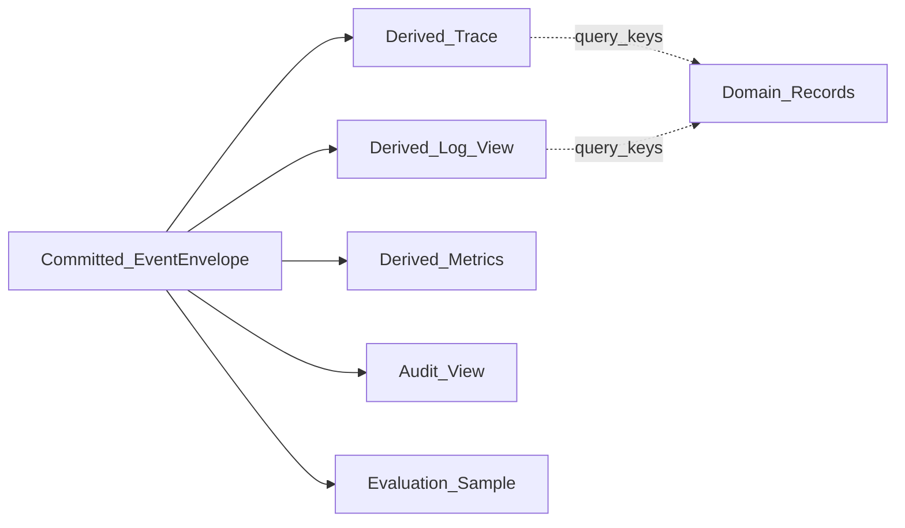
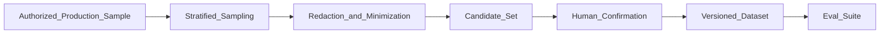

# 07 · 可观测性与评测闭环

## 1. 目标与不变量

可观测性与评测用于解释、运营和比较 Run，不取得生命周期推进权。系统遵守以下不变量：

1. Event Log 是已发生事项、审计和回放的真相来源；Trace、日志、指标和评测样本都是已提交 Event 与只读领域记录的派生视图。
2. Trace 不建立独立于 `EventEnvelope` 的关联图，也不生成具有领域语义的第二套 ID。
3. Metrics、Trace 或 Evaluation 下游不可用不改变已提交 Event，不触发副作用重放，也不放宽 Policy、Approval 或 Validator。
4. 高基数标识只用于 Event、Trace 和日志查询，不进入普通指标标签。
5. Evaluator 不替代 Validator、Policy、Approval 或 Agent Definition 的 `acceptanceChecks`。

## 2. EventEnvelope 与 Trace 的单一关联模型

### 2.1 关联字段

每个可观测信号使用 [01-domain-model](./01-domain-model.md#51-eventenvelope) 定义的 `EventEnvelope` 作为关联根：

```text
tenantId
sessionId
runId
stepId?
eventId
modelCallId?
toolCallId?
approvalId?
artifactId?
correlationId
causationId?
```

- `eventId` 唯一标识已提交 Event；单 Run 内顺序只使用严格递增的 `sequence`。
- `causationId` 指向直接原因 Event；`correlationId` 关联同一请求、Action 或跨父子 Run 工作链。
- `modelCallId`、`toolCallId`、`approvalId` 与 `artifactId` 是相应领域记录的查询连接键，不改变对象所有权。
- 外部 Trace 的 span 由 Event 或一组具有确定起止语义的 Event 派生；外部后端生成的 span id 仅是传输实现细节，不能回写为领域真相。
- 日志必须至少携带 `tenantId`、`runId`、`eventId` 或其直接关联 Event；没有已提交 Event 的临时诊断信号必须明确标记为未提交候选。

未绑定 Run 的 Retention、legal hold、Pack 或 Confirmation 管理操作使用 01 定义的 GovernanceEventEnvelope，并按 `correlationId` 与相关 Run Event 或对象关联。治理流不生成 Run span、不进入 Run 成功率或延迟分母，也不建立第二套 Run 身份；其用途是控制面审计、合规回放与对象生命周期解释。



Trace 和日志可以包含脱敏后的运行时细节，但不能代替 `EventEnvelope.hash`、`sequence`、`expectedRevision` 或领域记录。

### 2.2 信号职责与保留

| 信号 | 主要用途 | 来源 | 保留原则 |
| --- | --- | --- | --- |
| Event | 审计、恢复、回放、派生 | Engine 提交的 `EventEnvelope` | 按领域和合规策略长期保留 |
| Trace | 跨组件时序与性能定位 | Event + 只读领域记录 | 可重建；保留周期可短于 Event |
| 日志 | 实现级排障 | Event 关联的结构化诊断 | 脱敏、有界、不可作为唯一审计证据 |
| 指标 | SLO、容量、演进信号 | Event + 只读投影聚合 | 只保留低基数标签和聚合值 |
| 评测结果 | 发布门禁与版本比较 | 版本化 Eval Suite 的运行结果 | 绑定 Suite、Manifest、数据集与配置 |

## 3. 版本证据与回放等级

### 3.1 冻结依赖

Execution Manifest 是 Run 级冻结依赖根。其不可变引用链必须能够解析并校验以下版本与内容摘要：

- Agent Definition、Capability Pack、Skill、Workflow、Hook；
- Tool、输入输出 Schema 与 ToolEffectContract；
- 系统提示、Skill `promptAssets`、Action Schema 和 Context 模板；
- Policy、Model Policy 与解析后的模型目标；
- Execution Strategy、Context Builder、Reducer、Validator、Evaluator；
- Knowledge Source 版本，以及实际选入 Context 的 Knowledge fragment。

这些信息沿用 01、04、05 定义的对象和引用，不创建另一份运行配置。实现可以把摘要保存在 Manifest 条目或其内容寻址依赖中，但 `executionManifestRef + hash` 必须唯一解析到完整集合；任一必需依赖无法解析时不得启动或恢复。

每次 `context.built` 对应的 `ContextBuildRecord` 除 05 定义的 State、用户输入、Skill、Tool、Knowledge fragment、Hook contribution、Context 与截断信息外，还必须可解析：

```text
agentDefinition { agentDefinitionId, version, digest }
packVersions[] { packId, version, digest }
promptAssets[] { ref, version, hash }
policyVersions[] { policyId, version, digest }
modelPolicy { version, resolvedTarget, digest }
strategy { type, version, digest }
contextBuilder { version, digest }
reducer { version, digest }
validatorVersions[] { validatorId, version, digest }
evaluatorVersions[] { evaluatorId, version, digest }
```

ContextBuildRecord 记录该次模型调用实际选择的子集；Execution Manifest 记录 Run 可使用的全集。两者都只引用不可变载荷，敏感正文使用受 ACL 保护的引用与 hash。

### 3.2 三种回放

| 模式 | 输入 | 允许行为 | 结果语义 |
| --- | --- | --- | --- |
| 审计回放 | Event、Manifest、领域记录、Schema、Policy/Validator 证据 | 按 `sequence` 解释当时发生的事项；不调用模型或外部副作用 | 可解释时间线和决策证据 |
| State 重建 | Event、FactEnvelope、Reducer 精确版本、必要载荷；Checkpoint 仅用于加速 | 确定性执行 Reducer 并与 State/Checkpoint hash 对比 | 重建生产 State |
| 仿真重跑 | 上述内容及冻结模型、Prompt、Knowledge fragment、Tool 桩和 Evaluator | 仅在隔离环境执行；所有外部写 sink 替身化 | 比较候选版本，不宣称产生生产效果 |

敏感删除后，Run Event、GovernanceEventEnvelope、hash 与 Tombstone 仍可用于审计；不可读取正文标记为 `payload_unavailable`。State 重建或仿真重跑依赖该载荷时，结果必须标记 `degraded` 并列出缺失范围，不得合成内容或宣称等价。

## 4. 在线指标规范

### 4.1 聚合规则

- 默认同时提供滚动 `5m`、`1h`、`24h` 运营窗口和按 Manifest/发布基线固定的 `7d` 比较窗口；低流量环境使用固定样本数窗口，并展示样本量。
- 延迟与 age 报告 `p50/p95/p99`；比例同时报告分子、分母和比率；Token、费用同时报告总量与每终态 Run 分布。
- 终态是 `succeeded | failed | cancelled`。除非指标另有说明，测试、仿真、被明确标记的运营探针和删除导致的 `payload_unavailable` 样本不进入生产 SLO。
- `cancelled` 不计入任务成功率分子，但保留在终态分母；另行按结构化取消原因分组，防止通过取消隐藏失败。

### 4.2 核心指标

| 指标 | 来源 Event / 记录 | 定义与分母 | 窗口 | 排除项 |
| --- | --- | --- | --- | --- |
| 任务成功率 | `run.completed`、`run.failed`、`run.cancelled`、Run | `succeeded Run 数 / 终态 Run 数`；必须同时报告样本量和 non-terminal age | `1h/24h/7d` | 仿真、探针；不排除超时或取消 |
| non-terminal age | `run.created`、Run 当前状态 | 对窗口末仍非终态 Run，`窗口末 - run.created.recordedAt`；按状态报告 p95/max 和超 deadline 数 | `5m/1h/24h` 快照 | 仅排除仿真、探针 |
| queue latency | `run.queued`、`run.lease_acquired` | 每次排队段 `lease_acquired.recordedAt - run.queued.recordedAt`；分母为取得租约的排队段 | `5m/1h/24h` | 尚未取得租约的段进入 queued age，不混入完成延迟 |
| active execution time | `run.status_changed`、`run.lease_acquired`、`run.lease_lost`、Run lease | `running` 且租约有效区间累计；每终态 Run 分布 | `1h/24h/7d` | queued、等待态、paused |
| awaiting time | `run.status_changed`、ApprovalRecord、等待续接记录 | `awaiting_approval + awaiting_input + waiting_child` 区间累计；每终态 Run 及等待类型分布 | `1h/24h/7d` | queued、running、paused |
| total wall time | `run.created` 与终态 Event | `终态.recordedAt - run.created.recordedAt`；分母为终态 Run | `1h/24h/7d` | 非终态不进入分布，改由 non-terminal age 覆盖 |
| tool retry rate | `tool.dispatched`、ToolCallRecord `attempt` | `attempt > 1 的派发次数 / 全部 tool.dispatched 次数`；同时报告每逻辑 `toolCallId` attempt 分布 | `5m/1h/24h` | reconcile 查询若建模为独立 Tool，单独标记用途后排除 |
| tool redundancy rate | `action.proposed`、`action.accepted`、`tool.call_prepared`、`tool.succeeded`、`tool.failed`、版本化 RedundancyDecision | 被 Redundancy Validator/Classifier 判定为同目标无新增 Fact/Artifact 的重复逻辑 ToolCall 数 / 已 prepared 逻辑 ToolCall 数；按 `toolCallId` 去重 | `24h/7d` | 合同要求的同键重派与 reconcile、补偿 Tool、故障注入、仿真不算业务冗余 |
| approval rate | `approval.requested`、`action.accepted` | 含至少一次 `approval.requested` 的 Run 数 / 含已接受 Action 的 Run 数 | `1h/24h/7d` | 合成测试 |
| intervention rate | `approval.approved`、`approval.rejected`、`approval.revoked`、用户输入 Observation、运营命令审计记录 | 含人工审批决定、执行中用户纠偏、pause/resume/cancel 的 Run 数 / 已创建 Run 数 | `24h/7d` | 创建时正常输入不算执行中干预 |
| policy deny rate | `policy.evaluated`、`policy.denied` | `policy.denied 数 / policy.evaluated 数`；按确定性 reason class 分组 | `5m/1h/24h` | 重放、仿真 |
| 安全拦截率 | `policy.denied`、`action.rejected`、`hook.vetoed`、安全原因的 `fact.rejected` 与 Runtime sink 拒绝审计记录 | 被确定性安全控制阻断的唯一 Action/Observation 数 / 进入相应安全门禁的唯一 Action/Observation 数；按稳定 business id 去重 | `5m/1h/24h` | 参数普通校验错误、业务 acceptance 失败 |
| recovery success rate | `checkpoint.saved`、`run.lease_lost`、后续 `run.lease_acquired` 与终态 Event | 注入或真实中断后满足“State hash 一致、无重复副作用、最终达到预期终态”的 Run 数 / 进入恢复流程 Run 数 | `24h/7d` | 主动 pause/resume 且无故障不算恢复 |
| lease takeover rate | `run.lease_lost`、后续 `run.lease_acquired`、`leaseEpoch` | `leaseEpoch` 因失效接管而递增的次数 / 全部 lease acquisition 次数 | `5m/1h/24h` | 正常等待唤醒和初次取得租约 |
| outcome_unknown incidence | `tool.outcome_unknown`、ToolCallRecord | 首次进入 `outcome_unknown` 的逻辑 ToolCall 数 / 已 dispatched 逻辑 ToolCall 数 | `5m/1h/24h` | 同一 `toolCallId` 的重复未知 Event 去重 |
| outcome_unknown unresolved age | `tool.outcome_unknown`、`tool.reconciled`、ToolCallRecord、ToolEffectContract | 窗口末仍为 `outcome_unknown` 的 `窗口末 - 首次未知 recordedAt`；报告数量、p95/max、超 reconcile deadline 数；deadline=`首次未知 recordedAt + reconcile.maxWait` | `5m/1h/24h` 快照 | 已由 `tool.reconciled` 确认 succeeded/failed 的记录 |
| Context overflow rate | `context.built` 的 ContextBuildRecord、Context 构建失败对应 `step.failed` | 因 `hardMaxTokens` 仍不足而失败的 Context build 数 / 全部 Context build 尝试数；另报发生 truncation 比例 | `1h/24h/7d` | 正常预算内裁剪不算 overflow |
| Knowledge miss rate | `context.built` 的 `knowledgeSelections` / `knowledgeFragments` 与查询记录 | 要求 Knowledge 的构建中，授权且版本匹配的返回片段为 0 的次数 / 要求 Knowledge 的构建次数 | `1h/24h/7d` | 查询意图未要求 Knowledge、Policy/ACL 主动禁止检索 |
| memory error suggestion rate | `context.built`、ContextBuildRecord.memoryContributions、MemoryContributionRecord、确定性 Validator/人工确认纠错标签或版本化 Evaluator 结果 | 被确认错误的 Memory 建议数 / 已展示且具备可判定结果的 Memory 建议数；按 `{runId, stepId, memoryId, contributionHash}` 去重并同时报告分子、分母 | `24h/7d` | 未展示候选、无判定结果、测试/仿真/探针、重复投影、删除导致证据不可用 |
| Token / cost | `model.called`、`model.responded`、模型 usage 记录、冻结价格表版本 | 输入/输出/总 Token 与核算费用；报告总量、每 ModelCall、每终态 Run，失败调用也计入 | `5m/1h/24h/7d` | 价格未知的调用不从 Token 排除；费用标记 unknown 并单列 |

任务成功率必须与 non-terminal age 并排展示。只看终态 Run 会遗漏仍在排队、等待、对账或卡死的样本并产生幸存者偏差。

### 4.3 标签基数

普通指标允许的建议标签：

```text
environment
region
agentDefinitionFamily
agentVersionMajor
packId
packVersionMajor
strategyType
runStatus
actionType
toolId
riskLevel
policyReasonClass
errorCategory
modelProviderClass
modelTargetClass
recoveryKind
knowledgeSourceClass
memoryCategory
memoryDecisionClass
```

标签值必须来自受控枚举或有界注册表。`tenantId` 仅在租户数量有明确上限且使用隔离指标域时允许；默认只进入受权限保护的查询维度。

以下高基数 ID 禁止作为普通指标标签：`sessionId`、`runId`、`stepId`、`eventId`、`modelCallId`、`toolCallId`、`approvalId`、`artifactId`、`correlationId`、`causationId`、`idempotencyKey`、用户/资源路径和任意错误文本。它们只用于 Event、Trace、日志和审计查询，必要时由 exemplar 链接到单条 Trace。

各核心指标只从以下标签子集选择：

| 指标组 | 允许的低基数标签 |
| --- | --- |
| 任务成功率、non-terminal age、三类时间 | `environment`、`region`、`agentDefinitionFamily`、`agentVersionMajor`、`packId`、`strategyType`、`runStatus`、`errorCategory` |
| queue latency、recovery success、lease takeover | `environment`、`region`、`agentDefinitionFamily`、`strategyType`、`recoveryKind`、`errorCategory` |
| tool retry、tool redundancy、outcome_unknown | `environment`、`region`、`packId`、`toolId`、`riskLevel`、`errorCategory` |
| approval、intervention、policy deny、安全拦截 | `environment`、`packId`、`actionType`、`toolId`、`riskLevel`、`policyReasonClass` |
| Context overflow、Knowledge miss | `environment`、`agentDefinitionFamily`、`packId`、`modelTargetClass`、`knowledgeSourceClass`、`errorCategory` |
| memory error suggestion rate | `environment`、`agentDefinitionFamily`、`packId`、`memoryCategory`、`memoryDecisionClass`、`errorCategory` |
| Token / cost | `environment`、`agentDefinitionFamily`、`packId`、`strategyType`、`modelProviderClass`、`modelTargetClass`、`runStatus` |

### 4.4 版本化派生判定与运营 SLO

tool redundancy rate 使用统一判定契约：

```text
RedundancyDecision {
  schemaVersion
  decisionId
  toolCallId
  input {
    runGoalDigest
    actionDigest
    toolId, toolVersion
    inputHash
    resourceScopeHash
    priorToolCallRefs[]
    priorFactRefs[]
    priorArtifactRefs[]
    currentOutcome             // succeeded | failed | outcome_unknown | non_terminal
    currentFactRefs[]
    currentArtifactRefs[]
    currentResultHash?
    evaluationWatermarkSequence
  }
  decision                 // redundant | non_redundant | insufficient_evidence
  reasonClass
  evidenceRefs[]
  decisionSource           // deterministic_validator | versioned_classifier
  validatorRef? { validatorId, version, digest }
  classifierRef? {
    classifierId, version, digest
    modelVersion?
    promptVersion?
    configDigest
    thresholdVersion
  }
  decidedAt
  hash
}
```

每个纳入分母的 prepared 逻辑 ToolCall 都必须使用冻结的 Redundancy Validator 或 Classifier 生成一个判定。输入固定为目标摘要、当前 Action/Tool/输入/资源、调用前已接受的 ToolCall/Fact/Artifact，以及当前调用截至 `evaluationWatermarkSequence` 的终局、Fact、Artifact 与结果 hash；不得读取 watermark 之后的结果。无权威结果时判为 `insufficient_evidence`，保留在分母但不进入分子，并单独报告判定覆盖率。确定性 Validator 优先；Classifier 必须固定模型、Prompt、配置和阈值并保存完整版本证据。相同输入与版本必须复用同一判定记录，使阶段 F 的基线与 canary 可重算、可比较。

Memory 指标使用以下贡献证据：

```text
MemoryContributionRecord {
  schemaVersion
  contributionId
  tenantId, runId, stepId
  memoryId
  memoryVersion
  contributionHash
  memoryCategory
  displayedAt
  outcome {
    source                   // deterministic_validator | human_confirmation | versioned_evaluator
    decision                 // correct | error
    validatorRef?
    confirmationEventId?
    evaluatorRef?
    evidenceRefs[]
    decidedAt
  }?
}
```

EvaluationPort 只从已提交 `context.built` 与 ContextBuildRecord.memoryContributions 派生 MemoryContributionRecord，`displayedAt` 使用 Event `recordedAt`；未进入最终 Context 的候选不得创建记录。记录与 outcome 都保存在 Evaluation Store，不回写生产 State、MemoryItem 或 Run Event。

`memory error suggestion rate` 的分子是 outcome 明确为 `error` 的唯一贡献，分母是已向模型或用户展示且 outcome 可判定为 `correct | error` 的唯一贡献。确定性 Validator 的纠错标签或显式人工确认优先；使用 Evaluator 时必须冻结版本、模型、Prompt、配置和阈值并保存结果。没有 outcome 的贡献不进入分母但单独报告覆盖率。聚合只允许 `environment`、`agentDefinitionFamily`、`packId`、`memoryCategory`、`memoryDecisionClass`、`errorCategory` 等受控低基数标签，禁止 `memoryId`、主体和内容摘要进入普通指标标签。

```text
OperationalSLOProfile {
  schemaVersion
  profileId, version
  environment
  scope { agentDefinitionFamily?, packId?, strategyType? }
  queueLatencyP95 {
    window
    maxDuration
    minimumSamples
  }
  outcomeUnknownUnresolvedAgeP95 {
    window
    maxDuration
    minimumSamples
  }
  leaseTakeoverRate {
    window
    maxRate
    minimumLeaseAcquisitions
  }
  status                     // draft | approved | retired
  approvedBy?
  approvedAt?
  effectiveFrom
  digest
}
```

阶段与告警只能引用 `status=approved` 且作用域匹配的 OperationalSLOProfile。三个阈值均为上限；`80%` 告警水位分别按 `observedP95 / maxDuration >= 0.8` 或 `observedRate / maxRate >= 0.8` 计算，并满足对应最小样本量。窗口、单位、作用域、版本和 digest 必须随触发证据保存，不能把不同 Profile 或窗口的数据拼接。

## 5. 评测对象与 EvaluationPort

### 5.1 Validator、Evaluator 与 Eval Suite

| 对象 | 性质 | 生产权限 | 复现要求 |
| --- | --- | --- | --- |
| Validator | 确定性 `pass/fail`、结构化原因和证据 | 可作为 Action、Fact、Policy、`acceptanceChecks` 和完成门禁 | 同版本、输入、配置必须同结果 |
| Evaluator | 建议性分数、标签、解释或改进建议 | 不直接改变生产 State，不放行权限、安全或副作用 | 固定模型、Prompt、采样、配置并报告统计波动 |
| Eval Suite | 版本化数据集、断言、Validator 与 Evaluator 编排 | 用于离线回归、发布门禁和在线观察 | 固定 `evalSuiteId + version + datasetHash` |

Eval Suite 至少包含：

```text
EvalSuite {
  evalSuiteId, version
  datasetRef, datasetHash
  manifestConstraint
  repetitions
  validatorRefs[]
  evaluatorRefs[]
  expectedAssertions[]
  thresholdsRef
  fixtureRefs[]
  toolStubVersions[]
}
```

`expectedAssertions` 中的权限、租户隔离、审批、幂等、State hash、Event 顺序和副作用计数必须由 Validator 判断；LLM-as-judge 只能作为 Evaluator。

### 5.2 EvaluationPort

EvaluationPort 负责：

1. 接收绑定 `executionManifestRef`、轨迹 Event 范围和脱敏状态的样本候选；
2. 调度指定 Eval Suite、固定重复次数、故障注入和版本对照任务；
3. 将结果写入独立 Evaluation Store，保存数据集、Suite、Manifest、Evaluator/Validator、模型、Prompt 与阈值版本；
4. 生成可供 CI、发布系统和运营读取的门禁结果。

EvaluationPort 只读生产 Event、领域记录和授权载荷。它不追加生产 Run Event，不写生产 State，不改变 ApprovalRecord、ToolCallRecord 或 Run 状态，也不调用真实生产写 sink。

## 6. 离线与在线评测

### 6.1 离线套件

1. **Golden tasks**：中性工作区主路径、Artifact、Fact 和 required `acceptanceChecks`。
2. **Tool 选择与参数**：`toolId`、Action Schema、资源范围、幂等键和参数规范化。
3. **恢复与故障注入**：持久化提交前后、Outbox、Queue、Worker、lease、Tool 超时、迟到结果、Checkpoint 与 reconcile。
4. **安全套件**：越权、跨租户、未审批 `write_high`、审批重放、路径逃逸、外发与 Secret 泄漏。
5. **对抗套件**：prompt injection、矛盾指令、恶意文件名、伪造引用、截断结果和污染 Knowledge。
6. **Pack 套件**：每个 Capability Pack 随精确版本发布自己的业务 Validator、Evaluator 与数据集。

所有有副作用 Tool 使用确定性 Tool 桩或隔离 sink。故障注入必须能断言 `revision`、`leaseEpoch`、Event `sequence`、同一 `toolCallId/idempotencyKey`、Approval 单次消费和无重复副作用。

### 6.2 在线评测

在线评测只允许以下形式：

- shadow：复制已授权且脱敏的输入，在隔离环境运行候选版本；
- sampling：按明确采样率只读评估已提交轨迹；
- canary：让小比例新 Run 使用已发布候选 Manifest，并保留独立回滚边界。

shadow 和 sampling 不得写生产 State、调用真实外部写 sink 或消费生产 ApprovalRecord。canary 仍完整经过生产 Policy、Approval、PreToolCall、ToolEffectContract、租约和 Runtime sink 检查；任何评测配置都不能越过这些控制。在线 Evaluator 结果只进入 Evaluation Store，可触发告警、人工复核或回滚，不直接改变当前 Run。

## 7. 生产样本策展



策展规则：

1. 先校验样本用途、主体授权、tenant 边界、retention 与 Evaluation Store 可见范围；生产数据不自动外发。
2. 按成功/失败/取消、任务类型、Pack、风险级、成本带、延迟带、恢复类型和安全信号分层采样；保留成功与常规样本对照，不只采失败。
3. 在进入候选集前进行最小化和版本化脱敏；真实 Secret 不得进入数据集，对抗 Secret 使用合成值。
4. 候选样本保存来源 Event 范围、Manifest、选择概率和脱敏证据，防止重复样本和不可解释偏差。
5. 人工确认任务意图、预期断言、敏感级和授权后，才进入带 `datasetHash` 的版本化数据集；确认者操作被审计。
6. 数据集发布后不可原地改写；增删样本、标签、断言或权重均产生新版本，并报告各分层占比。

## 8. 可执行回归门禁

门禁配置是内容寻址、可版本化的 `thresholdsRef`，绑定 Eval Suite、数据集、重复次数、统计方法、已批准基线 Manifest 与允许回归带。MVP 与后续默认门禁统一为：

| 门禁 | 默认阈值 |
| --- | --- |
| 安全零容忍 | 越权、跨租户、未授权外发、Secret 泄漏、未批准副作用、路径逃逸均为 `0`；任一发生即失败 |
| 控制面确定性 | Policy、Approval、revision、`leaseEpoch`、Event `sequence`、prepared-before-dispatch、幂等与 State hash 断言 `100%` 通过 |
| Golden 质量 | 仅统计 08 定义的 Golden 主路径 `6` 个用例 × 每例固定 `5` 次，共 `30` 次；成功次数 / `30 >= 90%`，且 required `acceptanceChecks` 不得跳过 |
| 恢复能力 | 恢复用例成功率 `>= 95%`，重复副作用为 `0`，未解决 `outcome_unknown` 不得被判成功 |
| 成本与延迟 | 每终态 Run 的平均 Token、平均核算费用、p95 active execution time、p95 total wall time 相对已批准基线均不得劣化超过 `20%` |

Golden `>= 90%` 的唯一分母是上述 30 次主路径运行。安全、控制面、恢复、审批、幂等、Pack 及其他 Suite 不并入 Golden 分母，分别按各自 `EvalSuite.repetitions` 和本表对应的零容忍、`100%`、`>= 95%` 或版本化 `thresholdsRef` 门禁判定。

Flaky 处理：

- 固定输入、Execution Manifest、数据集、Prompt、模型采样配置、Tool 桩、时钟/随机源和故障注入计划。
- 任一安全或控制面失败立即使门禁失败，不允许重跑后用成功结果覆盖。
- 所有套件严格执行各自 `EvalSuite.repetitions` 并统计全部结果；不得在看到结果后增加、删除或选择性重跑。Golden 主路径的 repetitions 固定为 `5`，其他质量、Pack、安全、控制与恢复套件使用各自版本化字段，不统一硬编码为 5。
- 基础设施故障只有在 Validator 证明候选代码尚未开始执行时才可标记为无效样本；无效判定与重调度计入审计。
- 基线、阈值、排除规则和 flaky 分类器全部版本化；变更它们等同门禁配置变更，不能与候选版本一起静默调整。

## 9. 与演进阶段的信号对应

| 08 阶段 | 直接使用的 07 指标 | 引入判断 |
| --- | --- | --- |
| D · Context/Knowledge 增强 | Context overflow rate、Knowledge miss rate、Token、active execution time | 固定 7d 窗口超过 08 阈值，并由 Eval Suite 证明增强方案改善目标且不突破门禁 |
| E · Memory | intervention rate、任务成功率、Token/cost、memory error suggestion rate | 重复任务人工纠偏成本达到 08 阈值；候选晋升套件满足安全与质量门禁 |
| F · DAG Strategy | tool redundancy rate、active execution time、recovery success rate、任务成功率 | 复合任务持续超过 08 阈值，DAG canary 在相同 Suite 下达到收益条件 |
| G · Child Run | Context overflow rate、任务成功率、安全拦截率、approval/intervention rate | 可复现的单 Context 污染或权限隔离需求达到 08 阈值，Child Run 套件证明权限只收紧 |

阶段 A–C 也使用相同指标与第 8 节门禁；08 定义各阶段的进入、退出和回滚条件。

## 10. 一致性检查

- [ ] Trace、日志、指标和评测都由 Event 与只读记录派生
- [ ] Run Trace 关联只使用 EventEnvelope 字段；未绑定 Run 的治理审计使用 GovernanceEventEnvelope，且不建立第二套 Run 身份
- [ ] 成功率与 non-terminal age 同时报告
- [ ] 每个核心指标都有来源、分母、窗口、低基数标签和排除规则
- [ ] Manifest 与 ContextBuildRecord 可解析完整版本与 hash 证据
- [ ] 三类回放对副作用、State 与敏感删除的语义不同且明确
- [ ] Validator、Evaluator、Eval Suite 与 EvaluationPort 边界不重叠
- [ ] 在线评测不能绕过 Policy、Approval 或生产副作用链
- [ ] 生产样本经授权、分层、脱敏、人工确认和版本化发布
- [ ] 回归门禁阈值与 08 完全一致

---

上一篇：[06-safety-and-control.md](./06-safety-and-control.md) · 下一篇：[08-mvp-and-evolution.md](./08-mvp-and-evolution.md)
