# 08 · MVP 能力边界与演进路线

## 1. MVP 定位与闭环

MVP 验证一个中性通用工作区任务的完整控制闭环：客户端创建异步 Run，Engine 以轻量循环推进，模型只能提出结构化 Action，所有数据经过 Observation、FactEnvelope 与 Reducer，所有副作用经过 Policy、Approval 和 ToolEffectContract，进程或租约故障后可从 Event 与 Checkpoint 恢复，最终以 Artifact、State、Event、Trace 和评测结果验收。

MVP 必须具备可运行的安全、恢复和评测能力，不以同步专用路径、内存状态、日志或人工操作填补契约空缺。

```mermaid
flowchart LR
    C[CreateRun] --> O[Atomic_Run_Event_Outbox]
    O --> Q[Queued]
    Q --> R[Running_Light_Loop]
    R --> G[Policy_Approval_Hooks]
    G --> T[Prepared_ToolCall]
    T --> F[Observation_Fact_Reducer]
    F --> K[Checkpoint_and_Recovery]
    K --> E[Terminal_Event_Artifact]
    E --> V[Trace_Metrics_Golden_Eval]
```



## 2. MVP 能力清单

### 2.1 接入、投递与并发

| 能力 | MVP 要求 |
| --- | --- |
| Agent Definition | 一个版本化通用工作区 Agent；固定 budgets、Tool allowlist、Policy、Knowledge、Model Policy 与 required `acceptanceChecks` |
| Execution Manifest | 创建 Run 时解析并冻结 Agent、Pack、Skill、Workflow、Hook、Tool、Prompt、Action Schema、Policy、Model、Strategy、Context Builder、Reducer、Validator、Evaluator 与 Knowledge 版本和 hash |
| 异步 Run API | CreateRun、查询 Run/State/Event、提交输入、审批决定、pause/resume/cancel、按 `sequence` 订阅 Event |
| CreateRun 幂等 | 租户作用域 `idempotencyKey`；同键同请求摘要返回同一 `runId`，同键不同摘要返回 `conflict` |
| 原子创建 | Run `status=created`、`run.created`、客户端幂等记录和首条 Outbox 在同一事务提交 |
| 排队与租约 | 严格 `created → queued → running`；Queue 至少一次投递；Scheduler 只发命令；补偿扫描可重建调度信号 |
| 并发控制 | 所有可变提交校验 `expectedRevision + leaseEpoch`；取得或接管租约时 `leaseEpoch` 严格递增 |

同步等待只允许作为客户端订阅终态的封装；客户端超时不取消 Run。

### 2.2 执行内核与五个 Hook 点

MVP 只启用 `Run.strategy.type=light`。每个 Step 按 03 的顺序执行预算、Hook、Context、Model、Action Schema、Policy、Approval、Tool、Observation、FactEnvelope、Reducer 和完成门禁。

五个 Hook 点都必须有最小可执行实现：

| Hook 点 | MVP 行为 |
| --- | --- |
| `PreReasoning` | 接受有来源、TTL、敏感级和预算的 Context contribution；支持确定性 veto |
| `PostReasoning` | 记录模型 Action 后支持 veto 或 Observation；不能改写 Action |
| `PreToolCall` | 在 Policy/Approval 复核后、ToolCallRecord `prepared` 前执行；veto 时不消费审批 |
| `PostToolCall` | 权威结果或一次 reconcile 后产生 Observation 或 veto Step 成功；不抹去 Tool 结果 |
| `OnRunEnd` | 终态提交前产生最终 Observation；只可阻止 `succeeded`，不能阻止安全失败或取消 |

每次调用至少产生 `hook.invoked`，并按结果产生 `hook.context_contributed`、`hook.vetoed`、`hook.observation_emitted` 或 `hook.failed`。Hook 只返回 Context contribution、veto 或 Observation，不调用 Tool、不写 State、不分配 Event `sequence`。

### 2.3 数据、状态与恢复

MVP 持久化并交叉校验：

- Run、Step、Action 和单 Run 严格递增的 `EventEnvelope.sequence`；
- State、Observation、FactEnvelope；
- Checkpoint 的 `revision`、`sequence`、State hash、strategy cursor 与待续信息；
- ToolCallRecord、ApprovalRecord、Artifact 元数据与幂等记录；
- ContextBuildRecord 及其 Manifest、State、Skill、Tool、Prompt、Knowledge fragment、Hook contribution、Model、Reducer、Validator 与 Evaluator 版本/hash 证据。

State 唯一写入口是 `nextState = reduce(previousState, FactEnvelope)`。Checkpoint 只加速恢复；无有效 Checkpoint 时必须能从 `run.created` 和 Event 重建 State 与轻量策略游标。Context 在恢复后重新构建，不是恢复真相。

### 2.4 Tool 与副作用

MVP Tool 集合：

```text
workspace.list
workspace.read
workspace.search
workspace.write
artifact.write_markdown
artifact.validate
synthetic.write_high
synthetic.write_high.reconcile
```

- Workspace Tool 只能访问授权路径根。路径规范化必须覆盖 `.`、`..`、符号链接、连接点、大小写、Unicode 和设备路径；输出受单条、总大小和敏感信息限制。
- `workspace.write` 为 `write_low`：只写授权 Workspace 根下的 UTF-8 文件，`path` 与 `content` 必填，经 prepared-before-dispatch；不得写 `/` 自身。
- `artifact.write_markdown` 只写受控 Artifact Store 或授权 Workspace 根，使用稳定幂等键并返回不可变 `artifactId/ref/hash`。
- 每个 Tool 都有版本化输入/输出 Schema、风险级、超时、权限和 ToolEffectContract。
- `sideEffectProfile != none` 的调用必须先按 01 §5.3 原子提交 ToolCallRecord `prepared`、`namespace=tool_call` 的 IdempotencyRecord、`tool.call_prepared` 与派发 OutboxRecord，再携带同一 `toolCallId`、`idempotencyKey` 和 `dispatchLeaseEpoch` 派发。
- 权威结果产生 `tool.succeeded` 或 `tool.failed`。超时、断连、取消竞态或 Worker 失效产生 `tool.outcome_unknown`，只能按效果契约 reconcile，并由 Engine 提交 `tool.reconciled` 及最终状态。
- 未解决 `outcome_unknown` 的相关 Run 不得进入 `succeeded`；恢复、重试与租约接管不得生成新幂等键。

### 2.5 Policy 与 Approval

MVP 实现平台、租户、Pack、Agent 的确定性 Policy 组合：

```text
allow < require_approval < deny
```

read 和受控 `write_low` 仍经过 allowlist、Schema、资源范围和 Runtime 检查。MVP 不开放真实高风险外部写；`write_high` 默认 deny，仅隔离的 `synthetic.write_high` 在专用测试租户和合成资源范围内返回 `require_approval`。

`synthetic.write_high` 用于验证完整审批链：

1. Engine 创建完整 ApprovalRecord，绑定 `actionDigest`、资源范围、Tool/Policy/Manifest 版本、审批主体和绝对 TTL；
2. Run/Step 进入 `awaiting_approval`，原子保存 Checkpoint 和待续信息并释放 lease；
3. `approved` 只把 Run 唤醒到 `queued`；取得新 lease 后重新执行 Policy、摘要、权限、TTL 与 PreToolCall 检查；
4. ApprovalRecord `approved → consumed`、`approval.consumed`、ToolCallRecord `prepared` 和派发 Outbox 原子提交；
5. 合成 sink 记录稳定资源键和副作用计数，可注入超时并由 `synthetic.write_high.reconcile` 查询权威结果。

`rejected`、`expired`、`revoked`、`consumed` 不可再次放行。合成 sink 与任何真实业务系统、外部网络或生产资源隔离。

### 2.6 Knowledge

MVP 只允许受控 Knowledge Source：

- `sourceId + sourceVersion` 固定在 Execution Manifest；
- 仅使用精确键、标签过滤或确定性规则检索；
- 返回的 KnowledgeFragment 必须带 tenant、版本、hash、provenance、ACL、sensitivity 和有效期；
- Context Builder 是唯一检索和组装入口；
- 检索结果不自动成为 Observation、FactEnvelope、State 或 Memory。

MVP 不包含向量检索、embedding、语义路由、跨源自动融合或生产产出自动写回 Knowledge。

### 2.7 Sandbox 边界

MVP 不注册、不授权也不执行 `sandbox.exec`、任意代码或 Shell。`SandboxPort` 可以保留在 Core 端口契约中，用于兼容后续受控实现，但不是 MVP 的执行路径，任何 Agent Definition 和 Tool allowlist 都不得引用它。

Workspace Tool 不依赖 Sandbox 获得宿主访问权；它仍通过 WorkspacePort 的授权路径根、操作 allowlist、路径防逃逸、大小/文件数/输出上限和租户隔离执行。

### 2.8 Trace、指标与 Golden Eval

MVP 按 07 的单一关联模型从已提交 Event 派生 Trace，不建立第二套领域 Trace。至少上线：

- 任务成功率与 non-terminal age；
- queue latency、active execution time、awaiting time、total wall time；
- tool retry、policy deny、安全拦截、approval/intervention；
- recovery success、lease takeover；
- `outcome_unknown` incidence 与 unresolved age；
- Context overflow、Knowledge miss、Token/cost。

普通指标只使用 07 允许的低基数标签；高基数 ID 只用于 Event、Trace、日志和审计查询。Golden Eval 使用版本化 Eval Suite、固定 Tool 桩、固定重复次数和第 5 节门禁。

## 3. MVP 垂直切片

1. 客户端以稳定幂等键提交目标和已授权工作区引用。
2. CreateRun 原子保存 Run、`run.created`、幂等记录与 Outbox；Dispatcher、Queue、Scheduler 推进到 `running`。
3. 轻量循环依次使用 `workspace.list` 确认授权根与候选路径、`workspace.search` 定位相关内容、`workspace.read` 读取所需材料；全部结果先成为 Observation，再经 FactEnvelope 与 Reducer 更新 State。
4. Context Builder 以固定规则查询受控 Knowledge Source，按预算构建 Context 并保存 ContextBuildRecord。
5. Agent 生成 Markdown 产物；Artifact 引用经验证后进入 State。
6. required `acceptanceChecks` 由 Validator 确定性验证；通过后才能接受 `finish`。
7. Engine 提交 `run.completed`、最终 Checkpoint；客户端取得 Artifact 引用、State 和可重放 Event。
8. 任一预设故障点中断后，新的租约取得者按 `revision`、`leaseEpoch`、Checkpoint、Event 和 ToolCallRecord 恢复，不重复副作用。
9. 专用用例通过 `synthetic.write_high` 走完审批等待、唤醒、单次消费、未知结果与对账，但不触达真实外部写。

## 4. MVP 非目标

| 能力 | MVP 状态与边界 |
| --- | --- |
| DAG Strategy | 不启用；只保留与 light 共用的 Strategy 契约，阶段 F 才可启用 |
| Child Run | 不启用 `spawn_child` 执行路径；对象、Schema、Policy 与恢复契约保留，直到阶段 G |
| 多 Agent / 有限多角色 | 不启用；不能用共享 State、后台 Hook 或隐式子任务模拟 |
| Memory 检索与晋升 | 关闭；candidate 不进入 Context，不执行 promoted 流程 |
| 向量或语义 Knowledge 路由 | 关闭；只允许版本固定的精确/规则检索 |
| 自动 Knowledge 写回 | 关闭；Run 产出不得直接发布为 Knowledge |
| 语义 Skill 路由 | 关闭；Skill 由固定 Agent/Pack 配置与确定性规则选择 |
| `sandbox.exec`、任意代码或 Shell | 不注册、不授权、不执行 |
| 真实 `write_high` 外部系统 | 不开放；审批只通过隔离合成 Tool 验证 |
| 自主发布生产变更 | 不允许；发布门禁与实际发布权限分离 |

MVP 禁用能力不得通过 Tool 别名、Hook、Pack 后台任务、模型自由文本或 Adapter 旁路实现。

## 5. 可执行 MVP 验收矩阵

### 5.1 套件规模与断言

| 套件 | 最少独立用例 | 每例运行 | 必须覆盖 |
| --- | ---: | ---: | --- |
| Golden 主路径 | `6` | 固定 `5` 次 | 读取、检索、Artifact、Fact/State、`acceptanceChecks`、finish |
| 越权与安全 | `8` | 固定 `1` 次 | 跨租户、路径逃逸、未授权 Tool、prompt injection、外发、Secret、未批准副作用、Hook 越界 |
| 恢复故障注入 | `8` | 固定 `5` 次 | 提交前后崩溃、Outbox/Queue 重投、lease 丢失、Checkpoint、迟到结果、Tool 超时、reconcile |
| 审批生命周期 | `6` | 固定 `1` 次 | approve、reject、expire、revoke、摘要/版本不匹配、单次消费 |
| 幂等与未知结果 | `6` | 固定 `5` 次 | CreateRun 同键、摘要冲突、prepared-before-dispatch、同键重派、`outcome_unknown`、权威对账 |

每个用例固定输入、Execution Manifest、Tool 桩、时钟/随机源、模型采样配置、故障点、预期 Event 序列、最终 State/Artifact hash 和副作用计数。控制面断言包括 `expectedRevision`、`leaseEpoch`、Event `sequence`、Approval 状态、ToolCallRecord 状态与幂等键。

### 5.2 统一通过门槛

MVP 和后续阶段使用与 07 完全一致的默认门禁：

| 门禁 | 默认阈值 |
| --- | --- |
| 安全零容忍 | 越权、跨租户、未授权外发、Secret 泄漏、未批准副作用、路径逃逸均为 `0`；任一发生即失败 |
| 控制面确定性 | Policy、Approval、revision、`leaseEpoch`、Event `sequence`、prepared-before-dispatch、幂等与 State hash 断言 `100%` 通过 |
| Golden 质量 | 仅统计 Golden 主路径 `6 × 5 = 30` 次运行；成功次数 / `30 >= 90%`，且 required `acceptanceChecks` 不得跳过 |
| 恢复能力 | 恢复用例成功率 `>= 95%`，重复副作用为 `0`，未解决 `outcome_unknown` 不得被判成功 |
| 成本与延迟 | 每终态 Run 的平均 Token、平均核算费用、p95 active execution time、p95 total wall time 相对已批准基线均不得劣化超过 `20%` |

Golden 门禁的分母固定为 30 次主路径运行。越权与安全、恢复故障注入、审批生命周期、幂等与未知结果以及 Pack 等其他 Suite 不并入 Golden 分母，分别按各自 `EvalSuite.repetitions` 与安全、控制、恢复或版本化专项阈值独立判定。

若基线样本尚不存在，首个满足全部确定性门禁的候选可被显式批准为版本化基线；不能用空基线自动通过成本与延迟门禁。

### 5.3 Flaky 规则

- 安全和控制面用例是确定性断言；任一次失败即门禁失败，不允许重跑洗绿。
- 质量与恢复用例只执行套件预设次数并统计全部结果；不得看到结果后临时增加运行、删除失败或选择最佳结果。
- 只有在 Validator 证明候选执行尚未开始的基础设施故障才可判为无效样本；无效原因、证据和重新调度被记录。
- 数据集、Manifest、Tool 桩、模型/Prompt、重复次数、统计方法、阈值和已批准基线都内容寻址并版本化。

## 6. 阶段 A–G

每一阶段先满足进入信号，再以独立 Manifest、Eval Suite 和 canary 边界启用。退出意味着该阶段能力可以扩大使用范围；回滚通过停用候选 Manifest、Pack 或 Strategy 指针完成，不改写历史 Run。

### 阶段 A — MVP 契约闭环

范围是第 2 节全部能力和第 4 节全部禁用项。

- **进入信号**：Core 对象、端口、Event、状态机、Policy 和 ToolEffectContract 已有可实现的版本化契约。
- **退出条件**：第 5 节全部最小用例数满足，安全与控制面 `100%`，未授权或重复副作用为 `0`，Golden 30 次主路径运行的成功率 `>= 90%`，恢复 `>= 95%`，成本与四项延迟/费用指标均在 `20%` 回归带内。
- **回滚条件**：任一安全/控制断言失败、Event 无法重建 State、恢复产生重复副作用或 unresolved `outcome_unknown` 被判成功；停止新增 Run，并将流量指向上一个已批准 Manifest。

### 阶段 B — 可控性运营增强

阶段 B 增加运营规模和自动化，不填补 MVP 缺失能力。ApprovalRecord、幂等、对账、租约、最小 Trace/指标和审计证据在阶段 A 已完整可用。

可增加审批队列运营、对账调度器、审计导出、租约扫描、SLO 告警、细粒度预算和隔离 Adapter；仍不开放真实 `write_high` 或 `sandbox.exec`。

- **进入信号**：连续 `7d` 至少 `500` 个 Run，或 queue latency p95、outcome_unknown unresolved age p95、lease takeover rate 任一达到匹配作用域且 `status=approved` 的 [07 OperationalSLOProfile](./07-observability-and-evaluation.md#44-版本化派生判定与运营-slo) 上限的 `80%`；持续时间指标按 `observedP95 / maxDuration >= 0.8`，比例指标按 `observedRate / maxRate >= 0.8`，并满足 Profile 最小样本量。
- **退出条件**：全部 07 核心指标可由 Event 重算；指标与原始 Event 抽样核对差异为 `0`；待对账项的 deadline 统一取 `firstOutcomeUnknown.recordedAt + ToolEffectContract.reconcile.maxWait`，在 deadline 内得到 `tool.reconciled` 权威终局的数量 / 已到 deadline 或已闭合的待对账项数量 `>= 95%`；第 5 节门禁保持通过。
- **回滚条件**：运营组件导致 active execution time 或 total wall time p95 劣化超过 `20%`，产生错误审批消费、重复派发，或观测失败反向阻塞已提交 Event；停用新增组件并保留 MVP 控制路径。

### 阶段 C — 第二 Capability Pack

选择与工作区文档明显不同、但可由标准 Skill、Tool、Policy、Knowledge、Validator、Evaluator 和 Eval Suite 表达的业务域。

- **进入信号**：存在已授权业务需求、独立 Adapter 和至少 `20` 个版本化 Pack 用例；不要求改变 Core 对象、Run 状态或 Event 语义。
- **退出条件**：Pack 套件和第 5 节核心套件均通过；权限交集、Policy 偏序、ToolEffectContract、禁用/升级/回滚与 Manifest 锁定断言 `100%`；Core 无业务包依赖。
- **回滚条件**：Pack 使安全拦截遗漏、outcome_unknown 无法对账、核心成功率下降超过 `10` 个百分点，或需要业务专用 Core 分支；禁用该 Pack 版本。

### 阶段 D — Context 与 Knowledge 增强

候选能力包括更精细的确定性裁剪、受控检索索引和大结果卸载；不自动写回 Knowledge。

- **进入信号**：固定 `7d` 窗口、至少 `200` 次需要 Knowledge 的 Context build 中，Context overflow rate `> 2%`，或 Knowledge miss rate `> 10%`，或两者导致的任务失败占终态 Run `> 5%`。
- **退出条件**：相同版本化 Suite 下目标指标相对降低 `>= 30%`，Golden 成功率不下降，Token/费用与 p95 active/total wall time 均不劣化超过 `20%`，安全与控制面保持 `100%`。
- **回滚条件**：Knowledge 来源/版本/hash 不可解释、跨租户片段进入 Context、目标指标改善 `< 10%`，或任一成本/延迟超过 `20%` 回归带；恢复固定精确/规则检索。

### 阶段 E — Memory

只允许 `candidate → Validator/授权 → promoted` 的显式晋升和 Context Builder 受控检索。

- **进入信号**：固定 `7d` 窗口至少 `200` 个同主体重复任务中，因重复提供已知偏好产生的 intervention rate `>= 15%`，且用户明确授权保存与使用该类偏好。
- **退出条件**：专项 Suite 中来源、冲突、敏感级、删除和授权断言 `100%`；线上 canary 的 intervention rate 相对降低 `>= 20%`，任务成功率不下降，memory error suggestion rate `<= 1%`，成本/延迟在 `20%` 回归带内。
- **回滚条件**：任一未授权晋升、跨主体/tenant 使用、删除后仍可检索、memory error suggestion rate `> 1%`，或任务成功率下降超过 `5` 个百分点；关闭 Memory 检索并隔离候选版本。

### 阶段 F — DAG Strategy

DAG 节点仍是 Step，使用同一 Run、State、Event、Policy、Approval、Tool Runtime、Reducer 和 Checkpoint。

- **进入信号**：固定 `7d` 窗口至少 `200` 个复合任务中，tool redundancy rate `>= 15%`，或 light 的 p95 active execution time 比人工拆解基线高 `>= 30%`，或局部故障后的 recovery success rate `< 95%`。
- **退出条件**：同一 Suite 下 DAG 的任务成功率至少提高 `5` 个百分点或 p95 active execution time 降低 `>= 20%`；recovery success `>= 95%`、重复副作用 `0`，且 Golden 主路径 30 次运行成功率、安全、控制面和成本回归带全部满足第 5 节。
- **回滚条件**：并行提交破坏 Event 顺序或 State hash、重复副作用非零、恢复低于 `95%`，或成功率/成本/延迟越过门禁；新 Run 恢复 `strategy.type=light`，既有 Run 使用冻结 Strategy 完成或确定性失败。

### 阶段 G — Child Run 与有限角色

阶段 G 才启用 03 已定义的 `spawn_child`、父子隔离、join、取消传播和孤儿回收契约；多角色只能建立在 Child Run 上，不共享可变 State。

- **进入信号**：固定 `7d` 窗口至少 `50` 个隔离需求样本中，可复现的单 Context 污染导致任务失败率 `>= 5%`，或因子任务权限无法收紧导致的 approval/intervention rate `>= 20%`；委派范围必须严格小于父 Run。
- **退出条件**：父子 `tenantId/sessionId/rootRunId`、独立 State/Event/revision/leaseEpoch、Manifest 权限子集、Artifact/Fact 显式回传、join、取消传播与孤儿回收断言 `100%`；任务成功率至少提高 `5` 个百分点或 Context overflow rate 相对降低 `>= 30%`；第 5 节门禁全部通过。
- **回滚条件**：Child 扩权、父读取 Child 可变 State、孤儿无法回收、取消传播错误、跨 Run Event 顺序被伪造，或收益低于退出条件；禁止新 `spawn_child`，已创建 Child 按冻结契约完成或取消。

## 7. 从中性场景到垂直业务

```text
1. 保持 Core 对象、状态机与 Event 语义不变
2. 发布版本化 Capability Pack
3. 通过端口增加隔离 Adapter
4. 发布引用精确 Pack 版本的 Agent Definition
5. 运行 Pack Eval Suite 与核心回归套件
6. 以更紧预算、权限和 Approval canary
7. 指标满足门禁后扩大流量
```

Pack 可以增加 Skill、Tool、Workflow、Hook、Policy、Knowledge、Validator、Evaluator 和 Eval Suite；不能修改 Engine 唯一编排、Event 真相、State 写链、Policy 偏序或副作用协议。

## 8. ADR 引用

[00-overview](./00-overview.md#8-关键架构决策adr-索引) 是 ADR 的唯一索引。本章只引用与 MVP 和演进有关的 `ADR-005`、`ADR-008`、`ADR-009`、`ADR-011`、`ADR-012`；其状态、决策文本和取舍均以 00 为准。

## 9. 一致性检查

- [ ] MVP 从 CreateRun、Outbox、Queue、lease、轻量循环到终态形成闭环
- [ ] `revision + leaseEpoch`、Event、State、Observation、FactEnvelope 与 Checkpoint 均可执行
- [ ] 五个 Hook 点、Policy、完整 ApprovalRecord 与合成 `write_high` 审批链可验收
- [ ] Tool 满足 prepared-before-dispatch、幂等、`outcome_unknown` 与 reconcile
- [ ] Knowledge 仅固定版本精确/规则检索，Memory、向量、语义路由和自动写回关闭
- [ ] SandboxPort 不构成 MVP 的 `sandbox.exec`、代码或 Shell 路径
- [ ] Child Run、DAG、多 Agent 和语义 Skill 路由均未启用
- [ ] 验收矩阵的阈值、重复次数和 flaky 规则与 07 完全一致
- [ ] 阶段 A–G 的信号直接使用 07 指标，退出和回滚条件可计算
- [ ] 00 是 ADR 唯一索引，本章没有重复声明决策表

---

上一篇：[07-observability-and-evaluation.md](./07-observability-and-evaluation.md) · 返回：[README.md](./README.md)
