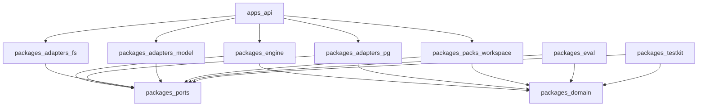
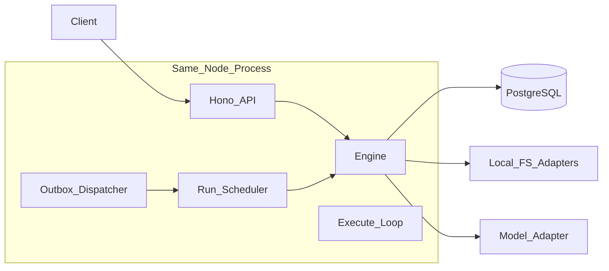

# 00 · 工程实现架构

> 文档状态：工程落地基线  
> 适用范围：将 [docs/design](../design/README.md) 映射为 TypeScript Monorepo 实现  
> 产物边界：架构映射文档；不含可运行代码与完整 OpenAPI

字段、状态、Event 与权限语义以设计文档为准（尤其 [01-domain-model](../design/01-domain-model.md)）。本文只规定选型、包边界、Adapter 映射、事务落地与实现顺序。

## 1. 目标与边界

### 1.1 目标

落地 [08-mvp-and-evolution](../design/08-mvp-and-evolution.md) **阶段 A** 对应的通用工作区垂直切片：异步 CreateRun、light Strategy、Observation → FactEnvelope → Reducer、Policy/Approval/ToolEffectContract、Checkpoint 恢复、Artifact 验收，以及可派生 Trace/Metrics 与 Golden Eval 样例。

工程形态固定为：

- **TypeScript**（Node >= 20，ESM）
- **pnpm workspace + Turborepo**（约定见 [turborepo.md](../turborepo.md)）
- **MVP-0 单进程部署**：API、Engine、Outbox Dispatcher、Run Scheduler 与执行循环同进程；Persistence / Outbox / Queue / Lease 仍经端口实现语义（对齐 [02 §8](../design/02-core-architecture.md)）

### 1.2 非目标（与 08 §4 一致）

| 能力 | MVP-0 / 阶段 A |
| --- | --- |
| DAG Strategy | 不启用；只保留 Strategy 接口 |
| Child Run / `spawn_child` | 不启用执行路径；领域类型可预留 |
| Memory / 向量检索 / 语义路由 | 关闭 |
| 真实 `write_high` 外部系统 | 不开放；仅 `synthetic.write_high` |
| `sandbox.exec` / 任意代码或 Shell | 不注册、不执行 |
| 独立消息中间件作为真相源 | MVP-0 不引入 Redis/Kafka 等作为 Run 真相 |

### 1.3 与设计文档的关系

| 主题 | 权威来源 | 本文职责 |
| --- | --- | --- |
| 术语、对象、状态枚举、Event 类型 | 01 | 映射为 `packages/domain` 类型与校验 |
| Engine 编排、端口清单、投递链 | 02 | 映射为包与 Adapter |
| Run/Step 状态机、Hook、副作用、恢复 | 03 | 映射为 `engine` 模块与事务单元 |
| Capability Pack | 04 | 映射为 `packs-workspace` |
| Context / State / Knowledge | 05 | 映射为 Context Builder 与 Reducer |
| 安全与审批 | 06 | 映射为 Policy/Approval 实现与合成 Tool |
| Trace / Metrics / Eval | 07 | 映射为 Event 派生与 `packages/eval` |
| MVP 验收与阶段门禁 | 08 | 约束本阶段实现范围与评测落位 |

禁止在工程层引入与 01 同名但异义的状态、Event 或错误类别。

## 2. 技术选型与工程 ADR

### 2.1 选型表

| 议题 | 选定 | 理由 |
| --- | --- | --- |
| 语言 | TypeScript / ESM，Node >= 20 | 与 JSON/Schema/异步控制面契合；类型有利于契约落地；对齐 Turborepo 指南 |
| 仓库 | pnpm + Turborepo 2.x | 多包共享 domain/ports；任务拓扑与缓存 |
| HTTP | **Hono** | 轻量、类型友好；单进程内可挂载路由与后台循环 |
| 领域校验 | **Zod** | 从 01 文本 schema 落地为运行时校验；Action/Event/命令入参统一 |
| Action digest | 独立 **RFC 8785 JCS** 实现 + 固定测试向量 | 与 Zod 解耦；审批/确认摘要必须确定性 |
| 数据库 | **PostgreSQL** | 与 Outbox 同事务；`SKIP LOCKED` 实现 Queue/Lease |
| SQL / 迁移 | **Drizzle** | 类型化 schema + 迁移；不把 ORM 生命周期泄漏进 Engine |
| Workspace / Artifact | 本地文件系统 Adapter | MVP-0 零外部依赖；端口保留对象存储替换 |
| Model | OpenAI-compatible HTTP Adapter | 不绑供应商 SDK 进 Core |
| 测试 | **Vitest** + `testkit` 假时钟/故障注入 | 对齐 08 确定性断言与恢复注入 |
| Secret（MVP-0） | 进程环境 / 本地文件经 `SecretPort` | 不进 Context/Event；生产后端后置 |

### 2.2 TypeScript 可行性与风险

| 能力 | 判定 | 工程对策 |
| --- | --- | --- |
| Event / `revision` / `leaseEpoch` / Outbox 同事务 | 无硬卡点 | `pg` 显式事务；协议正确性优先于 ORM 便利 |
| 确定性 Reducer、Action digest（JCS） | 可控风险 | 锁定 canonicalization 库与向量测试；禁止依赖对象键插入顺序 |
| Model Port、SSE Event Stream、Workspace/Artifact | 无硬卡点 | 标准 HTTP / 流 / 文件系统 |
| 五 Hook、Policy、Approval、ToolEffectContract | 无硬卡点 | 纯编排；TS 类型边界有利 |
| `isolated_extension` / 强沙箱 | **延后卡点** | MVP 不启用 `sandbox.exec`；后续可用 `child_process` / WASM，不阻塞阶段 A |
| 多 Worker 极限吞吐 | **延后优化** | MVP-0 单进程；拆 API+Worker 时只换组装与 Adapter，不复制状态机 |

**不因语言削弱 01–08 不变量。** 隔离或吞吐硬需求通过换 Adapter 或进程边界解决，禁止第二套 Run/Event 语义。

### 2.3 工程 ADR（仅本目录索引）

| ID | 决策 | 状态 |
| --- | --- | --- |
| E-ADR-001 | 实现语言为 TypeScript；设计契约不绑定语言 | Accepted |
| E-ADR-002 | MVP-0 单进程；Queue/Lease 用 Postgres 表实现端口语义 | Accepted |
| E-ADR-003 | Persistence 与 Outbox 必须可加入同一 PostgreSQL 事务 | Accepted |
| E-ADR-004 | `engine` 禁止依赖任何 `adapters-*` 或具体 Pack 实现 | Accepted |
| E-ADR-005 | HTTP 选用 Hono；领域校验 Zod；SQL 选用 Drizzle | Accepted |
| E-ADR-006 | Artifact/Workspace MVP-0 用本地 FS；Model 用 OpenAI-compatible HTTP | Accepted |

设计层 ADR（ADR-001…012）仍以 [00-overview §8](../design/00-overview.md#8-关键架构决策adr-索引) 为唯一索引。

## 3. 包与目录映射

### 3.1 目标仓库骨架

编码阶段按下列边界创建（**本文不创建代码**）：

```text
<repo>/
├── apps/
│   └── api/                      # Hono HTTP + 进程内 Dispatcher/Scheduler/Worker 引导
├── packages/
│   ├── domain/                   # 01 类型、错误码、纯函数（digest、合法转换校验）
│   ├── ports/                    # 02 端口接口；零基础设施依赖
│   ├── engine/                   # Run Engine、light Strategy、Hook/Policy/Approval/Tool/Reducer 编排
│   ├── adapters-pg/              # Persistence + Outbox + Idempotency + Queue + Lease（同库）
│   ├── adapters-fs/              # WorkspacePort + ObjectStorePort 本地实现
│   ├── adapters-model/           # ModelPort（OpenAI-compatible）
│   ├── packs-workspace/          # 通用工作区 Pack + synthetic.write_high
│   ├── eval/                     # Eval Suite 驱动（只读 Event；不推进 Run）
│   └── testkit/                  # 假时钟、故障注入、Tool 桩、确定性种子
├── docs/
│   ├── design/                   # 契约（已有）
│   └── engineering/              # 本目录
├── package.json
├── pnpm-workspace.yaml
└── turbo.json
```

包名建议统一 scope，例如 `@monai/domain`、`@monai/engine`（编码时再钉死）。

### 3.2 依赖方向



| 包 | 允许依赖 | 禁止 |
| --- | --- | --- |
| `domain` | 无内部包；仅第三方纯工具（如 JCS） | 任何 ports/adapters/engine/apps |
| `ports` | `domain` | adapters、engine、apps、具体 Pack |
| `engine` | `domain`、`ports` | 任意 `adapters-*`、`packs-*`、`apps/*` |
| `adapters-*` | `domain`、`ports` | `engine`、其他无关 adapters（除非共享极薄 util） |
| `packs-workspace` | `domain`、`ports` | `engine`、Persistence 实现 |
| `eval` / `testkit` | `domain`、`ports`（及测试所需 adapters 组装） | 在生产路径推进 Run |
| `apps/api` | `engine` + 所需 adapters + Pack 注册组装 | 把编排逻辑写进路由层 |

组装（composition root）只允许出现在 `apps/api`（及日后独立 Worker 入口）：注入 Port 实现、注册 Pack、启动 Dispatcher/Scheduler。

### 3.3 设计模块 → 代码模块

| 设计模块（02） | 代码落点 |
| --- | --- |
| Agent API / Authn | `apps/api` 路由与中间件 |
| Event Stream | `apps/api` SSE；读已提交 Event via PersistencePort |
| Run Engine | `packages/engine` 核心 |
| Execution Strategy（light） | `packages/engine/strategy/light` |
| Budget Guard | `packages/engine/budget` |
| Hook Runner | `packages/engine/hooks` |
| Context Builder | `packages/engine/context` |
| Model Port | `packages/ports` 接口 + `adapters-model` |
| Policy Engine | `packages/engine/policy` |
| Approval Gate | `packages/engine/approval`（状态仍由 Engine 提交） |
| Validator Runner | `packages/engine/validator` |
| Tool Runtime | `packages/engine/tools` |
| State Reducer | `packages/engine/reducer`（纯函数；持久化由 Engine） |
| Checkpoint Manager | `packages/engine/checkpoint` |
| Extension Registry | `packages/engine/registry` |
| Persistence / Outbox / Idempotency / Lease / Queue | `packages/ports` + `adapters-pg` |
| Workspace / ObjectStore | `ports` + `adapters-fs` |
| SecretPort | `ports` + MVP-0 本地 Adapter（可暂放 `adapters-fs` 或 `apps/api` 组装旁路实现） |
| KnowledgePort | `ports` + Pack 内确定性规则源 Adapter |
| Trace / Metrics / Evaluation | Event 派生消费者；评测在 `packages/eval` |
| Capability Pack | `packages/packs-workspace` |

## 4. MVP-0 部署与进程内投递

### 4.1 进程视图



### 4.2 投递约定

严格投递链仍为设计契约：

```text
Persistence / Transactional Outbox → Outbox Dispatcher → Run Queue → Run Scheduler → Engine
```

MVP-0 实现要点：

1. **Outbox**：与领域写入同事务插入 `outbox_records`；Dispatcher 周期 `claim` → 写入 queue 表 → `mark published`。
2. **Queue**：Postgres 表 + `FOR UPDATE SKIP LOCKED`；载荷至少含 `{ runId, revision }`；至少一次投递。
3. **Lease**：Run 行或独立 lease 表；`queued → running` 时 `leaseEpoch` 严格递增；heartbeat 只延长过期时间、不递增 epoch。
4. **补偿扫描**：扫描长期 `created` 或未发布 Outbox，重建同一 `{ runId, revision }` 信号，不创建新 Run。
5. **进程拆分预留**：执行循环入口为 `engine` 的纯函数/服务 API；HTTP 层只提交命令。日后 `apps/worker` 复用同一组装，不改 Core。

### 4.3 本地依赖

- PostgreSQL（Docker Compose 即可）
- 本地工作区根目录与 Artifact 目录（环境变量配置绝对路径）
- Model：可配置 base URL / API key（经 SecretPort 注入，不进 Event）

## 5. 持久化与事务边界

### 5.1 逻辑表（MVP-0 最小集）

命名示意；物理 schema 在编码时用 Drizzle 迁移落地：

| 表 / 集合 | 对应对象 |
| --- | --- |
| `runs` | Run（含 `revision`、`leaseEpoch`、status、manifest ref） |
| `steps` | Step |
| `events` | EventEnvelope（`run_id + sequence` 唯一） |
| `states` | State 快照（或与 runs 同行；须可按 revision 对齐） |
| `checkpoints` | Checkpoint |
| `tool_call_records` | ToolCallRecord |
| `approval_records` | ApprovalRecord |
| `confirmation_grants` | ConfirmationGrant（若启用 confirm_once） |
| `idempotency_records` | IdempotencyRecord |
| `outbox_records` | OutboxRecord |
| `queue_messages` | Queue 投递槽 |
| `execution_manifests` | 不可变 Manifest |
| `artifacts` | Artifact 元数据 |
| `observations` / `fact_envelopes` | 可选独立表或 Event payloadRef 外置 |

所有改变 Run 可变投影的提交必须校验 `expectedRevision`（及执行路径上的 `leaseEpoch`），成功后 `revision + 1` 恰好一次。

### 5.2 原子提交单元（MVP-0 必做）

| 单元 | 前置校验 | 同事务写入（最小） | 关键 Event |
| --- | --- | --- | --- |
| **CreateRun** | 租户幂等键；Manifest 可解析 | `idempotency_records` + `runs(status=created)` + `events(run.created, seq=1)` + 首条 `outbox_records` | `run.created` |
| **created → queued** | `expectedRevision`；status=created | status、`run.queued` | `run.queued`、`run.status_changed` |
| **queued → running** | lease 可取得；`expectedRevision` | owner/expiry、`leaseEpoch++`、status | `run.lease_acquired`、`run.status_changed` |
| **running → queued**（yield/丢失） | 当前 epoch/owner | 清 owner、status | `run.lease_lost` 或 yield 原因、`run.queued`、`run.status_changed` |
| **进入 awaiting_approval** | Policy=`require_approval`；持有有效 lease | ApprovalRecord(pending)、待续信息、Checkpoint、放 lease、status | `policy.evaluated`、`approval.requested`、`run.status_changed` 等 |
| **审批唤醒 → queued** | ApprovalRecord 合法转换 | Approval 状态、status=queued、Outbox | `approval.approved` 等、`run.queued` |
| **approval consumed + tool prepared** | digest/TTL/版本/PreToolCall 通过；lease 有效 | ApprovalRecord(consumed)、ToolCallRecord(prepared)、Idempotency(tool_call)、派发 Outbox | `approval.consumed`、`tool.call_prepared` |
| **tool dispatched / 终局** | `dispatchLeaseEpoch` 匹配 | ToolCallRecord 状态 | `tool.dispatched` / `succeeded` / `failed` / `outcome_unknown` |
| **Observation → Fact → State** | 观察先于 Fact 的 sequence 顺序 | Observation、Fact、State、`revision++` | `observation.recorded` 然后 `fact.accepted|rejected`、`state.reduced` |
| **outcome_unknown → reconciled** | 对账契约与预算 | ToolCallRecord 终态 | `tool.reconciled` 及最终 succeeded/failed |
| **finish → succeeded** | acceptanceChecks、无未解决 unknown、OnRunEnd | Step/Run 终态、最终 Checkpoint | `run.completed`、`run.status_changed` |
| **failed / cancelled** | 03 终止原因唯一映射 | 终态、Checkpoint | `run.failed` 或 `run.cancelled` |

提交失败对外视为未发生：不 ack 依赖成功的队列消息，不宣称领域成功。

### 5.3 Event sequence

- 仅 Engine 在成功事务内从 `max(sequence)+1` 连续分配。
- 生产者不得自带 sequence。
- 单 Run 内严格递增；跨 Run 无全局顺序。

## 6. API 面（工程级）

完整 OpenAPI 后置；MVP-0 最小命令与查询如下。鉴权与租户上下文由接入层注入，本文不规定 IdP。

### 6.1 命令

| 方法与路径（示意） | 语义 | 幂等 |
| --- | --- | --- |
| `POST /v1/runs` | CreateRun（goal、inputRef、agent、idempotencyKey） | 租户作用域 `idempotencyKey`；同摘要同 `runId`，异摘要 `conflict` |
| `POST /v1/runs/{runId}/approvals/{approvalId}` | 批准 / 拒绝 | 决策本身按 ApprovalRecord 状态机；重复合法决策返回当前投影 |
| `POST /v1/runs/{runId}/inputs` | 提交用户输入 Observation | 稳定 `inputId` 去重 |
| `POST /v1/runs/{runId}/pause` | 授权暂停 | 条件提交 |
| `POST /v1/runs/{runId}/resume` | 授权恢复 → queued | 条件提交 |
| `POST /v1/runs/{runId}/cancel` | 授权取消 | 条件提交 |

同步等待：客户端订阅终态；**不**提供同步专用状态机。可选 `POST /v1/runs?wait=true` 仅封装订阅，超时返回 `runId`。

### 6.2 查询与订阅

| 方法与路径（示意） | 语义 |
| --- | --- |
| `GET /v1/runs/{runId}` | Run 投影（status、revision、leaseEpoch、manifest ref） |
| `GET /v1/runs/{runId}/state` | 当前 State（大载荷为 ref） |
| `GET /v1/runs/{runId}/events?afterSequence=` | 已提交 Event 列表 |
| `GET /v1/runs/{runId}/events/stream` | SSE：从游标推送已提交 Event |
| `GET /v1/runs/{runId}/artifacts/{artifactId}` | 元数据；内容经 ObjectStore 授权读取 |

### 6.3 错误映射

HTTP 错误体对齐 01 §10：

```text
{ code, category, retryable, message, details?, causationId? }
```

| category | 典型 HTTP |
| --- | --- |
| `validation` | 400 |
| `authorization` | 403 |
| `approval_required` | 409 或业务 200 + Run 进入等待（命令侧以 Run 状态为准） |
| `conflict` | 409 |
| `lease_lost` | 409 / 内部重试，不默认暴露给无关客户端 |
| `budget_exceeded` / `fatal` | 409 / 500（终态可查） |
| `transient` | 503 |

不得在 `message`/`details` 中泄漏 Secret、跨租户标识或未授权载荷。

## 7. Pack、Tool 与评测落位

### 7.1 `packs-workspace`

实现 08 §2.4 Tool 集合：

```text
workspace.list
workspace.read
workspace.search
artifact.write_markdown
artifact.validate
synthetic.write_high
synthetic.write_high.reconcile
```

约束：

- 路径规范化与授权根由 WorkspacePort + Policy 共同保证。
- `synthetic.write_high` 仅专用测试租户与合成 sink；验证审批、单次消费、`outcome_unknown` 与 reconcile。
- Pack Manifest 冻结进 Execution Manifest；Run 中不热切换。

### 7.2 Knowledge（MVP-0）

- 固定 `sourceId + version`；精确键 / 标签 / 确定性规则检索。
- 仅 Context Builder 调用 KnowledgePort。
- 无向量、无自动写回。

### 7.3 `packages/eval` 与 `testkit`

对齐 08 §5 套件分层：

| 套件 | 工程落位 |
| --- | --- |
| Golden 主路径 | `eval` + 固定 Manifest / Tool 桩 / 模型采样配置 |
| 越权与安全 | `eval` + 确定性断言（不允许 flaky 重跑洗绿） |
| 恢复故障注入 | `testkit` 崩溃点 / lease 丢失 / Outbox 重投 |
| 审批生命周期 | approve/reject/expire/revoke/摘要不匹配/单次消费 |
| 幂等与未知结果 | CreateRun 同键、prepared-before-dispatch、同键重派、reconcile |

**阶段 A 编码初期**：先落地驱动框架与每类样例至少 1 个；再按 08 矩阵扩到完整用例数。Eval 只消费已提交 Event 与只读投影，不拥有推进权。

## 8. 端口实现矩阵（MVP-0）

| 端口（02） | MVP-0 实现 | 备注 |
| --- | --- | --- |
| `PersistencePort` | `adapters-pg` | 条件提交中枢 |
| `OutboxPort` | `adapters-pg` | 与 Persistence 同 UoW |
| `QueuePort` | `adapters-pg`（表 + SKIP LOCKED） | 非外部 Broker |
| `LeasePort` | `adapters-pg` | epoch 单调递增 |
| `IdempotencyPort` | `adapters-pg` | CreateRun / tool_call |
| `ExecutionManifestStorePort` | `adapters-pg`（不可变行） | hash 校验 |
| `ModelPort` | `adapters-model` | 结构化输出按冻结 schema |
| `WorkspacePort` | `adapters-fs` | 授权根 |
| `ObjectStorePort` | `adapters-fs` | content-addressed 文件 |
| `KnowledgePort` | Pack 侧规则源 Adapter | 经 Context Builder |
| `SecretPort` | 本地/env Adapter | 短时注入 |
| `SandboxPort` | **不接线** | 保留接口；Agent allowlist 不得引用 |
| `EventStreamPort` | API 读库 + SSE | 推送成功非提交条件 |
| `EvaluationPort` | `eval` 读写评测存储 | 不改生产门禁 |
| `ApprovalPort` / `ToolCallPort` | 查询面；写仍经 Engine | 避免旁路提交 |

## 9. 实现顺序（编码路线图）

本轮不编码；后续按下列切片推进，每片保持可测：

1. **骨架**：`domain` + `ports` + Drizzle PG schema / 迁移 + 空 `apps/api`
2. **提交内核**：Persistence 条件提交、`revision`、Event `sequence` 分配
3. **CreateRun 投递**：幂等 + Outbox + 进程内 Dispatcher / Queue / Scheduler / Lease；打通 `created → queued → running`
4. **Light loop 骨架**：无模型；支持 `noop` / 预算耗尽失败 / 基础 Checkpoint
5. **Tool 链**：Tool Runtime + workspace/artifact tools + Observation → Fact → Reducer
6. **门禁**：Policy 偏序 + `synthetic.write_high` 审批全链 + prepared-before-dispatch
7. **认知**：ModelPort + Context Builder + Knowledge 规则检索；主路径 Artifact + `acceptanceChecks` + `finish`
8. **Hook**：五个 mountPoint 最小可执行实现与失败语义
9. **恢复与评测**：`testkit` 故障注入 + `eval` 样例；对照 08 §5.2 门禁逐步加压

每片完成时核对：Engine 唯一编排、无 adapters 反向依赖、禁用能力无旁路。

## 10. 本轮文档不展开

- 完整 OpenAPI / 从 01 生成全量 JSON Schema 流水线
- DAG / Child Run / Memory 的工程设计
- K8s、多区域、灾备拓扑
- 生产级 Secret 后端、对象存储产品绑定
- GovernanceEvent 全量运维面（阶段 A 仅保留契约兼容所需最小钩子）

## 11. 一致性检查清单

- [ ] 包依赖方向无环；`engine` 不依赖 adapters/packs
- [ ] Queue/Lease/Outbox 产品可替换，但不改变 CreateRun 与状态机语义
- [ ] 所有可变提交校验 `expectedRevision`（执行路径含 `leaseEpoch`）
- [ ] Tool 满足 prepared-before-dispatch、同键重试、`outcome_unknown` 对账
- [ ] MVP-0 未接线 `sandbox.exec`、真实 `write_high`、DAG、Child Run、Memory
- [ ] Eval 不推进生产 Run
- [ ] 领域命名与 01 一致，无同名异义
- [ ] 工程 ADR 不覆盖设计 ADR-001…012 的决策文本

---

上一篇：[README.md](./README.md) · 设计契约入口：[../design/README.md](../design/README.md)
