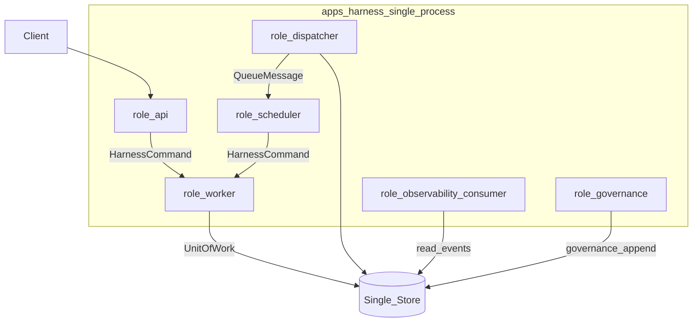

# 00 · 实现基线与 EDR 索引

> 文档状态：工程架构基线  
> 上游权威：[`docs/design/`](../design/README.md)  
> 产物边界：实现映射与工程决策；不含代码与产品锁定（除非 EDR 明确 Accepted）

## 1. 目的

将设计层「技术中立」的 Harness 契约，落到一组 **可评审、可执行、可演进** 的工程约束：语言、仓库形态、部署单元、事务边界、决策治理。

本文件是 `EDR-*`（Engineering Decision Record）的 **唯一索引**；其他工程章节只引用，不重复声明决策表。

## 2. 与设计层的关系

| 设计 ADR / 不变量 | 工程映射 |
| --- | --- |
| ADR-002 统一异步 Run | 单 Command 模型；同步等待仅为客户端订阅 |
| ADR-006 Pack 接入、Core 禁止依赖业务 | `packs/*` 独立包；`runtime` 不 import Pack 实现 |
| ADR-010 技术与部署中立 | Core 只依赖 `ports`；产品选型进 EDR，不进领域文档 |
| ADR-011 / 012 MVP 与量化演进 | 装配层关闭禁用能力；测试与 [05](./05-testing-and-evolution.md) 对齐 07/08 |
| Engine 唯一编排与提交 | `packages/runtime` 内唯一 `commit` 入口 |
| Persistence + Outbox 同 UoW | [03](./03-persistence-and-transactions.md) 强制单连接事务 |

冲突规则：设计契约优先；工程档案只能收紧实现约束，不能放宽安全或状态机语义。

## 3. 技术基线（Accepted）

| 项 | 选择 | 说明 |
| --- | --- | --- |
| 语言 | TypeScript | 与契约 Schema、结构化 Action、类型边界匹配 |
| 运行时 | Node.js `>= 20` | 与 [`docs/turborepo.md`](../turborepo.md) 一致 |
| 包管理 | pnpm workspace | `workspace:*`、统一 lockfile |
| 任务编排 | Turborepo 2.x | 按包依赖拓扑 build / test / lint |
| 模块系统 | ESM（`"type": "module"`） | 库先 build 出 `dist` 再被引用 |

上述内容由 **EDR-001** 锁定。HTTP 框架（EDR-007）仍 Deferred；Schema（Zod）与 SQL 层（drizzle）分别见 EDR-008 / EDR-009。

## 4. 部署基线（Accepted）

MVP 采用 **模块化单体**：

| 角色 | 同进程职责 | 禁止 |
| --- | --- | --- |
| `api` | 鉴权、命令提交、只读查询、Event 订阅封装 | 不写 Run Event / State；不调 Tool |
| `dispatcher` | claim Outbox、投递 Queue、记录投递状态 | 不改变 Run 状态真相 |
| `scheduler` | 并发限额、补偿扫描、租约请求 | 只发 Command，不直接推进状态机 |
| `worker` | 持有执行租约，运行 Engine 执行段 | 不绕过 `expectedRevision + leaseEpoch` |
| `observability` | 从已提交 Event 派生 Trace/Metrics/Eval 样本 | 不推进 Run、不触发副作用重放 |
| `governance` | Pack 注册、Retention、无 Run 的 Confirmation 治理 | 不取得 Engine 推进权 |

单一 deployable：`apps/harness`。未来拆分见 [02 §7](./02-runtime-composition.md#7-拆分接缝api--worker) 与 [05 §4](./05-testing-and-evolution.md#4-从单体到-api--worker)。

## 5. 存储与投递基线

| 项 | 状态 | 决策 |
| --- | --- | --- |
| 单事务存储 | Accepted（EDR-003） | Domain UoW 内 Persistence + Outbox + Idempotency 同连接提交 |
| 外部 IO | Accepted（EDR-003） | Model / Hook / Tool / 网络调用在事务外 |
| 内联 Queue / Scheduler | Accepted（EDR-004） | 同进程实现 `QueuePort` / 调度循环，语义仍至少一次 |
| 权威库产品 | Accepted（EDR-005） | PostgreSQL 单库为首版权威存储 |
| Run 级锁 | Accepted（EDR-006） | `runs` 行 `SELECT … FOR UPDATE`；MVP 不叠加 advisory lock |
| Schema 校验 | Accepted（EDR-008） | Zod（`strict` / 未知字段拒绝）；可导出 JSON Schema |
| SQL 访问层 | Accepted（EDR-009） | drizzle-orm；事务边界仅在 persistence adapter |

## 6. EDR 治理

### 6.1 状态

| 状态 | 含义 |
| --- | --- |
| `Accepted` | 实现必须遵守；变更需新 EDR 或修订记录 |
| `Proposed` | 推荐默认；实现启动前应关闭或显式保留风险 |
| `Deferred` | 刻意延后；不得在代码中当作已定事实写死全局假设 |

### 6.2 编号与存放

- 标识：`EDR-NNN`，仅在本节索引维护标识、决策句、状态与链接。
- 正文可展开在对应工程章节；索引表不复制长论证。
- **禁止** 在 `docs/design` 中新增同名工程产品选型为 ADR，除非该选型已上升到领域不变量。

### 6.3 编写要求

每条 EDR 至少包含：决策、状态、设计依据（链接 00–08）、备选、取舍、验证条件。

## 7. 质量属性在工程侧的落点

设计优先级（正确性与安全 → 可恢复与可审计 → 扩展 → 观测 → 延迟成本）映射为：

1. 架构测试禁止非法依赖与绕过 Engine 的写路径。
2. 真实单库集成测试覆盖 CreateRun 原子性、lease fencing、prepared-before-dispatch。
3. Pack / Adapter 可替换，不要求改 `runtime`。
4. 观测消费者异步、失败不回滚已提交 Event。
5. 内联投递可换真实 Queue，不改 Command / Event 语义。

## 8. EDR 索引

| ID | 决策 | 状态 | 主要展开 |
| --- | --- | --- | --- |
| EDR-001 | 采用 TypeScript + Node.js `>=20` + pnpm + Turborepo 作为实现基线 | Accepted | 本节 §3；[01](./01-repository-and-modules.md) |
| EDR-002 | MVP 单一 deployable 模块化单体；角色同进程、接口按可拆分设计 | Accepted | 本节 §4；[02](./02-runtime-composition.md) |
| EDR-003 | Persistence 与 Outbox 同一 UoW；外部 IO 不得跨越数据库事务 | Accepted | [03](./03-persistence-and-transactions.md) |
| EDR-004 | 首版 Queue/Dispatcher/Scheduler 可内联，但必须实现至少一次、去重与补偿扫描 | Accepted | [02](./02-runtime-composition.md)；[03](./03-persistence-and-transactions.md) |
| EDR-005 | 首版权威存储采用 PostgreSQL 单库（领域 + outbox + lease + 投影） | Accepted | [03](./03-persistence-and-transactions.md) |
| EDR-006 | 单 Run 提交互斥采用 `runs` 行 `FOR UPDATE`，保证串行 commit；MVP 不叠加 advisory lock | Accepted | [03](./03-persistence-and-transactions.md) |
| EDR-007 | HTTP 与 Event 订阅框架（REST/SSE 等）选型 | Deferred | [02](./02-runtime-composition.md)；[04](./04-ports-extensions-and-security.md) |
| EDR-008 | Schema 校验采用 Zod（strict / 未知字段拒绝）；Pack Manifest 等可后续导出 JSON Schema | Accepted | [04](./04-ports-extensions-and-security.md) |
| EDR-009 | SQL 访问层采用 drizzle-orm；事务边界不得泄漏给 Engine | Accepted | [03](./03-persistence-and-transactions.md) |
| EDR-010 | `isolated_extension` 载体（worker_threads / 子进程 / WASM 等） | Deferred | [04](./04-ports-extensions-and-security.md) |
| EDR-011 | `packages/runtime` 首版保持单包，内部分模块；不拆独立写入微服务 | Accepted | [01](./01-repository-and-modules.md) |
| EDR-012 | 统一 `HarnessCommand` 信封作为 API / Scheduler / Worker 唯一推进入口 | Accepted | [02](./02-runtime-composition.md) |
| EDR-013 | Governance Event 与 Evaluation Store 与 Run 真相分离存储/表族 | Accepted | [03](./03-persistence-and-transactions.md)；[04](./04-ports-extensions-and-security.md) |
| EDR-014 | MVP 装配层显式禁用 DAG、spawn_child、Memory、sandbox.exec、真实 write_high | Accepted | [04](./04-ports-extensions-and-security.md)；设计 [08](../design/08-mvp-and-evolution.md) |
| EDR-015 | 测试金字塔：纯函数 → InMemory 故障注入 → 真实单库集成 → 08 Eval Suite | Accepted | [05](./05-testing-and-evolution.md) |

### 8.1 取舍摘要

| 议题 | 采用 | 备选 | 依据 |
| --- | --- | --- | --- |
| 部署 | 模块化单体 | 首日 API+Worker | 降低运维面，保留 Command/Port 接缝 |
| Core 分包 | `runtime` 单包 | Engine/Policy/Tool 多包 | 避免提交协议被拆散与循环依赖 |
| 队列 | 内联实现 QueuePort | Redis/SQS 首日上线 | EDR-004；用测试锁住语义 |
| 权威库 | PostgreSQL 单库 | 其他具备 CAS/事务的库 | EDR-005 |
| Run 互斥 | `FOR UPDATE` 行锁 | advisory lock / 组合 | EDR-006；与 revision 同路径读取 |
| Schema | Zod | 纯 JSON Schema / 代码生成 | EDR-008；可导出 JSON Schema |
| SQL 层 | drizzle-orm | kysely / 手写 SQL | EDR-009；事务仅在 adapter |
| 决策编号 | EDR 与 ADR 分离 | 混入 design ADR | 避免污染设计层技术中立 |

### 8.2 验证假设

1. 单进程内联投递足以验证 Outbox → Queue → Scheduler → Engine 闭环，且双投递测试可暴露至少一次语义缺陷。
2. PostgreSQL 单库能承载 MVP Event append、CAS 提交与补偿扫描；若不成立，须新 EDR 更换或调整拓扑。
3. `runtime` 单包在团队规模扩大前不会成为合并瓶颈；若成为瓶颈，优先按文件夹所有权拆分，而非拆写库服务。

## 9. 非目标（工程档案撰写阶段；实现见 implementation）

下列项由 `docs/implementation` + 代码树兑现，不在本工程档案内「假装已实现」：

- CI 流水线、远程 turbo cache
- HTTP 框架（EDR-007 Deferred）
- 完整 Capability Pack / 全部 Adapter 实现
- 修改 `docs/design` 契约正文（导航互链除外）

## 10. 一致性检查

- [ ] EDR 仅在本节维护索引
- [ ] Accepted 项均可追溯到设计不变量或已确认产品基线
- [ ] Proposed / Deferred 未写成强制实现
- [ ] 单体部署图与设计 02 §8 单进程映射一致
- [ ] 未引入第二套领域术语

---

下一篇：[01-repository-and-modules.md](./01-repository-and-modules.md)
