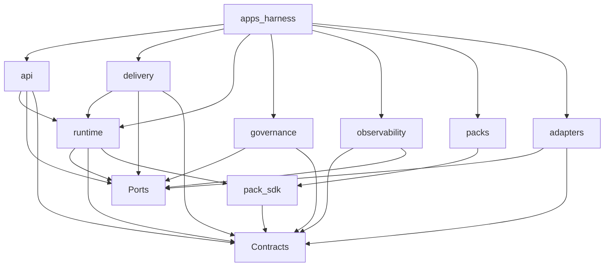

# 01 · 仓库与模块边界

> 上游：[`00-implementation-baseline.md`](./00-implementation-baseline.md)  
> 设计依据：[02-core-architecture](../design/02-core-architecture.md)、[04-extension-model](../design/04-extension-model.md)、[ADR-006/010](../design/00-overview.md#8-关键架构决策adr-索引)  
> 工作区通则：[`docs/turborepo.md`](../turborepo.md)

## 1. 目标

固定首版 monorepo 的 **发布/运行边界**、包职责、依赖方向，以及「现在拆 / 暂不拆」清单，使后续建仓时不重新争论 Core 与 Pack、API 与 Worker 的边界。

## 推荐目录树

```text
monai-harness/
├── apps/
│   └── harness/                 # MVP 唯一 deployable
├── packages/
│   ├── contracts/               # 领域类型、事件常量、错误码、canonicalization
│   ├── ports/                   # 纯端口接口与 DTO
│   ├── runtime/                 # Engine 与提交协议（单包，EDR-011）
│   ├── api/                     # HTTP/SSE 接入（无领域写权）
│   ├── delivery/                # Outbox Dispatcher、Scheduler、补偿扫描
│   ├── governance/              # Pack 注册、Retention、无 Run 治理流（P1+ 再建）
│   ├── observability/           # Trace/Metrics/Evaluation 派生（P7）
│   ├── pack-sdk/                # Pack 作者 SDK（P3+）
│   ├── packs/
│   │   └── workspace-generic/   # MVP 通用工作区 Pack（P3+）
│   └── adapters/                # 各 Port 实现（P1+）
├── tooling/
│   └── tsconfig/                # 共享 TS 基座
├── docs/
│   ├── design/
│   ├── engineering/
│   └── implementation/
├── pnpm-workspace.yaml
├── turbo.json
└── package.json
```

P0 已创建：`apps/harness`、`packages/{contracts,ports,runtime,api,delivery}`、`tooling/tsconfig`。其余按阶段补建。
切包原则（对齐 turborepo 指南）：

1. **按发布/运行边界切，不按文件类型切。**
2. **依赖只能向下。** 库不依赖应用；应用可依赖库。
3. **`apps/harness` 为 `private: true`。**
4. **第三类目录**（`tooling/`、`packs/`）仅在生命周期与 `packages/` 不同时保留独立 glob。

## 3. 包职责

### 3.1 `apps/harness`

| 职责 | 说明 |
| --- | --- |
| 进程入口 | 加载配置、装配 DI、注册角色、graceful shutdown |
| 角色组合 | 同进程挂载 api / dispatcher / scheduler / worker / observability / governance |
| 禁止 | 放置领域算法；禁止在 app 内绕过 `runtime` 写库 |

### 3.2 Core 圈

| 包 | 职责 | 禁止 |
| --- | --- | --- |
| `contracts` | 01 对象的 TS 类型/JSON Schema 镜像、eventType、错误 category、Action digest 契约 | 不依赖 ports/runtime/infra |
| `ports` | 02 §7 端口接口；CommitPlan / 命令 DTO 可放此处或 contracts | 无具体客户端、无副作用实现 |
| `runtime` | Engine、Commit、Strategy(light)、HookRunner、ContextBuilder、Policy/Approval/Validator/Budget、ToolRuntime/Reconciler 编排、Reducer、Checkpoint、Manifest 解析、ExtensionRegistry | 不 import `adapters/*` 或 `packs/*`；唯一可变提交出口 |

`runtime` 建议 **内部文件夹**（非独立 npm 包）：

```text
runtime/
  engine/
  commit/
  strategy/          # light 启用；dag/ 预留不注册
  hooks/
  context/
  control/           # policy, approval, validator, budget
  execution/         # tool runtime + reconciler orchestration
  state/             # reducer + checkpoint
  manifest/
  extension/
  commands/
```

### 3.3 接入与投递

| 包 | 职责 | 禁止 |
| --- | --- | --- |
| `api` | 鉴权后构造 `HarnessCommand`；只读查询；Event 流视图 | 不分配 sequence；不直接调用 Tool；不直接 Persistence 写 Run |
| `delivery` | Outbox claim/publish、Queue 消费、Scheduler、补偿扫描 | 不写 State/Reducer；不 import ToolRuntime |

### 3.4 扩展与旁路

| 包 | 职责 |
| --- | --- |
| `pack-sdk` | Handler 签名、Schema 辅助、capability-scoped ExecutionContext 构造约定 |
| `packs/*` | 版本化 Skill/Tool/Workflow/Hook/Policy/Knowledge/Validator/Evaluator |
| `governance` | Pack 注册结果、AgentDefinition 配置面、Retention/Tombstone、无 Run Confirmation 治理 |
| `observability` | 已提交 Event → Trace/Metrics/Eval 样本；Evaluation Store 写入 |

### 3.5 Adapters

所有 `adapters/*` **只实现 ports**，可依赖具体 SDK。  
`persistence-*` 适配器必须能将 Persistence 与 Outbox 纳入同一 UoW（[EDR-003](./00-implementation-baseline.md#8-edr-索引)）。

## 4. 依赖规则

### 4.1 允许方向



### 4.2 禁止边（应用架构测试 enforce）

```text
runtime          ──X──► packs/*
runtime          ──X──► adapters/*（无静态 import；仅 DI 注入）
packs/*          ──X──► runtime | api | delivery | adapters/persistence
observability    ──X──► runtime 写路径 / commit API
api              ──X──► adapters/persistence（写）
contracts        ──X──► 任何其他 packages
ports            ──X──► runtime | adapters | packs
任意 core 包     ──X──► 具体 ORM/Redis/OpenAI SDK（仅 adapters 允许）
```

### 4.3 Turborepo 任务依赖（规划）

```text
build 顺序（示意）:
  contracts → ports → pack-sdk → runtime → delivery → api
  → governance → observability → adapters/* → packs/* → apps/harness

test:
  contracts / runtime 纯函数：无 ^build 也可
  adapters/persistence：依赖真实库时单独集成任务
  apps/harness：承接 08 套件与故障注入
```

根脚本只转发 `turbo run`；细则遵循 [`docs/turborepo.md`](../turborepo.md)。

## 5. 合并与拆分策略

### 5.1 首版必须合并（同一 npm 包）

| 单元 | 理由 |
| --- | --- |
| `runtime` 整包 | 共享 `revision + leaseEpoch + sequence` 提交协议；拆包易产生第二写入口（EDR-011） |
| Persistence + Outbox + Idempotency 适配器 | 同 UoW（EDR-003） |
| `contracts` 全集 | 术语与 Schema 单一真相 |

### 5.2 首版即可独立

| 单元 | 理由 |
| --- | --- |
| `packs/*` | 业务迭代频率不同；供应链隔离 |
| 各 infra adapter（除与 UoW 绑定的 persistence 组） | 可替换 |
| `observability`、`governance`、`api`、`delivery` | 职责与写权限不同；便于日后拆进程 |

### 5.3 暂不拆（等信号）

| 暂不拆 | 等到 |
| --- | --- |
| `runtime` 内 engine/control/execution 独立 npm 包 | 提交协议稳定且多团队并行冲突 |
| `strategy/dag` 独立包 | 设计 08 阶段 F 门禁通过 |
| Child Run / Memory 子系统包 | 阶段 G / E |
| 每 Tool 一包 | 无必要；按 Pack 版本发布 |
| `apps/dispatcher` 独立进程 | 07/08 运营信号（如阶段 B）触发 |

## 6. 命名与 scope

| 类型 | 约定 |
| --- | --- |
| 应用 | `harness`（短名，便于 `--filter=harness`） |
| 库 | `@monai/*`（已锁定） |
| Pack | `packId` 使用反向域名（设计 04）；npm 包名可映射为 `@monai/pack-workspace-generic` |

## 7. 与设计模块的对照

| 设计模块（02） | 工程包 |
| --- | --- |
| Agent API / Auth / Event Stream | `api` |
| Outbox / Dispatcher / Queue / Scheduler | `delivery` + queue/lease adapters |
| Run Engine / Strategy / Hooks / Budget | `runtime` |
| Context / Knowledge / Model | `runtime` + knowledge/model adapters |
| Policy / Approval / Validator | `runtime/control` |
| Tool Runtime / Sandbox / Workspace / Secret | `runtime/execution` + adapters |
| Reducer / Checkpoint / Persistence / Manifest | `runtime` + persistence/manifest adapters |
| Extension Registry / Packs | `runtime/extension` + `packs/*` + `pack-sdk` |
| Trace / Metrics / Evaluation | `observability` |

## 8. 一致性检查

- [ ] 仅一个 MVP deployable：`apps/harness`
- [ ] `runtime` 不依赖 packs/adapters 实现
- [ ] API/delivery 不拥有 Reducer/State 写权
- [ ] 禁止边可被自动化检查
- [ ] 目录规划未引入设计层未定义的第二套领域对象

---

上一篇：[00-implementation-baseline.md](./00-implementation-baseline.md) · 下一篇：[02-runtime-composition.md](./02-runtime-composition.md)
