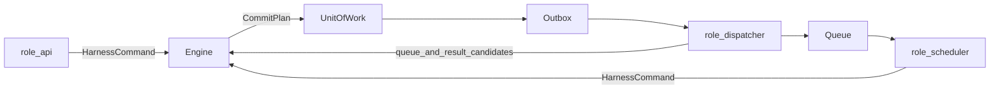
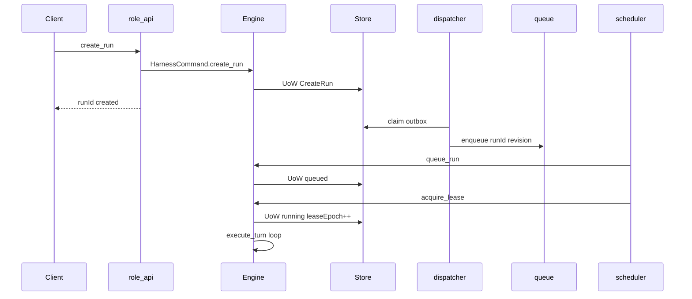

# 02 · 运行时组合

> 上游：[01-repository-and-modules](./01-repository-and-modules.md)  
> 设计依据：[02](../design/02-core-architecture.md)、[03](../design/03-run-lifecycle.md)  
> 相关 EDR：EDR-002、EDR-004、EDR-012

## 1. 目标

描述模块化单体内 **如何装配与运转**：bootstrap、统一命令信封、角色职责、关键控制流，以及拆成 API + Worker 时保持不变的边界。

## 2. Bootstrap 与依赖注入

```text
main
  → load config (env, feature flags)
  → build adapters (persistence, queue, lease, model, workspace, ...)
  → build runtime (Engine + collaborators; inject ports only)
  → build delivery (dispatcher, scheduler, compensation scanner)
  → build api / governance / observability
  → register roles in-process
  → start loops + HTTP server
  → on shutdown: stop accepting → drain → release leases
```

约束：

1. `runtime` 构造函数只接收 `ports` 与纯配置；不 new 具体 SDK。
2. Feature flags 默认关闭 DAG、`spawn_child`、Memory、sandbox.exec、真实 write_high（EDR-014）。
3. Pack 通过 Registry 解析进 Execution Manifest；Core 不静态 import Pack 符号。

## 3. HarnessCommand 信封（EDR-012）

API、Scheduler、补偿扫描、Worker 内部调度 **只** 通过命令进入 Engine：

```text
HarnessCommand {
  schemaVersion
  commandId                 // 命令幂等键
  commandType               // 见下表
  tenantId
  runId?
  expectedRevision?         // 可变提交类必填
  leaseEpoch?               // 执行类 / 派发类必填
  actor? { principalId, authContextRef }
  payload? | payloadRef?
  issuedAt
  correlationId?
}
```

### 3.1 最小 commandType 集合

| commandType | 典型来源 | Engine 行为摘要 |
| --- | --- | --- |
| `create_run` | api | UoW-CreateRun |
| `queue_run` | scheduler / 补偿 | created→queued |
| `acquire_lease` | scheduler | queued→running + leaseEpoch++ |
| `release_lease` / `yield_run` | worker / 扫描 | running→queued |
| `execute_turn` | worker | 推进 light 循环一个可提交边界 |
| `submit_input` | api | 用户 Observation；唤醒至 queued |
| `approval_decision` | api | 审批候选；由 Engine 提交状态 |
| `pause_run` / `resume_run` / `cancel_run` | api | 授权控制命令 |
| `tool_dispatch_result` | dispatcher / runtime 回调 | dispatched / terminal / unknown 候选 |
| `reconcile_tool` | reconciler loop | 对账候选 |
| `governance_*` | governance | **不** 经 Run Engine 推进；走治理服务 |

命令处理失败不得部分对外宣称成功；冲突返回设计层 `conflict` / `lease_lost` 等 category。

## 4. Engine 唯一提交入口

```text
Engine.handle(command):
  load aggregate
  validate preconditions (revision, leaseEpoch, status)
  invoke collaborators → candidates only
  order events (eventOrderingVersion)
  begin UoW → commit(CommitPlan) XOR expose no success
```

协作者（Strategy、Policy、HookRunner、ToolRuntime、Validator、ApprovalGate） **只返回候选**；不得：

- 分配 Event `sequence`
- 直接写 State / Approval Log
- 在未 prepared 时派发副作用
- 消费 ApprovalRecord

提交协议细节见 [03](./03-persistence-and-transactions.md)。

## 5. 进程内角色



| 角色 | 循环 | 说明 |
| --- | --- | --- |
| api | 请求驱动 | 同步返回命令受理结果；长等待用 Event 订阅 |
| dispatcher | poll Outbox | claim → publish Queue 或触发 tool dispatch 意图；更新 outbox 投递字段 |
| scheduler | poll Queue + 定时补偿 | 发 `queue_run` / `acquire_lease`；租户公平与并发限额 |
| worker | 持 lease 执行 | 调 `execute_turn`；heartbeat；丢失 lease 立即停派发与提交 |
| reconciler | 定时/队列 | 仅对 `outcome_unknown` 发 `reconcile_tool` |
| observability | 异步消费已提交 Event | 投影失败只重试消费 |
| governance | 控制面 API/定时 | GovernanceEvent append CAS |

MVP 可将 reconciler 挂在 worker 同进程定时器；语义上仍是「候选 → Engine 提交」。

## 6. 关键运行流

### 6.1 CreateRun → running



严格顺序：`created → queued → running`。队列实现不得跳过 `queued` Event。

### 6.2 标准 Step（light）

与设计 03 §5.1 对齐，工程侧强调 **事务外 IO**：

```text
execute_turn:
  load + budget check                          # 可只读
  strategy propose
  PreReasoning hooks                           # 事务外
  context build (+ KnowledgePort)              # 事务外读
  model completeStructured                     # 事务外
  PostReasoning hooks                          # 事务外
  validate action + policy evaluate
  branch:
    require_approval → UoW wait + release lease
    tool.call → PreToolCall → UoW prepared → dispatch(事务外)
    ask_user / finish / noop → 各自 UoW
  on observations → UoW observation then fact then state
  checkpoint when required
```

禁止：打开 DB 事务后调用 Model/Tool/Hook 网络 IO。

### 6.3 Tool 副作用

```text
Policy/Approval OK
  → PreToolCall（veto 则不 prepared、不消费审批）
  → UoW: [approval.consumed] + ToolCallRecord.prepared
         + IdempotencyRecord + tool.call_prepared + Outbox(dispatch)
  → 事务外 dispatch（携带 toolCallId, idempotencyKey, dispatchLeaseEpoch）
  → 结果候选 → Engine 提交 dispatched / succeeded|failed|outcome_unknown
  → Observation → Fact → Reducer
```

迟到的旧 `leaseEpoch` 结果不得作为权威成功；只进入对账路径。

### 6.4 审批等待与唤醒

```text
running → UoW awaiting_approval + Checkpoint(Continuation) + release lease
approval_decision → Engine 校验
  approved → UoW → queued + Outbox
  其后 scheduler acquire_lease → 重新 Policy + digest + PreToolCall
  → UoW consumed + prepared + dispatch outbox
```

等待态 **不能** 直接回到 `running`。

### 6.5 恢复

Worker 取得新租约后：

1. 校验 Execution Manifest 可解析  
2. 选择合法 Checkpoint（revision/sequence 不超过 Event 尾）  
3. 自 checkpoint 之后 replay Event，重建 State 与策略游标  
4. 扫描 ToolCallRecord：`prepared` / `dispatched` / `outcome_unknown` 进入恢复/对账  
5. 若为等待/暂停态：不执行 Step，仅保持可唤醒  
6. Context **重建**，不把旧 Context 当真相  

细节与表结构见 [03 §8](./03-persistence-and-transactions.md#8-恢复实现要点)。

## 7. 拆分接缝（API + Worker）

模块化单体已固定以下接缝；拆进程时 **改 bootstrap，不改领域契约**：

| 接缝 | 单体内 | 拆分后 |
| --- | --- | --- |
| Engine 入口 | 内存 `handle(command)` | Worker 消费同构 Command JSON |
| API → Engine | 直接调用或进程内队列 | 经 Outbox/Queue 投递命令 |
| Outbox | 同库表 | 不变；Dispatcher 可独立进程 |
| Queue | 内存或 DB 投影 | Redis/SQS 等；载荷仍含 `runId+revision` |
| Lease | DB 行 | 同 schema；Worker 心跳独立 |
| Tool 派发 | Worker 内 | **仍在 Worker**；不挪到 API |
| Event Stream | API 只读 | API 只读；可接 replica |
| Observability | 同进程异步 | 独立 consumer |

拆分触发条件与检查点见 [05 §4](./05-testing-and-evolution.md#4-从单体到-api--worker)。

## 8. 同步等待封装

客户端库（未来 `packages/client-sdk`，Deferred）应：

1. 调用 `create_run`  
2. 按 `sequence` 订阅 Event  
3. 阻塞至终态或客户端超时  
4. 超时 **不** 自动 cancel，除非另发 `cancel_run`

服务端不得实现同步专用状态机。

## 9. 失败与降级（工程落点）

| 场景 | 行为 |
| --- | --- |
| Model 失败 | 冻结 Model Policy 内重试/fallback；耗尽则 Step failed |
| 持久化冲突 | 整事务失败；重载后有限重试命令 |
| lease_lost | 立即停派发与提交 |
| Outbox 积压 | 补偿扫描；不创建新 Run |
| 观测投影失败 | 不回滚 Run；重试消费 |
| Manifest 不可解析 | 拒绝创建或提交 Run failed |

## 10. 一致性检查

- [ ] 所有推进经 `HarnessCommand` / Engine.handle
- [ ] 无 Policy→Tool→Reducer 直连写库路径
- [ ] CreateRun / Tool / Approval 流与设计 02/03 一致
- [ ] 拆分接缝不依赖第二套状态机
- [x] HTTP 框架 Accepted：Hono（EDR-007）；api 无 Persistence 写权

---

上一篇：[01-repository-and-modules.md](./01-repository-and-modules.md) · 下一篇：[03-persistence-and-transactions.md](./03-persistence-and-transactions.md)
