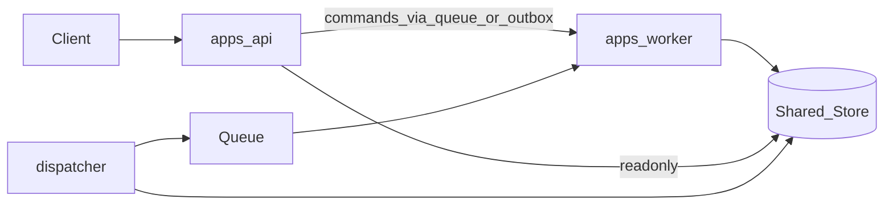

# 05 · 测试与演进

> 上游：[04-ports-extensions-and-security](./04-ports-extensions-and-security.md)  
> 设计依据：[07](../design/07-observability-and-evaluation.md)、[08](../design/08-mvp-and-evolution.md)  
> 相关 EDR：EDR-004、EDR-015、以及拆分相关的 EDR-002

## 1. 目标

固定实现阶段的 **测试分层、故障注入、与 07/08 门禁的对应关系**，以及从模块化单体演进到 API + Worker 的触发条件与检查点。本文不生成测试代码或 CI 配置。

## 2. 测试金字塔（EDR-015）

```text
            ┌─────────────────────────┐
            │ L3 Eval / Golden Harness │  ← 08 §5 套件与门禁
            └───────────┬─────────────┘
          ┌─────────────┴─────────────┐
          │ L2 Integration (real store)│  ← UoW / Outbox / Lease / Recovery
          └─────────────┬─────────────┘
     ┌──────────────────┴──────────────────┐
     │ L1 Component (InMemory + FaultHooks) │  ← Engine 全链路语义
     └──────────────────┬──────────────────┘
┌───────────────────────┴───────────────────────┐
│ L0 Unit (pure): Reducer, Policy, Digest, Order │
└───────────────────────────────────────────────┘
```

### 2.1 L0 纯函数单测

| 目标 | 必须覆盖 |
| --- | --- |
| StateReducer | 串行 Fact；前置失效 → reject；无 last-write-wins；无 IO/时间依赖 |
| Policy 组合 | 偏序、deny 优先、后层不放宽 |
| ActionCanonicalizer | JCS/NFC/规范化失败路径；digest 稳定 |
| EventOrderingPolicy | `observation.recorded` 先于 `fact.*`；policy.evaluated 与 deny 顺序 |
| BudgetGuard | 步数/token/费用/墙钟计量边界 |
| ToolEffectContract 键派生 | 同逻辑调用同键；恢复不换键 |

同版本同输入必须确定性输出（Validator 契约）。

### 2.2 L1 组件测试（InMemory Ports + 故障钩子）

提供可注入时钟、种子随机源、以及：

```text
FaultInjectionHook {
  beforeCommit(plan) → ok | fail
  afterCommitBeforeDispatch() → ok | crash
  onToolDispatch(toolCallId) → success | timeout | unknown
  leaseBehavior → normal | expire | steal
}
```

覆盖设计 08 恢复与幂等意图：提交前后崩溃、Outbox/Queue 重投、lease 丢失与接管、Checkpoint 有无、迟到结果、Tool 超时与 reconcile、Approval digest 不匹配等。

**要求**：即使 Queue 内联，也必须跑「双投递 / 双消费」用例，防止单体掩盖至少一次语义（EDR-004）。

### 2.3 L2 真实单库集成

在 Proposed 的 PostgreSQL（或同等事务存储）上验证：

| 场景 | 断言 |
| --- | --- |
| CreateRun 原子性 | 失败时无 Run / 无 Event / 无脏 Outbox |
| Outbox claim 并发 | 同一记录仅一 claimer 成功 |
| revision 冲突 | 先写保留，后写 `conflict` |
| leaseEpoch fencing | stale worker commit / dispatch → `lease_lost` |
| sequence | 单 Run 连续、无洞、无重复 |
| Idempotency | 同键同摘要同 runId；同键异摘要 `conflict` |
| 恢复 | 无 Checkpoint 全量 replay 与有 Checkpoint 加速后 State hash 一致 |
| prepared-before-dispatch | 无 prepared 记录则无外部副作用 |

### 2.4 L3 Eval Suite / Golden（对齐 08 §5）

| 套件 | 最少用例 × 重复 | 工程落点 |
| --- | --- | --- |
| Golden 主路径 | 6 × 5 | 固定 Manifest、Tool 桩、模型采样配置 |
| 越权与安全 | 8 × 1 | 零容忍；失败不可重跑洗绿 |
| 恢复故障注入 | 8 × 5 | L1/L2 FaultHooks + 真实库 |
| 审批生命周期 | 6 × 1 | `synthetic.write_high` |
| 幂等与未知结果 | 6 × 5 | sink 副作用计数、同键重派 |

门禁阈值以设计 07/08 为准（安全 0、控制面 100%、Golden ≥90%/30 次、恢复 ≥95%、成本延迟 20% 回归带）。工程档案不另定第二套阈值。

Flaky 规则：安全/控制面确定性失败即失败；质量/恢复只统计预设次数全部结果。

## 3. 三类回放测试（07 §3.2）

| 模式 | 工程断言 |
| --- | --- |
| 审计回放 | 按 sequence 解释；不调 Model/Tool |
| State 重建 | 冻结 Reducer + Event（±Checkpoint）→ State hash 匹配 |
| 仿真重跑 | 隔离环境；外部写 sink 替身；不宣称生产效果 |

敏感删除后：允许 `payload_unavailable` / `degraded`，禁止合成正文后宣称等价。

## 4. 从单体到 API + Worker

### 4.1 触发信号（参考，非自动切换）

在保持 07/08 门禁的前提下，以下信号支持启动拆分评估：

- 设计 08 阶段 B 运营信号（queue latency / unresolved age / lease takeover 触及 SLO Profile 水位）
- 单进程 CPU/事件循环阻塞导致 p95 active execution 持续恶化
- 需要独立扩缩 Worker 池与 API 网关

未满足信号时，不要求仅为「架构纯粹」拆进程。

### 4.2 迁移检查点

拆分前必须全部为真：

- [ ] Core 零 infra 静态 import  
- [ ] 所有推进经 `HarnessCommand`  
- [ ] QueuePort / LeasePort / PersistencePort 可替换  
- [ ] Outbox claim 支持多 dispatcher（`SKIP LOCKED` 或等价）  
- [ ] Tool 派发仍在 Worker，不在 API  
- [ ] EventStream 只读已提交 Event  
- [ ] L1 双投递与 L2 fencing 套件全绿  
- [ ] 08 核心套件在「API 与 Worker 分离配置」下可重复  

### 4.3 拆分后拓扑（目标态）



共享同一权威库，直到容量或故障域要求进一步拆库；拆库不得破坏单 Run 提交协议。

## 5. 观测与评测工程落点

| 信号 | 来源 | 工程约束 |
| --- | --- | --- |
| Trace / Metrics | 已提交 Event | 异步投影；失败不回滚 Run |
| 指标标签 | 07 低基数枚举 | 禁止 runId 等高基数进普通指标 |
| Evaluation Store | EvaluationPort | 与生产 State 分离（EDR-013） |
| 基线批准 | 08 §5.2 | 首个候选基线需显式批准；空基线不自动过成本门禁 |

MVP 至少能从 Event 重算：任务成功率、non-terminal age、queue/active/awaiting/total 时间、tool retry、policy deny、recovery、lease takeover、outcome_unknown、Context overflow、Knowledge miss、Token/cost（定义见设计 07）。

## 6. 建议实现顺序（仅规划）

与测试能力同步推进，避免无恢复语义的「假闭环」：

```text
1. contracts + ports + persistence UoW + Event append
2. Outbox + inline queue + scheduler + CreateRun→running
3. light loop + ModelPort stub + Policy + Observation/Fact/Reducer
4. Tool prepared/dispatch/unknown/reconcile + synthetic.write_high
5. Approval + ask_user + Checkpoint/Continuation
6. RecoveryService + L1/L2 故障注入
7. EventStream + 核心指标 + Golden/Eval 门禁接线
```

每步退出应带上对应层测试，而不是攒到最后。

## 7. 一致性检查

- [ ] 测试分层与 EDR-015 一致  
- [ ] 08 套件规模与阈值未在工程侧改写  
- [ ] 内联队列仍测至少一次语义  
- [ ] 拆分检查点可执行且不改领域契约  
- [ ] 本文未创建代码或 CI 文件承诺为已完成  

---

上一篇：[04-ports-extensions-and-security.md](./04-ports-extensions-and-security.md) · 返回：[README.md](./README.md)
